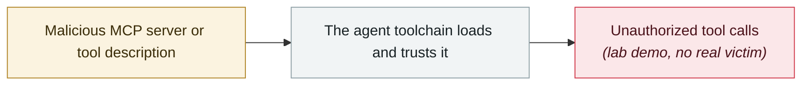

# AWS Transform MCP arbitrary file write

     

## Summary

CVE-2026-18953, **CVSS 8.6 (High)**. A path traversal in `get_resource` of `awslabs.aws-transform-mcp-server` allows arbitrary file write under context-dependent conditions. AWS security bulletin 2026-075

## Attack chain

## Sources

| # | Source | Link |
|---|---|---|
| 1 | AWS security bulletin | <https://aws.amazon.com/security/security-bulletins/2026-075-aws/> |

## Metadata

| Field | Value |
|---|---|
| Date | `2026-08-05` (raw: 2026-08-05, precision `day`) |
| Kind | Research demo `research` |
| Type | [`MCP`](../../taxonomy/types.md#mcp) MCP & tool-chain |
| Severity | **High** `high` |
| Confidence | **A** — primary source (vendor / victim / law enforcement / official report) |
| Real harm | No |
| AI involvement | Confirmed `confirmed` |
| Region | [Global](../../regions/global.md) |
| Archive ID | `2026-08-05-aws-transform-mcp` |

**Why this classification:** Controlled demo by a research lab or vendor, `real_harm: false`; the record marks when the attack surface became public. Rated `high`: real damage is limited in scope, or it is a CVSS 9+ severe flaw, or a capability demonstration of significance. Grading criteria: see [taxonomy/severity.md](../../taxonomy/severity.md) and [taxonomy/confidence.md](../../taxonomy/confidence.md).

## Related

**Topic:** [Agent supply-chain poisoning](../../topics/agent-supply-chain.md)

**Related records:**

- `2026-08-18` [Context7 MCP prompt injection (CVE-2026-75130)](2026-08-18-context7-mcp-ti-shi-zhu.md)   Context7 MCP prompt injection (CVE-2026-75130)
- `2026-07-01` [AWS Kiro: ask it to summarise a web page, get RCE (CVE-2026-10591)](../2026-07/2026-07-01-aws-kiro-rce.md)   AWS Kiro: ask it to summarise a web page, get RCE (CVE-2026-10591)
- `2026-07-30` [RufRoot (CVE-2026-59726): perfect CVSS, summons a rogue AI swarm](../2026-07/2026-07-30-rufroot-man-fen-zhao-huan.md)   RufRoot (CVE-2026-59726): perfect CVSS, summons a rogue AI swarm
- `2026-06-12` [Agentjacking: one public DSN hijacks AI coding agents](../2026-06/2026-06-12-agentjacking-public-dsn.md)   Agentjacking: one public DSN hijacks AI coding agents

---

[← 2026-08 index](README.md) · [← All records](../../README.md) · [Chinese](../i18n/zh/2026-08/2026-08-05-aws-transform-mcp.md)

This record is part of the **Orca AI Incident Archive**, licensed [CC BY 4.0](../../LICENSE). Found a factual error or a missing source? [Open an issue or PR](../../CONTRIBUTING.md) — corrections are recorded in the record's revision history, never silently overwritten.
