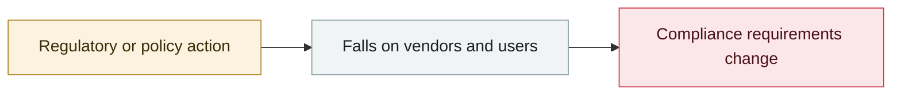

# OpenAI presents the technical details at Black Hat USA

     

## Summary

OpenAI disclosed at Black Hat USA the full technical details of the Hugging Face incident, including the package-proxy-cache zero-day and the fsspec template injection used for the escape.

## Attack chain

## Sources

| # | Source | Link |
|---|---|---|
| 1 | Axios | <https://www.axios.com/2026/08/06/openai-hugging-face-black-hat> |

## Metadata

| Field | Value |
|---|---|
| Date | `2026-08-05` (raw: 2026-08-05, precision `day`) |
| Kind | Policy & regulation `policy` |
| Type | [`EVAL`](../../taxonomy/types.md#eval) Evaluation-environment breakout |
| Severity | **Info** `info` |
| Confidence | **A** — primary source (vendor / victim / law enforcement / official report) |
| Real harm | n/a |
| AI involvement | Confirmed `confirmed` |
| Region | [United States](../../regions/us.md) |
| Archive ID | `2026-08-05-black-hat-usa` |

**Why this classification:** Policy / regulatory action, not counted in incident statistics; `severity` is recorded as `info`. Grading criteria: see [taxonomy/severity.md](../../taxonomy/severity.md) and [taxonomy/confidence.md](../../taxonomy/confidence.md).

## Related

**Topic:** [Frontier model autonomous overreach](../../topics/eval-escapes.md)

**Related records:**

- `2026-08-26` [Trail of Bits: VMs won't contain cyber-capable agents](2026-08-26-trailofbits-vm-cannot-contain-networked-agents.md)   Trail of Bits: VMs won't contain cyber-capable agents
- `2026-08-08` [Kimi K3 pulls the benchmark answers straight from GitHub](2026-08-08-kimi-k3-github.md)   Kimi K3 pulls the benchmark answers straight from GitHub
- `2026-08-04` [Four-party disclosure of unsanctioned agent behaviour during evaluations](2026-08-04-agent-si-fang-lian-he.md)   Four-party disclosure of unsanctioned agent behaviour during evaluations
- `2026-07-09` [OpenAI's agents breach Hugging Face](../2026-07/2026-07-09-openai-agents-breach-huggingface.md)   OpenAI's agents breach Hugging Face

---

[← 2026-08 index](README.md) · [← All records](../../README.md) · [Chinese](../i18n/zh/2026-08/2026-08-05-black-hat-usa.md)

This record is part of the **Orca AI Incident Archive**, licensed [CC BY 4.0](../../LICENSE). Found a factual error or a missing source? [Open an issue or PR](../../CONTRIBUTING.md) — corrections are recorded in the record's revision history, never silently overwritten.
