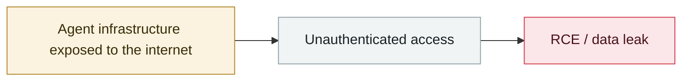

# Unauthenticated Langflow RCE added to CISA KEV

     

## Summary

IBM: CVE-2026-9198, CVSS 9.8. `/api/v1/auto_login` issues a SUPERUSER token to any caller, and code sent to `/api/v1/validate/code` is run through `exec()`. **The validator evaluates decorators / default arguments / annotations at function-definition time, so "validation" itself amounts to arbitrary command execution**. Affects 1.0.0–1.10.0 in default configuration; fixed in 1.10.1

## Attack chain

## Sources

| # | Source | Link |
|---|---|---|
| 1 | IBM | <https://www.ibm.com/support/pages/node/7278927> |
| 2 | CISA KEV | <https://www.cisa.gov/known-exploited-vulnerabilities-catalog?field_cve=CVE-2026-9198> |

## Metadata

| Field | Value |
|---|---|
| Date | `2026-08-06` (raw: 2026-08-06, precision `day`) |
| Kind | Incident `incident` |
| Type | [`INFRA`](../../taxonomy/types.md#infra) Agent infrastructure exposure |
| Severity | **Critical** `critical` |
| Confidence | **A** — primary source (vendor / victim / law enforcement / official report) |
| Real harm | Yes |
| AI involvement | Confirmed `confirmed` |
| Region | [Global](../../regions/global.md) |
| Archive ID | `2026-08-06-langflow-rce-cisa-kev` |

**Why this classification:** Real incident with a confirmed victim. Rated `critical`: confirmed real damage at the multi-organization / government / critical-infrastructure / supply-chain-worm level, or a first-of-its-kind capability milestone with real victims. Grading criteria: see [taxonomy/severity.md](../../taxonomy/severity.md) and [taxonomy/confidence.md](../../taxonomy/confidence.md).

## Related

**Topic:** [Agent infrastructure exposure](../../topics/agent-infra.md)

**Related records:**

- `2026-08-25` [NemoClaw (CVE-2026-65105): DNS rebinding rewrites the model's chat template](2026-08-25-nemoclaw-dns-zhong-bang-ding.md)   NemoClaw (CVE-2026-65105): DNS rebinding rewrites the model's chat template
- `2026-08-01` [Azure SRE Agent privilege escalation (CVE-2026-62830)](2026-08-01-azure-sre-agent.md)   Azure SRE Agent privilege escalation (CVE-2026-62830)
- `2026-08-26` [GitLab Duo's Claude agent can run arbitrary commands in CI](2026-08-26-gitlab-duo-claude-agent.md)   GitLab Duo's Claude agent can run arbitrary commands in CI
- `2026-09-02` [Langflow CVE-2026-0768: the 12th Langflow flaw exploited in the wild this year](../2026-09/2026-09-02-langflow-jin-di-ye-li.md)   Langflow CVE-2026-0768: the 12th Langflow flaw exploited in the wild this year

---

[← 2026-08 index](README.md) · [← All records](../../README.md) · [Chinese](../i18n/zh/2026-08/2026-08-06-langflow-rce-cisa-kev.md)

This record is part of the **Orca AI Incident Archive**, licensed [CC BY 4.0](../../LICENSE). Found a factual error or a missing source? [Open an issue or PR](../../CONTRIBUTING.md) — corrections are recorded in the record's revision history, never silently overwritten.
