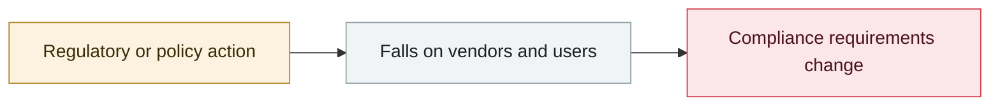

# 1Password: AI patches fully fix only 26% of the time

     

## Summary

Off-by-1 Labs: 2 generative AI models produced 6,480 patches for 6 CVEs that require complex fixes; after excluding 400 that simply "copied upstream", 6,080 remained — **only 26.0% on average fully eliminated the vulnerability without changing behaviour**, and **53.9% left the vulnerability in place, introduced new flaws, or both**. Separately, Checkmarx's SusViBes benchmark: functional success rate 83–95%, but **only 24–36% were both secure and functionally correct**, and **65–75% of the working patches reproduced flaws that had already been fixed**

## Attack chain

## Sources

| # | Source | Link |
|---|---|---|
| 1 | 1Password | <https://1password.com/blog/why-ai-generated-patches-still-require-human-review> |
| 2 | PDF | <https://1password.com/files/resources/frontier-models-vulnerability-patches-flawed.pdf> |
| 3 | Checkmarx | <https://checkmarx.com/blog/zombie-cves-put-to-rest-by-humans-dug-back-up-by-ai-agents/> |

## Metadata

| Field | Value |
|---|---|
| Date | `2026-08-06` (raw: 2026-08-06, precision `day`) |
| Kind | Threat report `report` |
| Type | [`GOV`](../../taxonomy/types.md#gov) Governance & policy |
| Severity | **Info** `info` |
| Confidence | **A** — primary source (vendor / victim / law enforcement / official report) |
| Real harm | n/a |
| AI involvement | Confirmed `confirmed` |
| Region | [Global](../../regions/global.md) |
| Archive ID | `2026-08-06-password-bu-ding-wan-quan` |

**Why this classification:** Threat intelligence report covering several incidents; it is not counted as a single incident itself, so `severity` is recorded as `info`. Grading criteria: see [taxonomy/severity.md](../../taxonomy/severity.md) and [taxonomy/confidence.md](../../taxonomy/confidence.md).

## Related

**Topic:** [Defense & governance](../../topics/defense.md)

**Related records:**

- `2026-08-03` [CrowdStrike 2026 threat hunting report](2026-08-03-crowdstrike-wei-xie-shou-lie.md)   CrowdStrike 2026 threat hunting report
- `2026-08-04` [OSAA publishes the SAFE draft for AI incident sharing (RFC)](2026-08-04-osaa-safe-rfc.md)   OSAA publishes the SAFE draft for AI incident sharing (RFC)
- `2026-08-07` [OpenAI: next-generation model Astra may reach Critical cyber capability](2026-08-07-astra-critical-yi-dai-mo.md)   OpenAI: next-generation model Astra may reach Critical cyber capability
- `2026-08-18` [OpenAI slows development and pauses RL training for two weeks](2026-08-18-rl-xuan-bu-fang-man.md)   OpenAI slows development and pauses RL training for two weeks

---

[← 2026-08 index](README.md) · [← All records](../../README.md) · [Chinese](../i18n/zh/2026-08/2026-08-06-password-bu-ding-wan-quan.md)

This record is part of the **Orca AI Incident Archive**, licensed [CC BY 4.0](../../LICENSE). Found a factual error or a missing source? [Open an issue or PR](../../CONTRIBUTING.md) — corrections are recorded in the record's revision history, never silently overwritten.
