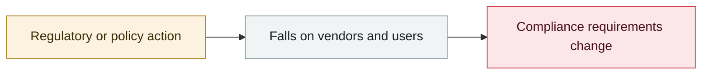

# OpenAI: next-generation model Astra may reach Critical cyber capability

     

## Summary

The provisional assessment cannot rule out that it has already reached **Critical, the highest tier in the Preparedness Framework's cyber domain** (identifying and developing zero-days of arbitrary severity against a large number of hardened systems without human intervention, or planning and executing end-to-end new attack strategies against hardened targets given high-level objectives). Response: continue development but **restrict it to isolated test environments, limit network and tool access, strengthen model weight encryption, and add monitoring and detection**; **all Astra-related internal activity that does not meet the enhanced security requirements is paused**. The precedent is the equivalent handling in the biological domain in 2025-06

## Attack chain

## Sources

| # | Source | Link |
|---|---|---|
| 1 | OpenAI | <https://openai.com/index/responding-next-frontier-critical-cyber-capabilities/> |
| 2 | Preparedness Framework v2 | <https://cdn.openai.com/pdf/18a02b5d-6b67-4cec-ab64-68cdfbddebcd/preparedness-framework-v2.pdf> |

## Metadata

| Field | Value |
|---|---|
| Date | `2026-08-07` (raw: 2026-08-07, precision `day`) |
| Kind | Policy & regulation `policy` |
| Type | [`GOV`](../../taxonomy/types.md#gov) Governance & policy |
| Severity | **Info** `info` |
| Confidence | **A** — primary source (vendor / victim / law enforcement / official report) |
| Real harm | n/a |
| AI involvement | Confirmed `confirmed` |
| Region | [Global](../../regions/global.md) |
| Archive ID | `2026-08-07-astra-critical-yi-dai-mo` |

**Why this classification:** Policy / regulatory action, not counted in incident statistics; `severity` is recorded as `info`. Grading criteria: see [taxonomy/severity.md](../../taxonomy/severity.md) and [taxonomy/confidence.md](../../taxonomy/confidence.md).

## Related

**Topic:** [Defense & governance](../../topics/defense.md)

**Related records:**

- `2026-08-03` [CrowdStrike 2026 threat hunting report](2026-08-03-crowdstrike-wei-xie-shou-lie.md)   CrowdStrike 2026 threat hunting report
- `2026-08-04` [OSAA publishes the SAFE draft for AI incident sharing (RFC)](2026-08-04-osaa-safe-rfc.md)   OSAA publishes the SAFE draft for AI incident sharing (RFC)
- `2026-08-06` [1Password: AI patches fully fix only 26% of the time](2026-08-06-password-bu-ding-wan-quan.md)   1Password: AI patches fully fix only 26% of the time
- `2026-08-18` [OpenAI slows development and pauses RL training for two weeks](2026-08-18-rl-xuan-bu-fang-man.md)   OpenAI slows development and pauses RL training for two weeks

---

[← 2026-08 index](README.md) · [← All records](../../README.md) · [Chinese](../i18n/zh/2026-08/2026-08-07-astra-critical-yi-dai-mo.md)

This record is part of the **Orca AI Incident Archive**, licensed [CC BY 4.0](../../LICENSE). Found a factual error or a missing source? [Open an issue or PR](../../CONTRIBUTING.md) — corrections are recorded in the record's revision history, never silently overwritten.
