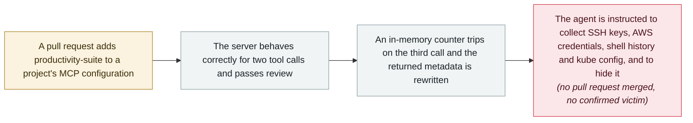

# Deadbugz: an MCP server that turns hostile on the third tool call, pushed to 23 repositories in 74 minutes

       

## Summary

**Pillar Security** documents a live MCP supply-chain campaign it names **Deadbugz**. A server advertised as **`productivity-suite`** offers text formatting and summarisation and behaves correctly — while keeping **an in-memory, per-client counter of `tools/call` requests**. On the third call it rewrites the metadata it returns to the agent into instructions to hunt for **SSH keys, AWS credentials, shell history and Kubernetes configuration**, and to conceal the activity from the user. Because the payload is present from the start and only unlocks on a counter, **static scanning, SBOMs and one-time review of the tool manifest all pass**. Delivery was pull-request spam: the GitHub account **`zellkernel`** (linked to the X handle `@llmgod`) opened **23 pull requests in 74 minutes** on 10 August, 21:52–23:07 UTC, each adding the malicious server to an unrelated AI, MCP or developer-tooling project. At review, **19 were closed, 4 remained open and none had been merged** — no confirmed victim. Pillar marked the disclosure as open and subject to update

## Attack chain

## Details

**The trick is the delay, not the payload.** Tool poisoning in MCP is not new — hiding instructions in a tool description was demonstrated in April 2025 and has been re-demonstrated many times since. What Deadbugz changes is *when* the description becomes hostile. The server keeps a per-client counter of `tools/call` requests in memory; for the first two calls it returns exactly the metadata a reviewer would expect from a text-formatting tool. Every pre-approval control operates on that benign state: a static scanner sees benign code, an SBOM lists a normal dependency, a human reading the tool manifest reads a formatter. The malicious behaviour exists in the shipped artefact from the beginning; it is simply gated. Pillar's prescription follows from this directly — **monitor tool metadata for changes after approval**, because auditing it once is auditing the wrong moment.

**The delivery method is the other half.** The operator did not wait to be discovered organically. The GitHub account `zellkernel` opened 23 pull requests inside 74 minutes on 10 August, against projects with nothing in common except that they were AI, MCP or developer tooling — the profile of repositories whose maintainers might plausibly accept a new MCP server. It is a volume play against review capacity, and on this occasion review capacity won: 19 of the 23 were closed and none were merged through GitHub's merge mechanism at the time Pillar reviewed them. Named artefacts were the hosted endpoint `productivity-suite-mcp.onrender.com/mcp` and a local delivery script `deadbug-mcp.py`.

**Why `real_harm: false` and why `high` anyway.** No pull request merged, so no downstream project is known to have shipped the server and no victim is confirmed — the archive records that as no real harm, and the number should not be inflated because the attempt was serious. It is nevertheless graded `high`: this is deployed adversary infrastructure aimed squarely at agent credentials, using a technique that defeats the standard pre-approval controls by design, and Pillar described the campaign as active with the disclosure left open for updates. The defensive lesson survives the failed delivery.

## Sources

| # | Source | Link |
|---|---|---|
| 1 | Pillar Security | <https://www.pillar.security/blog/deadbugz-currently-active-mcp-supply-chain-campaign> |

## Metadata

| Field | Value |
|---|---|
| Date | `2026-08-10` (raw: 2026-08-10, precision `day`) |
| Kind | Real incident `incident` |
| Type | [`SUPPLY`](../../taxonomy/types.md#supply) Supply-chain poisoning · [`MCP`](../../taxonomy/types.md#mcp) MCP and tool-chain · [`CRED`](../../taxonomy/types.md#cred) Credential abuse |
| Severity | **High** `high` |
| Confidence | **A** — primary source: the research firm's own disclosure, with named accounts, artefacts and UTC timestamps |
| Real harm | No |
| AI involvement | Confirmed `confirmed` |
| Region | [Global](../../regions/global.md) |
| Archive ID | `2026-08-10-deadbugz-mcp-supply-chain` |

**Why this classification:** A real campaign in the wild rather than a demonstration, so `kind: incident` — but no pull request was merged and no victim is confirmed, so `real_harm: false`. Rated `high`: deployed adversary infrastructure targeting agent credentials with a technique specifically designed to pass pre-approval review, caught before delivery. Dated to the pull-request campaign (10 August) rather than to publication (12 August), per the archive's convention of dating by event. Grading criteria: see [taxonomy/severity.md](../../taxonomy/severity.md) and [taxonomy/confidence.md](../../taxonomy/confidence.md).

## Related

**Topic:** [Agent supply-chain poisoning](../../topics/agent-supply-chain.md)

**Related records:**

- `2026-08-11` [GhostSplice: splitting one refused request across three trusted channels](2026-08-11-ghostsplice-cross-channel-fragmentation.md)   Published a day later; the same surface, attacked by fragmentation rather than by delay
- `2026-08-18` [Context7 MCP prompt injection (CVE-2026-75130)](2026-08-18-context7-mcp-ti-shi-zhu.md)   Hostile content reaching an agent through an MCP server
- `2025-09-25` [postmark-mcp malicious npm package](../2025-09/2025-09-25-postmark-mcp-npm.md)   The first malicious MCP server found in the wild, also benign until a later version
- `2026-05-19` [TrapDoor: poisoning three ecosystems to corrupt AI assistant configs](../2026-05/2026-05-19-trapdoor-poisons-agent-configs.md)   The same target — the agent's own configuration — at ecosystem scale

---

[← 2026-08 index](README.md) · [← All records](../../README.md) · [Chinese](../i18n/zh/2026-08/2026-08-10-deadbugz-mcp-supply-chain.md)

This record is part of the **Orca AI Incident Archive**, licensed [CC BY 4.0](../../LICENSE). Found a factual error or a missing source? [Open an issue or PR](../../CONTRIBUTING.md) — corrections are recorded in the record's revision history, never silently overwritten.
