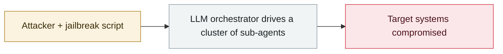

# Taiwan agent-swarm intrusion made public

     

## Summary

See the 2026-07 entry for the full story

## Attack chain

## Sources

| # | Source | Link |
|---|---|---|
| 1 | The Register | <https://www.theregister.com/security/2026/08/12/near-autonomous-ai-agents-attack-taiwans-nuclear-safety-agency/5287055> |

## Metadata

| Field | Value |
|---|---|
| Date | `2026-08-12` (raw: 2026-08-12, precision `day`) |
| Kind | Incident `incident` |
| Type | [`WEAPON`](../../taxonomy/types.md#weapon) Agent used as a weapon |
| Severity | **Low** `low` |
| Confidence | **A** — primary source (vendor / victim / law enforcement / official report) |
| Real harm | Yes |
| AI involvement | Confirmed `confirmed` |
| Region | [Taiwan](../../regions/tw.md) |
| Archive ID | `2026-08-12-agent-tai-wan-feng-qun` |

**Why this classification:** Real incident with a confirmed victim. Rated `low`: context entry, kept for timeline continuity. Grading criteria: see [taxonomy/severity.md](../../taxonomy/severity.md) and [taxonomy/confidence.md](../../taxonomy/confidence.md).

## Related

**Topic:** [Offensive AI capability evolution](../../topics/offensive-ai.md)

**Related records:**

- `2026-08-28` [PaperCut AI agent swarm campaign begins](2026-08-28-papercut-agent-swarm-campaign-begins.md)   PaperCut AI agent swarm campaign begins
- `2026-07-01` [Taiwan's nuclear safety commission and other agencies breached by an agent swarm](../2026-07/2026-07-01-taiwan-government-agent-swarm.md)   Taiwan's nuclear safety commission and other agencies breached by an agent swarm
- `2026-07-01` [JADEPUFFER: first ransomware driven end-to-end by an LLM](../2026-07/2026-07-01-jadepuffer-first-llm-driven-ransomware.md)   JADEPUFFER: first ransomware driven end-to-end by an LLM
- `2026-07-09` [OpenAI's agents breach Hugging Face](../2026-07/2026-07-09-openai-agents-breach-huggingface.md)   OpenAI's agents breach Hugging Face

---

[← 2026-08 index](README.md) · [← All records](../../README.md) · [Chinese](../i18n/zh/2026-08/2026-08-12-agent-tai-wan-feng-qun.md)

This record is part of the **Orca AI Incident Archive**, licensed [CC BY 4.0](../../LICENSE). Found a factual error or a missing source? [Open an issue or PR](../../CONTRIBUTING.md) — corrections are recorded in the record's revision history, never silently overwritten.
