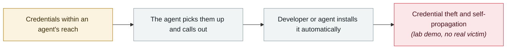

# AI finds a flaw AI helped write: Snowflake's Jira token

      

## Summary

In a GitHub Actions workflow of `snowflakedb/snowflake-connector-net` (which automatically files a Jira ticket when an issue is opened), **a change co-authored under the label "Copilot Autofix powered by AI" on 2026-06-18** introduced a script injection flaw — the issue title was expanded straight into a shell command instead of being passed through an environment variable, which could be used to exfiltrate Jira credentials.

It was found by **Wiz's autonomous "Red Agent"** (reported 2026-06-23); Snowflake fixed it and rotated the token the same day, confirming that no third party other than Wiz accessed it during the 5-day exposure window. Wiz published the full analysis on 2026-08-17.

⚠️ **GitHub disputes the characterisation**: the flawed workflow logic can be traced back to **a commit by a human Snowflake engineer in 2025-08**, and the Autofix "co-author" tag was only attached during the 2026-06-18 squash merge. **The record must keep both accounts side by side**

## Attack chain

## Sources

| # | Source | Link |
|---|---|---|
| 1 | Wiz | <https://www.wiz.io/blog/red-agent-snowflake-copilot-cicd-bug> |
| 2 | THN | <https://thehackernews.com/2026/08/snowflake-github-actions-flaw-lets_0330881554.html> |

## Metadata

| Field | Value |
|---|---|
| Date | `2026-08-17` (raw: 2026-08-17, precision `day`) |
| Kind | Research demo `research` |
| Type | [`CRED`](../../taxonomy/types.md#cred) Credential abuse · [`SUPPLY`](../../taxonomy/types.md#supply) Supply-chain poisoning |
| Severity | **High** `high` |
| Confidence | **A** — primary source (vendor / victim / law enforcement / official report) |
| Real harm | Yes |
| AI involvement | Confirmed `confirmed` |
| Region | [Global](../../regions/global.md) |
| Archive ID | `2026-08-17-snowflake-jira-zhao-dao-can` |

**Why this classification:** Controlled demo by a research lab or vendor, `real_harm: false`; the record marks when the attack surface became public. Rated `high`: real damage is limited in scope, or it is a CVSS 9+ severe flaw, or a capability demonstration of significance. Grading criteria: see [taxonomy/severity.md](../../taxonomy/severity.md) and [taxonomy/confidence.md](../../taxonomy/confidence.md).

## Related

**Topic:** [Agent supply-chain poisoning](../../topics/agent-supply-chain.md)

**Related records:**

- `2026-08-04` [CHAINDROP npm worm](2026-08-04-chaindrop-npm-ru-chong.md)   CHAINDROP npm worm
- `2026-08-01` [Azure SRE Agent privilege escalation (CVE-2026-62830)](2026-08-01-azure-sre-agent.md)   Azure SRE Agent privilege escalation (CVE-2026-62830)
- `2026-08-18` [Context7 MCP prompt injection (CVE-2026-75130)](2026-08-18-context7-mcp-ti-shi-zhu.md)   Context7 MCP prompt injection (CVE-2026-75130)
- `2026-09-01` [GitSpawn: a malicious .git/config runs attacker code in 7 coding agents before the model is ever contacted](../2026-09/2026-09-01-gitspawn-git-config-pre-model-rce.md)   GitSpawn: a malicious .git/config runs attacker code in 7 coding agents before the model is ever contacted

---

[← 2026-08 index](README.md) · [← All records](../../README.md) · [Chinese](../i18n/zh/2026-08/2026-08-17-snowflake-jira-zhao-dao-can.md)

This record is part of the **Orca AI Incident Archive**, licensed [CC BY 4.0](../../LICENSE). Found a factual error or a missing source? [Open an issue or PR](../../CONTRIBUTING.md) — corrections are recorded in the record's revision history, never silently overwritten.
