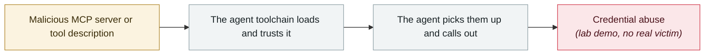

# Context7 MCP prompt injection (CVE-2026-75130)

      

## Summary

Context7 ≤ 2.1.2: the **Custom AI Instructions feature** served over MCP does not sanitise content; once an attacker poisons the custom instructions, **a single routine library-docs lookup by the agent** exfiltrates credentials from `.env` to the attacker's service and runs destructive file deletion on the victim's machine. CVSS 3.1 **9.0** (CVSS 4.0 6.4). ⚠️ **As of the disclosure date there is no public fix for that version range**

## Attack chain

## Sources

| # | Source | Link |
|---|---|---|
| 1 | OpenCVE | <https://app.opencve.io/cve/CVE-2026-75130> |
| 2 | Analysis | <https://www.digitalapplied.com/blog/context7-mcp-prompt-injection-cve-2026-75130> |

## Metadata

| Field | Value |
|---|---|
| Date | `2026-08-18` (raw: 2026-08-18, precision `day`) |
| Kind | Research demo `research` |
| Type | [`MCP`](../../taxonomy/types.md#mcp) MCP & tool-chain · [`CRED`](../../taxonomy/types.md#cred) Credential abuse |
| Severity | **High** `high` |
| Confidence | **A** — primary source (vendor / victim / law enforcement / official report) |
| Real harm | No |
| AI involvement | Confirmed `confirmed` |
| Region | [Global](../../regions/global.md) |
| Archive ID | `2026-08-18-context7-mcp-ti-shi-zhu` |

**Why this classification:** Controlled demo by a research lab or vendor, `real_harm: false`; the record marks when the attack surface became public. Rated `high`: real damage is limited in scope, or it is a CVSS 9+ severe flaw, or a capability demonstration of significance. Grading criteria: see [taxonomy/severity.md](../../taxonomy/severity.md) and [taxonomy/confidence.md](../../taxonomy/confidence.md).

## Related

**Topic:** [Agent supply-chain poisoning](../../topics/agent-supply-chain.md)

**Related records:**

- `2026-08-04` [CHAINDROP npm worm](2026-08-04-chaindrop-npm-ru-chong.md)   CHAINDROP npm worm
- `2026-08-05` [AWS Transform MCP arbitrary file write](2026-08-05-aws-transform-mcp.md)   AWS Transform MCP arbitrary file write
- `2026-08-01` [Azure SRE Agent privilege escalation (CVE-2026-62830)](2026-08-01-azure-sre-agent.md)   Azure SRE Agent privilege escalation (CVE-2026-62830)
- `2026-08-17` [AI finds a flaw AI helped write: Snowflake's Jira token](2026-08-17-snowflake-jira-zhao-dao-can.md)   AI finds a flaw AI helped write: Snowflake's Jira token

---

[← 2026-08 index](README.md) · [← All records](../../README.md) · [Chinese](../i18n/zh/2026-08/2026-08-18-context7-mcp-ti-shi-zhu.md)

This record is part of the **Orca AI Incident Archive**, licensed [CC BY 4.0](../../LICENSE). Found a factual error or a missing source? [Open an issue or PR](../../CONTRIBUTING.md) — corrections are recorded in the record's revision history, never silently overwritten.
