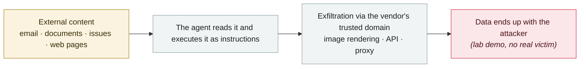

# Grok "cryptographic context injection": encrypted instructions, plaintext data

      

## Summary

Adversa AI. The attack page embeds **encrypted instructions — Grok can decrypt and execute them on its own**. The payload makes the model "generate a decryption key", and **that so-called key is really a template filled with the user's private data** (name, location, subscription tier, chat history); Grok then carries it out as a URL parameter when it opens the attacker's website. Zero-click.

⚠️ **Reported to xAI via HackerOne on 2026-06-03; still reproducible in production as of 2026-08-19**

## Attack chain

## Sources

| # | Source | Link |
|---|---|---|
| 1 | Adversa AI | <https://adversa.ai/blog/cryptographic-context-injection-grok-data-theft/> |
| 2 | THN | <https://thehackernews.com/2026/08/new-cryptographic-context-injection.html> |

## Metadata

| Field | Value |
|---|---|
| Date | `2026-08-19` (raw: 2026-08-19, precision `day`) |
| Kind | Research demo `research` |
| Type | [`IPI`](../../taxonomy/types.md#ipi) Indirect prompt injection · [`EXFIL`](../../taxonomy/types.md#exfil) Data exfiltration |
| Severity | **High** `high` |
| Confidence | **A** — primary source (vendor / victim / law enforcement / official report) |
| Real harm | No |
| AI involvement | Confirmed `confirmed` |
| Region | [Global](../../regions/global.md) |
| Archive ID | `2026-08-19-grok-mi-ma-xue-wen` |

**Why this classification:** Controlled demo by a research lab or vendor, `real_harm: false`; the record marks when the attack surface became public. Rated `high`: real damage is limited in scope, or it is a CVSS 9+ severe flaw, or a capability demonstration of significance. Grading criteria: see [taxonomy/severity.md](../../taxonomy/severity.md) and [taxonomy/confidence.md](../../taxonomy/confidence.md).

## Related

**Topic:** [Zero-click data exfiltration chain](../../topics/zero-click-exfil.md)

**Related records:**

- `2026-08-18` [CoSnitch (CVE-2026-24301)](2026-08-18-cosnitch.md)   CoSnitch (CVE-2026-24301)
- `2026-07-02` [Hidden web instructions make AI agents pay attackers (two in-the-wild campaigns)](../2026-07/2026-07-02-hidden-web-instructions-payment-fraud.md)   Hidden web instructions make AI agents pay attackers (two in-the-wild campaigns)
- `2026-09-08` [ChatGPT sandbox flaw pipes a victim's Gmail data into the attacker's account](../2026-09/2026-09-08-chatgpt-gmail-sha-xiang-que.md)   ChatGPT sandbox flaw pipes a victim's Gmail data into the attacker's account
- `2026-07-07` [GitLost: GitHub Agentic Workflows leak private repositories](../2026-07/2026-07-07-gitlost-github-agentic-workflows.md)   GitLost: GitHub Agentic Workflows leak private repositories

---

[← 2026-08 index](README.md) · [← All records](../../README.md) · [Chinese](../i18n/zh/2026-08/2026-08-19-grok-mi-ma-xue-wen.md)

This record is part of the **Orca AI Incident Archive**, licensed [CC BY 4.0](../../LICENSE). Found a factual error or a missing source? [Open an issue or PR](../../CONTRIBUTING.md) — corrections are recorded in the record's revision history, never silently overwritten.
