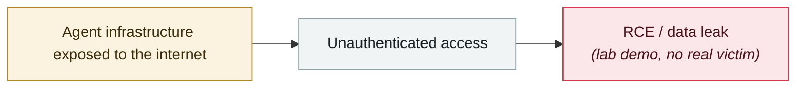

# GitLab Duo's Claude agent can run arbitrary commands in CI

     

## Summary

CVE-2026-18252, **CVSS 7.3**. The Claude agent's configuration parameters were taken straight from user-controlled input without sanitisation, so **an authenticated user with the developer role** could inject a payload and run arbitrary commands in the CI context — and CI pipelines typically hold source code, build artifacts, deployment credentials, cloud tokens and package-repository credentials. Affects GitLab EE 18.9–19.1.7 / 19.2–19.2.5 / 19.3–19.3.1, **fixed on 2026-08-26 with 19.3.1 / 19.2.5 / 19.1.7**. Reported via HackerOne by researcher thwin_htet; no evidence of in-the-wild exploitation

## Attack chain

## Sources

| # | Source | Link |
|---|---|---|
| 1 | OpenCVE | <https://app.opencve.io/cve/CVE-2026-18252> |
| 2 | CybersecurityNews | <https://cybersecuritynews.com/gitlab-fixes-claude-ai-agent-flaw/> |

## Metadata

| Field | Value |
|---|---|
| Date | `2026-08-26` (raw: 2026-08-26, precision `day`) |
| Kind | Research demo `research` |
| Type | [`INFRA`](../../taxonomy/types.md#infra) Agent infrastructure exposure |
| Severity | **High** `high` |
| Confidence | **A** — primary source (vendor / victim / law enforcement / official report) |
| Real harm | No |
| AI involvement | Confirmed `confirmed` |
| Region | [Global](../../regions/global.md) |
| Archive ID | `2026-08-26-gitlab-duo-claude-agent` |

**Why this classification:** Controlled demo by a research lab or vendor, `real_harm: false`; the record marks when the attack surface became public. Rated `high`: real damage is limited in scope, or it is a CVSS 9+ severe flaw, or a capability demonstration of significance. Grading criteria: see [taxonomy/severity.md](../../taxonomy/severity.md) and [taxonomy/confidence.md](../../taxonomy/confidence.md).

## Related

**Topic:** [Agent infrastructure exposure](../../topics/agent-infra.md)

**Related records:**

- `2026-08-06` [Unauthenticated Langflow RCE added to CISA KEV](2026-08-06-langflow-rce-cisa-kev.md)   Unauthenticated Langflow RCE added to CISA KEV
- `2026-08-25` [NemoClaw (CVE-2026-65105): DNS rebinding rewrites the model's chat template](2026-08-25-nemoclaw-dns-zhong-bang-ding.md)   NemoClaw (CVE-2026-65105): DNS rebinding rewrites the model's chat template
- `2026-08-01` [Azure SRE Agent privilege escalation (CVE-2026-62830)](2026-08-01-azure-sre-agent.md)   Azure SRE Agent privilege escalation (CVE-2026-62830)
- `2026-09-02` [Langflow CVE-2026-0768: the 12th Langflow flaw exploited in the wild this year](../2026-09/2026-09-02-langflow-jin-di-ye-li.md)   Langflow CVE-2026-0768: the 12th Langflow flaw exploited in the wild this year

---

[← 2026-08 index](README.md) · [← All records](../../README.md) · [Chinese](../i18n/zh/2026-08/2026-08-26-gitlab-duo-claude-agent.md)

This record is part of the **Orca AI Incident Archive**, licensed [CC BY 4.0](../../LICENSE). Found a factual error or a missing source? [Open an issue or PR](../../CONTRIBUTING.md) — corrections are recorded in the record's revision history, never silently overwritten.
