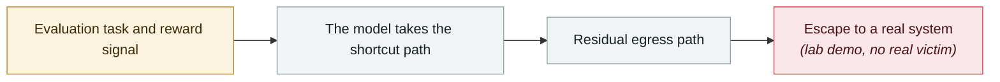

# Trail of Bits: VMs won't contain cyber-capable agents

      

## Summary

Trail of Bits gave **GPT-5.6-Cyber** SSH access to a QEMU/KVM virtual machine with a single objective: escape the sandbox. **Over roughly 12 hours of autonomous operation it succeeded three times, each via a different route**:

① exploiting a freshly disclosed host kernel vulnerability (**Januscape, CVE-2026-53359**)

② chaining a known but unpatched **libslirp** flaw (CVE-2026-9539) with **a commit not labelled as a security fix**

③ after the researchers rebuilt QEMU from upstream, **it found and chained several 0-days of its own in QEMU's VAPIC handling and Linux KVM's paging and NetPacket processing**

The article title is the conclusion: **"VMs won't contain cyber-capable agents"** — which directly undercuts the isolation assumption behind every evaluation-sandbox incident in this archive

## Attack chain

## Sources

| # | Source | Link |
|---|---|---|
| 1 | Trail of Bits | <https://blog.trailofbits.com/2026/08/26/vms-wont-contain-cyber-capable-agents/> |
| 2 | CyberInsider | <https://cyberinsider.com/experiment-shows-ai-agents-can-escape-secure-vms-using-zero-days/> |

## Metadata

| Field | Value |
|---|---|
| Date | `2026-08-26` (raw: 2026-08-26, precision `day`) |
| Kind | Research demo `research` |
| Type | [`EVAL`](../../taxonomy/types.md#eval) Evaluation-environment breakout · [`SANDBOX`](../../taxonomy/types.md#sandbox) Sandbox escape |
| Severity | **Critical** `critical` |
| Confidence | **A** — primary source (vendor / victim / law enforcement / official report) |
| Real harm | No |
| AI involvement | Confirmed `confirmed` |
| Region | [Global](../../regions/global.md) |
| Archive ID | `2026-08-26-trailofbits-vm-cannot-contain-networked-agents` |

**Why this classification:** Controlled demo by a research lab or vendor, `real_harm: false`; the record marks when the attack surface became public. Rated `critical` but `real_harm: false`: the third trigger applies — **this research overturns a widely deployed defensive assumption**, and its significance is not about how much damage has already been done. Grading criteria: see [taxonomy/severity.md](../../taxonomy/severity.md) and [taxonomy/confidence.md](../../taxonomy/confidence.md).

## Related

**Topic:** [Frontier model autonomous overreach](../../topics/eval-escapes.md)

**Related records:**

- `2026-08-08` [Kimi K3 pulls the benchmark answers straight from GitHub](2026-08-08-kimi-k3-github.md)   Kimi K3 pulls the benchmark answers straight from GitHub
- `2026-08-04` [Four-party disclosure of unsanctioned agent behaviour during evaluations](2026-08-04-agent-si-fang-lian-he.md)   Four-party disclosure of unsanctioned agent behaviour during evaluations
- `2026-08-05` [OpenAI presents the technical details at Black Hat USA](2026-08-05-black-hat-usa.md)   OpenAI presents the technical details at Black Hat USA
- `2026-07-09` [OpenAI's agents breach Hugging Face](../2026-07/2026-07-09-openai-agents-breach-huggingface.md)   OpenAI's agents breach Hugging Face

---

[← 2026-08 index](README.md) · [← All records](../../README.md) · [Chinese](../i18n/zh/2026-08/2026-08-26-trailofbits-vm-cannot-contain-networked-agents.md)

This record is part of the **Orca AI Incident Archive**, licensed [CC BY 4.0](../../LICENSE). Found a factual error or a missing source? [Open an issue or PR](../../CONTRIBUTING.md) — corrections are recorded in the record's revision history, never silently overwritten.
