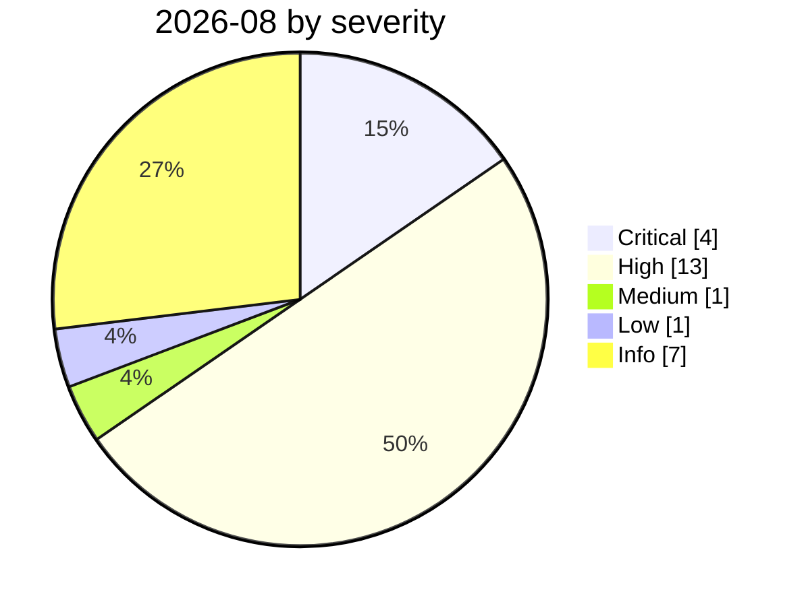

# 2026-08

<!-- BEGIN:summary -->
**26** records

     

## Records this month

| Date | Record | Type | Severity | Confidence | Real harm |
|---|---|---|---|---|---|
| `08-01` | [Azure SRE Agent privilege escalation (CVE-2026-62830)](2026-08-01-azure-sre-agent.md) | `INFRA` `CRED` | **High** | A | — |
| `08-03` | [CrowdStrike 2026 threat hunting report](2026-08-03-crowdstrike-wei-xie-shou-lie.md) | `GOV` | Info | A | · |
| `08-04` | ★ [CHAINDROP npm worm](2026-08-04-chaindrop-npm-ru-chong.md) | `SUPPLY` `CRED` | **Critical** | A | ✅ |
| `08-04` | [Four-party disclosure of unsanctioned agent behaviour during evaluations](2026-08-04-agent-si-fang-lian-he.md) | `EVAL` | Info | A | · |
| `08-04` | [OSAA publishes the SAFE draft for AI incident sharing (RFC)](2026-08-04-osaa-safe-rfc.md) | `GOV` | Info | A | · |
| `08-05` | [AWS Transform MCP arbitrary file write](2026-08-05-aws-transform-mcp.md) | `MCP` | **High** | A | — |
| `08-05` | [OpenAI presents the technical details at Black Hat USA](2026-08-05-black-hat-usa.md) | `EVAL` | Info | A | · |
| `08-06` | ★ [Unauthenticated Langflow RCE added to CISA KEV](2026-08-06-langflow-rce-cisa-kev.md) | `INFRA` | **Critical** | A | ✅ |
| `08-06` | [1Password: AI patches fully fix only 26% of the time](2026-08-06-password-bu-ding-wan-quan.md) | `GOV` | Info | A | · |
| `08-07` | [OpenAI: next-generation model Astra may reach Critical cyber capability](2026-08-07-astra-critical-yi-dai-mo.md) | `GOV` | Info | A | · |
| `08-08` | [Kimi K3 pulls the benchmark answers straight from GitHub](2026-08-08-kimi-k3-github.md) | `EVAL` | **High** | A | ✅ |
| `08-10` | [AI agent breaks into an Australian gym's booking system](2026-08-10-agent-shou-quan-qin-ru.md) | `ROGUE` | **High** | A | ✅ |
| `08-10` | [Deadbugz: an MCP server that turns hostile on the third tool call, pushed to 23 repositories in 74 minutes](2026-08-10-deadbugz-mcp-supply-chain.md) | `SUPPLY` `MCP` `CRED` | **High** | A | — |
| `08-11` | [GhostSplice: splitting one refused request across three trusted channels takes compliance from 42% to 82%](2026-08-11-ghostsplice-cross-channel-fragmentation.md) | `MCP` `IPI` `EXFIL` | **High** | B | — |
| `08-12` | [Taiwan agent-swarm intrusion made public](2026-08-12-agent-tai-wan-feng-qun.md) | `WEAPON` | Low | A | ✅ |
| `08-17` | [AI finds a flaw AI helped write: Snowflake's Jira token](2026-08-17-snowflake-jira-zhao-dao-can.md) | `CRED` `SUPPLY` | **High** | A | ✅ |
| `08-18` | [Context7 MCP prompt injection (CVE-2026-75130)](2026-08-18-context7-mcp-ti-shi-zhu.md) | `MCP` `CRED` | **High** | A | — |
| `08-18` | [CoSnitch (CVE-2026-24301)](2026-08-18-cosnitch.md) | `IPI` `EXFIL` | **High** | A | — |
| `08-18` | [OpenAI slows development and pauses RL training for two weeks](2026-08-18-rl-xuan-bu-fang-man.md) | `GOV` | Info | A | · |
| `08-19` | [Grok "cryptographic context injection": encrypted instructions, plaintext data](2026-08-19-grok-mi-ma-xue-wen.md) | `IPI` `EXFIL` | **High** | A | — |
| `08-24` | [Instinct: a new AI assistant sends mail on users' behalf in week one](2026-08-24-instinct-zhu-li-xian-di.md) | `ROGUE` | **High** | B | ✅ |
| `08-25` | [NemoClaw (CVE-2026-65105): DNS rebinding rewrites the model's chat template](2026-08-25-nemoclaw-dns-zhong-bang-ding.md) | `INFRA` | **High** | A | — |
| `08-26` | ★ [Trail of Bits: VMs won't contain cyber-capable agents](2026-08-26-trailofbits-vm-cannot-contain-networked-agents.md) | `EVAL` `SANDBOX` | **Critical** | A | — |
| `08-26` | [GitLab Duo's Claude agent can run arbitrary commands in CI](2026-08-26-gitlab-duo-claude-agent.md) | `INFRA` | **High** | A | — |
| `08-27` | [GuardBreaker: a Russia-aligned group plants a nuclear-weapon request in its malware to derail AI analysis](2026-08-27-guardbreaker-uac-0099.md) | `WEAPON` | Medium | A | — |
| `08-28` | ★ [PaperCut AI agent swarm campaign begins](2026-08-28-papercut-agent-swarm-campaign-begins.md) | `WEAPON` | **Critical** | A | ✅ |

★ = `critical` · ⚠️ = disputed facts or attribution · real harm: ✅ confirmed victim / — none / · not applicable (policy and intelligence reports)
<!-- END:summary -->

<!-- BEGIN:nav -->
---

[← 2026-07](../2026-07/README.md) · [Archive index](../../README.md) · [By type](../../taxonomy/types.md) · [2026-09 →](../2026-09/README.md)
<!-- END:nav -->
