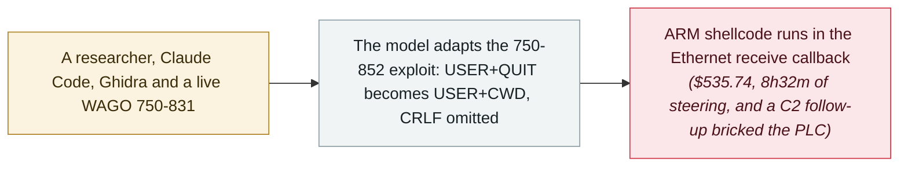

# Forescout ports a WAGO PLC exploit with Claude Code: $535.74, 8h32m, one bricked controller

     

## Summary

**Forescout Research (Vedere Labs)** uses **Claude Code** to port a working pre-authentication RCE exploit from one **WAGO PLC** model to another, executing attacker-supplied ARM shellcode on live hardware. The target is **CVE-2021-31886**, a stack-based buffer overflow in the Nucleus FTP server's handling of the `USER` command — CVSS 9.8, reachable before authentication on TCP port 21, with no firmware update available for the affected controllers. On the live 750-831 the model adapted a working 750-852 exploit — turning a `USER`+`QUIT` sequence into `USER`+`CWD` and omitting the CRLF terminator — and once code execution was established it moved from no-op shellcode to two working network payloads in **12 minutes**. But the port required sustained researcher steering, the final stage alone consumed **$535.74** in API usage (2.6k input and 1.3M output tokens) over an **8-hour-32-minute** session spread across days, and an attempt to extend the exploit into a C2 implant **bricked the PLC**. Forescout's own conclusion: the barrier is high today, but the trend line is clear

## Attack chain

## Details

**What was ported, and how.** Forescout had previously built a working RCE exploit for the **WAGO 750-852**; this exercise asked whether an AI could carry it across to the closely related **750-831** running firmware V01.04.16. The researchers supplied the existing exploit, a firmware binary for the new model, and the physical controller as a live target, and ran the work as interactive sessions with **Claude Code** that had a terminal, the reverse-engineering tool **Ghidra**, and the PLC itself. The work began on Claude **Sonnet 4.6** and moved to **Opus 4.6** after initial attempts stalled: on the 750-831, normal FTP processing zeroed 256 bytes at the attacker-controlled buffer, overwriting the injected shellcode before it could run. The model adapted the `USER`+`QUIT` sequence that worked against the 750-852 into a `USER`+`CWD` sequence, and omitting the CRLF terminator then *"prevented the relevant processing path from completing in the usual way"* — the buffer survived long enough for the payload to execute. Once code execution was established, Forescout says the model moved from working no-operation shellcode to two functional payloads in **12 minutes**: one sending ICMP echo requests to an attacker-controlled system, the other a UDP packet containing the string `PWNED`. The exploit runs in the Ethernet receive callback context, and the demonstrated capability stops at the point of sending network packets.

**What it cost, and what it says about the bar.** The headline number is the price of the final RCE-development stage: **$535.74** in API usage, based on 2.6k input and **1.3M output tokens**, across a session of **8 hours and 32 minutes** spread over several days — for a single exploit on a single target. Most of that time went into identifying the buffer-preservation problem. The exercise also needed continuous human judgement: *"guiding the AI through dead ends, supplying disassembly context, and correcting false leads."* And a later session that tried to extend the exploit into a command-and-control implant wrote to a flash-mapped memory region and permanently **bricked the PLC**. Forescout does not spin this: *"One could argue that the same researcher could have achieved the initial RCE port without AI in less time and at lower cost while also keeping the PLC alive."* Its assessment is that the barrier is high today — this is a constrained embedded target without source code or debugger access — but that the same progression that lowered the bar for higher-level software exploitation is beginning to reach low-level embedded systems.

**Why it is recorded here.** This is the archive's first record of an AI agent being directed at **operational-technology exploit development**, and it is recorded for the direction of travel rather than the demonstrated autonomy: researcher-steered, expensive, incomplete — and successful on live hardware. Forescout places it in a line that runs from generally available models finding bugs in open-source software, through what Google has described as the first known in-the-wild use of an AI-generated exploit for a zero-day (May 2026), to frontier models such as Mythos and GPT-5.5-Cyber that *"are now finding vulnerabilities at scale."* The archive takes the same caveat Forescout does: nothing here shows an agent deciding on its own to attack a controller. The more immediate risk it describes is an authorized agent taking the wrong action on a physical system where failure has real consequences.

## Sources

| # | Source | Link |
|---|---|---|
| 1 | Forescout Research (Vedere Labs) | <https://www.forescout.com/blog/can-ai-create-plc-attacks-yes-but-it%E2%80%99s-not-that-easy-yet/> |
| 2 | The Hacker News | <https://thehackernews.com/2026/09/researchers-use-claude-to-port-pre-auth.html> |
| 3 | Cloud Security Alliance | <https://labs.cloudsecurityalliance.org/research/csa-research-note-ai-assisted-plc-exploit-porting-20260902-c/> |

## Metadata

| Field | Value |
|---|---|
| Date | `2026-09-01` (raw: 2026-09-01, precision `day`) |
| Kind | Research demo `research` |
| Type | [`WEAPON`](../../taxonomy/types.md#weapon) Agent used as a weapon |
| Severity | **Medium** `medium` |
| Confidence | **A** — primary source: Forescout's own write-up, corroborated by The Hacker News and the Cloud Security Alliance |
| Real harm | No |
| AI involvement | Confirmed `confirmed` |
| Region | [Global](../../regions/global.md) |
| Archive ID | `2026-09-01-forescout-ai-plc-exploit-port` |

**Why this classification:** A live-hardware demonstration in which a researcher directs an AI agent to develop an exploit against a real OT target; recorded as `research` / `WEAPON` / `medium` with `real_harm: false`, because the exercise is researcher-driven, the demonstrated capability stops at sending network packets, and no in-the-wild use is claimed. Dated to Forescout's post (1 September 2026); The Hacker News and CSA followed on 2 September. Grading criteria: see [taxonomy/severity.md](../../taxonomy/severity.md) and [taxonomy/confidence.md](../../taxonomy/confidence.md).

## Related

**Topic:** [Offensive AI capability evolution](../../topics/offensive-ai.md)

**Related records:**

- `2026-09-08` [GTIG AI threat tracker: from prompting to autonomy](../2026-09/2026-09-08-gtig-prompting-to-autonomy.md)   The same week's state-of-the-art survey of adversarial AI, from prompting to agentic workflows
- `2026-05-12` [GTIG AI threat tracker, 2026 edition](../2026-05/2026-05-12-gtig-wei-xie-zhui-zong.md)   The May baseline this behaviour evolved from
- `2025-11-13` [GTG-1002: first AI-orchestrated cyber-espionage campaign](../2025-11/2025-11-13-gtg-1002-first-ai-orchestrated-espionage.md)   Where agent autonomy in offensive operations was first documented

---

[← 2026-09 index](README.md) · [← All records](../../README.md) · [Chinese](../i18n/zh/2026-09/2026-09-01-forescout-ai-plc-exploit-port.md)

This record is part of the **Orca AI Incident Archive**, licensed [CC BY 4.0](../../LICENSE). Found a factual error or a missing source? [Open an issue or PR](../../CONTRIBUTING.md) — corrections are recorded in the record's revision history, never silently overwritten.
