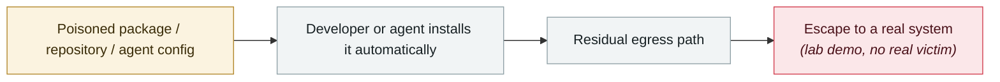

# GitSpawn: a malicious .git/config runs attacker code in 7 coding agents before the model is ever contacted

      

## Summary

**8 Git-configuration flaws** let a cloned repository run commands through **7 AI coding agents** (including Claude Code, Codex and Cursor), and **4 vendors had still not fixed them at disclosure time**.

The most dangerous property: **when certain commands are run inside a malicious repository, the attacker's code executes before "any prompt submitted, any model invoked, any tool approval, any trust prompt" — the command runs before the agent ever contacts the model**. The researchers demonstrated escalating a configuration-only credential leak into full RCE, harvesting 136 secrets

## Attack chain

## Sources

| # | Source | Link |
|---|---|---|
| 1 | THN | <https://thehackernews.com/2026/09/malicious-git-configs-can-make-claude.html> |

## Metadata

| Field | Value |
|---|---|
| Date | `2026-09-01` (raw: 2026-09-01, precision `day`) |
| Kind | Research demo `research` |
| Type | [`SUPPLY`](../../taxonomy/types.md#supply) Supply-chain poisoning · [`SANDBOX`](../../taxonomy/types.md#sandbox) Sandbox escape |
| Severity | **Critical** `critical` |
| Confidence | **A** — primary source (vendor / victim / law enforcement / official report) |
| Real harm | No |
| AI involvement | Confirmed `confirmed` |
| Region | [Global](../../regions/global.md) |
| Archive ID | `2026-09-01-gitspawn-git-config-pre-model-rce` |

**Why this classification:** Controlled demo by a research lab or vendor, `real_harm: false`; the record marks when the attack surface became public. Rated `critical` but `real_harm: false`: the third trigger applies — **this research overturns a widely deployed defensive assumption**, and its significance is not about how much damage has already been done. Grading criteria: see [taxonomy/severity.md](../../taxonomy/severity.md) and [taxonomy/confidence.md](../../taxonomy/confidence.md).

## Related

**Topic:** [Agent supply-chain poisoning](../../topics/agent-supply-chain.md) · [Frontier model autonomous overreach](../../topics/eval-escapes.md)

**Related records:**

- `2026-08-04` [CHAINDROP npm worm](../2026-08/2026-08-04-chaindrop-npm-ru-chong.md)   CHAINDROP npm worm
- `2026-08-26` [Trail of Bits: VMs won't contain cyber-capable agents](../2026-08/2026-08-26-trailofbits-vm-cannot-contain-networked-agents.md)   Trail of Bits: VMs won't contain cyber-capable agents
- `2026-08-17` [AI finds a flaw AI helped write: Snowflake's Jira token](../2026-08/2026-08-17-snowflake-jira-zhao-dao-can.md)   AI finds a flaw AI helped write: Snowflake's Jira token
- `2026-07-01` [DuneSlide: zero-click sandbox escape in Cursor](../2026-07/2026-07-01-duneslide-cursor-ling-dian-ji.md)   DuneSlide: zero-click sandbox escape in Cursor

---

[← 2026-09 index](README.md) · [← All records](../../README.md) · [Chinese](../i18n/zh/2026-09/2026-09-01-gitspawn-git-config-pre-model-rce.md)

This record is part of the **Orca AI Incident Archive**, licensed [CC BY 4.0](../../LICENSE). Found a factual error or a missing source? [Open an issue or PR](../../CONTRIBUTING.md) — corrections are recorded in the record's revision history, never silently overwritten.
