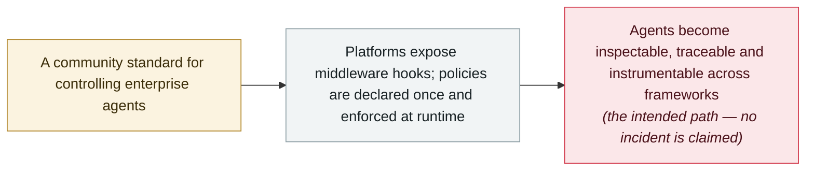

# OWASP publishes the Agent Control Standard and formally announces the 2026 LLM Top 10

     

## Summary

**The OWASP GenAI Security Project** publishes the **Agent Control Standard (ACS)** on 1 September — an open foundation for controlling enterprise agents, which the project says must be *“inspectable, traceable and instrumentable”*: showing what they are, what they can access, what they did and why. ACS defines how agent platforms expose **middleware hooks** and how safety policies can be enforced through them, enabling **declarative controls that are portable across agent frameworks and enforced at runtime**. It appears in the same September release round that formally announces the **OWASP GenAI LLM Top 10 2026** — a community guide developed with hundreds of AI security experts and grounded in thousands of real-world incidents, mapping risks to NIST, MITRE ATLAS, CWE and the OWASP Top 10 for Agentic Applications — whose resource page had already been online since **3 August**. Recorded as a governance marker: the control layer for agents is being standardised while the year's agent incidents accumulate, and this archive treats it as policy, not an incident

## Attack chain

## Details

**What the standard proposes.** ACS starts from a trust argument: *“Widescale adoption of AI agents depends on trust, and trust requires transparency and control. Enterprises cannot rely on black-box agents operating across cloud, SaaS, on-premises and endpoint environments.”* The mechanism it standardises is a middleware layer — hooks that agent platforms expose so that safety policies can be attached to an agent's actions and enforced while it runs, rather than only reviewed before deployment. The controls are **declarative** (expressed as policy, not code wired into each integration) and **portable across agent frameworks**, which is the part enterprises have lacked while agent tooling fragments: *“Together, transparency and standardized control provide the foundation for trustworthy agents at enterprise scale.”* The project notes the standard is now part of the OWASP GenAI Security Project. The CSA’s review of the release adds detail on what that makes ACS: a **donated** specification at **version 0.1**, built around an Agent Control System with “guardian agent” enforcement points, an observability layer using OpenTelemetry and OCSF, and an **Agent Bill of Materials (AgBOM)** in CycloneDX, SWID and SPDX formats — with instrumentation samples and further protocol support targeted for later versions.

**What shipped alongside it.** The same 1 September round carries the **GenAI Security Industry Framework Crosswalk**, which maps 51 GenAI vulnerabilities across four source lists to established governance and compliance frameworks. The round also formally announces the **OWASP GenAI LLM Top 10 2026** — “updated rankings, expanded threat coverage, and new research grounded in thousands of real-world AI security incidents”, developed by hundreds of experts and mapped to NIST, MITRE ATLAS, CWE and the OWASP Top 10 for Agentic Applications. One precision note: the Top 10's resource page has been live since **3 August**; the September dates in the announcement round refer to the formal launch, and this record is dated to the ACS release.

**How to read it.** This is a framework release, not an incident: `kind: policy`, `severity: info`, `real_harm: null`, and like the archive's other policy records it is excluded from incident counts. It is recorded because it marks the defensive side of the year's central lesson — that agent failures cluster at identity, permission and control boundaries rather than in model behaviour. The same week the standard appeared, Noma Labs published a design flaw (workflow identity hijacking) that is almost a worked example of what an enforced authorization boundary would have prevented.

## Sources

| # | Source | Link |
|---|---|---|
| 1 | OWASP Agent Control Standard (ACS) | <https://genai.owasp.org/resource/agent-control-standard-acs/> |
| 2 | OWASP GenAI LLM Top 10 2026 | <https://genai.owasp.org/resource/owasp-genai-llm-top-10-2026/> |
| 3 | OWASP GenAI Security Project — Resources Archive | <https://genai.owasp.org/resources/> |
| 4 | OWASP press release | <https://genai.owasp.org/2026/09/01/owasp-genai-security-project-unveils-2026-top-10-for-llm-applications-new-agent-control-standard-and-sponsors-as-community-tops-30000-members/> |
| 5 | Cloud Security Alliance | <https://labs.cloudsecurityalliance.org/research/csa-research-note-owasp-genai-top10-2026-agent-control-stand/> |

## Metadata

| Field | Value |
|---|---|
| Date | `2026-09-01` (raw: 2026-09-01, precision `day`) |
| Kind | Policy & regulation `policy` |
| Type | [`GOV`](../../taxonomy/types.md#gov) Governance & policy |
| Severity | **Info** `info` |
| Confidence | **A** — primary source: the standards body's own resource pages |
| Real harm | Not applicable |
| AI involvement | Confirmed `confirmed` |
| Region | [Global](../../regions/global.md) |
| Archive ID | `2026-09-01-owasp-agent-control-standard` |

**Why this classification:** A standards release with no incident attached — recorded as `kind: policy` / `GOV` / `info`, excluded from incident counts like the archive's other policy entries. Dated to the ACS resource page (1 September 2026); the LLM Top 10 2026 page carries 3 August as its own date and is described here as the same round's formal announcement. Grading criteria: see [taxonomy/severity.md](../../taxonomy/severity.md) and [taxonomy/confidence.md](../../taxonomy/confidence.md).

## Related

**Topic:** [Defense & governance](../../topics/defense.md)

**Related records:**

- `2026-09-09` [Workflow identity hijacking: Noma Labs turns an ordinary support email into privileged data access](../2026-09/2026-09-09-noma-workflow-identity-hijacking.md)   The design flaw an enforced authorization boundary would have prevented
- `2026-07-27` [NVIDIA convenes the Open Secure AI Alliance](../2026-07/2026-07-27-nvidia-open-secure-alliance.md)   Another defensive-side project from the same quarter
- `2026-07-17` [Anthropic, "A CISO's guide to agentic AI"](../2026-07/2026-07-17-anthropic-ciso-guide-agentic.md)   Vendor-side guidance on securing agent deployments

---

[← 2026-09 index](README.md) · [← All records](../../README.md) · [Chinese](../i18n/zh/2026-09/2026-09-01-owasp-agent-control-standard.md)

This record is part of the **Orca AI Incident Archive**, licensed [CC BY 4.0](../../LICENSE). Found a factual error or a missing source? [Open an issue or PR](../../CONTRIBUTING.md) — corrections are recorded in the record's revision history, never silently overwritten.
