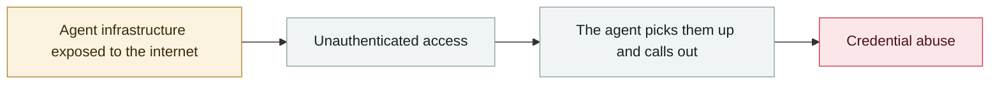

# Langflow CVE-2026-0768: the 12th Langflow flaw exploited in the wild this year

      

## Summary

Unauthenticated RCE, **executed with root privileges**, in the custom-component editor — the `validate` endpoint executes user-supplied Python from the `code` parameter without validation. A VulnCheck honeypot in the UK recorded **360 exploitation attempts, with traffic mainly from Russia**. The attackers looked specifically for environment variables: Langflow superuser credentials, AWS keys, **OpenAI API keys**, and also queried `/root/.cache/langflow/secret_key` and inspected `.ssh` and `.bash_history`.

💡 **This statistic deserves its own note**: this is the **12th Langflow flaw exploited in the wild in 2026**; and **before 2026 the platform had only a single known exploited flaw in its entire history**. Exploitation attempts against its CVE portfolio **already exceed 15,000 across 2026**

## Attack chain

## Sources

| # | Source | Link |
|---|---|---|
| 1 | BleepingComputer | <https://www.bleepingcomputer.com/news/security/critical-langflow-flaw-exploited-to-steal-openai-and-aws-keys/> |
| 2 | Security Affairs | <https://securityaffairs.com/198270/hacking/hackers-target-langflow-in-cve-2026-0768-attacks/> |
| 3 | CSA | <https://labs.cloudsecurityalliance.org/research/csa-research-note-langflow-ai-framework-credential-harvestin/> |

## Metadata

| Field | Value |
|---|---|
| Date | `2026-09-02` (raw: 2026-09-02, precision `day`) |
| Kind | Incident `incident` |
| Type | [`INFRA`](../../taxonomy/types.md#infra) Agent infrastructure exposure · [`CRED`](../../taxonomy/types.md#cred) Credential abuse |
| Severity | **Critical** `critical` |
| Confidence | **A** — primary source (vendor / victim / law enforcement / official report) |
| Real harm | Yes |
| AI involvement | Confirmed `confirmed` |
| Region | [Global](../../regions/global.md) |
| Archive ID | `2026-09-02-langflow-jin-di-ye-li` |

**Why this classification:** Real incident with a confirmed victim. Rated `critical`: confirmed real damage at the multi-organization / government / critical-infrastructure / supply-chain-worm level, or a first-of-its-kind capability milestone with real victims. Grading criteria: see [taxonomy/severity.md](../../taxonomy/severity.md) and [taxonomy/confidence.md](../../taxonomy/confidence.md).

## Related

**Topic:** [Agent infrastructure exposure](../../topics/agent-infra.md)

**Related records:**

- `2026-08-04` [CHAINDROP npm worm](../2026-08/2026-08-04-chaindrop-npm-ru-chong.md)   CHAINDROP npm worm
- `2026-08-06` [Unauthenticated Langflow RCE added to CISA KEV](../2026-08/2026-08-06-langflow-rce-cisa-kev.md)   Unauthenticated Langflow RCE added to CISA KEV
- `2026-08-25` [NemoClaw (CVE-2026-65105): DNS rebinding rewrites the model's chat template](../2026-08/2026-08-25-nemoclaw-dns-zhong-bang-ding.md)   NemoClaw (CVE-2026-65105): DNS rebinding rewrites the model's chat template
- `2026-08-01` [Azure SRE Agent privilege escalation (CVE-2026-62830)](../2026-08/2026-08-01-azure-sre-agent.md)   Azure SRE Agent privilege escalation (CVE-2026-62830)

---

[← 2026-09 index](README.md) · [← All records](../../README.md) · [Chinese](../i18n/zh/2026-09/2026-09-02-langflow-jin-di-ye-li.md)

This record is part of the **Orca AI Incident Archive**, licensed [CC BY 4.0](../../LICENSE). Found a factual error or a missing source? [Open an issue or PR](../../CONTRIBUTING.md) — corrections are recorded in the record's revision history, never silently overwritten.
