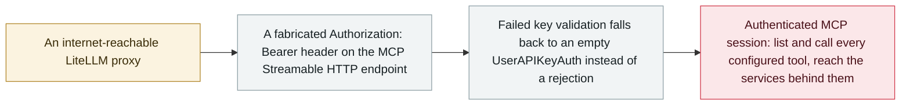

# Any bearer token opens LiteLLM's MCP endpoint: CVE-2026-59822 enters CISA KEV

      

## Summary

**CISA adds CVE-2026-59822 to the Known Exploited Vulnerabilities catalog** on 2 September, listing it as "BerriAI LiteLLM Improper Authentication Vulnerability" — one of seven flaws in that day's batch. The bug is in **LiteLLM's MCP Streamable HTTP endpoint**: when validation of a LiteLLM key fails, the OAuth2 passthrough fallback substitutes an **empty `UserAPIKeyAuth()` object instead of rejecting the request**, so any fabricated `Authorization: Bearer` header establishes an authenticated MCP session. From there an unauthenticated attacker can **list and call every configured MCP tool and reach the services behind them** — and LiteLLM is the component that holds the master keys and cloud credentials. All versions before **1.84.0** are affected; **CVSS 4.0 8.8** (CVSS 3.1 scores it 8.2), CWE-287. Federal remediation was due **16 September**. This is the second LiteLLM MCP flaw to reach KEV in 2026, after CVE-2026-42271 in June

## Attack chain

## Details

**A fallback that fails open.** LiteLLM is an AI gateway: one endpoint in front of many model providers, which is why it ends up holding the master key and the cloud credentials for everything behind it. Its MCP support exposes a Streamable HTTP endpoint so that agents can discover and call the MCP tools an operator has configured. That endpoint is supposed to require a LiteLLM key. It also supports OAuth2 passthrough, and the handler for that path had the classic fail-open shape: when key validation returned a rejection, the fallback did not stop the request, it replaced the rejected authentication context with **an empty `UserAPIKeyAuth()` object** and carried on. An empty auth object is, for everything downstream, an authenticated one. The practical exploit is a single fabricated header — any string after `Bearer` will do.

**What the session is worth.** MCP is a tool-calling protocol, so an authenticated MCP session is not read access to one API, it is the operator's whole configured tool surface: `tools/list` enumerates what has been wired up, and `tools/call` invokes it with the gateway's own privileges. Whatever an operator connected — repositories, ticketing systems, databases, internal HTTP services — is reachable through the same hole. This is the reason the archive treats gateway CVEs as agent-infrastructure incidents rather than ordinary web bugs: the component compromised is the one deliberately given credentials to everything else.

**Scale and exposure.** BerriAI fixed the fallback gating in **1.84.0** ([PR #26463](https://github.com/BerriAI/litellm/pull/26463), commit `73869f0`); every earlier release is affected. CISA's addition on 2 September set a federal remediation deadline of **16 September**. The scanning service FOFA reported more than 80,000 internet-facing LiteLLM surfaces at the time of the KEV listing — a secondary figure, and one that counts reachable interfaces rather than vulnerable ones, but an indication of the population.

**Not the first, and that is the point.** Some coverage framed this as the first MCP flaw to reach CISA KEV. It is not: **CVE-2026-42271**, a command injection in LiteLLM's *MCP test endpoints*, entered the catalog on [8 June 2026](../2026-06/2026-06-08-litellm-mcp-duan-dian-jie.md) and was chained with BadHost ([CVE-2026-48710](../2026-05/2026-05-28-badhost.md)) into unauthenticated RCE. The same 2 September KEV batch in fact carried CVE-2026-48710 as well. Two separately exploited authentication failures in one gateway's MCP surface inside four months is the finding worth recording, not a first.

## Sources

| # | Source | Link |
|---|---|---|
| 1 | CISA | <https://www.cisa.gov/news-events/alerts/2026/09/02/cisa-adds-seven-known-exploited-vulnerabilities-catalog> |
| 2 | OSV | <https://osv.dev/vulnerability/PYSEC-2026-3479> |
| 3 | GitHub Security Advisory | <https://github.com/BerriAI/litellm/security/advisories/GHSA-7488-6r32-c95q> |
| 4 | GitLab Advisory Database | <https://advisories.gitlab.com/pypi/litellm/CVE-2026-59822/> |
| 5 | The Hacker News | <https://thehackernews.com/2026/09/cisa-adds-seven-exploited-flaws-as.html> |

## Metadata

| Field | Value |
|---|---|
| Date | `2026-09-02` (raw: 2026-09-02, precision `day`) |
| Kind | Vulnerability disclosure `vulnerability` |
| Type | [`INFRA`](../../taxonomy/types.md#infra) Agent infrastructure exposure · [`MCP`](../../taxonomy/types.md#mcp) MCP and tool-chain |
| Severity | **High** `high` |
| Confidence | **A** — primary source: CISA, the upstream GitHub Security Advisory and OSV |
| Real harm | Yes |
| AI involvement | Confirmed `confirmed` |
| Region | [Global](../../regions/global.md) |
| Archive ID | `2026-09-02-litellm-mcp-auth-bypass-kev` |

**Why this classification:** A vulnerability disclosure, but `real_harm: true` — inclusion in CISA KEV means the agency has confirmed active exploitation in the wild, which is the archive's threshold for a disclosure to count as real damage. Rated `high` rather than `critical`: the flaw is severe and confirmed exploited, but no victim organisation has been named and no campaign has been attributed to it. Grading criteria: see [taxonomy/severity.md](../../taxonomy/severity.md) and [taxonomy/confidence.md](../../taxonomy/confidence.md).

## Related

**Topic:** [Agent infrastructure exposure](../../topics/agent-infra.md)

**Related records:**

- `2026-06-08` [LiteLLM CVE-2026-42271 MCP endpoint takeover](../2026-06/2026-06-08-litellm-mcp-duan-dian-jie.md)   The first LiteLLM MCP flaw to reach CISA KEV, three months earlier
- `2026-05-28` [BadHost (CVE-2026-48710)](../2026-05/2026-05-28-badhost.md)   The Starlette header bypass chained with LiteLLM, added to KEV in the same 2 September batch
- `2026-08-06` [Unauthenticated Langflow RCE added to CISA KEV](../2026-08/2026-08-06-langflow-rce-cisa-kev.md)   The same pattern in a neighbouring agent platform
- `2026-09-02` [Langflow CVE-2026-0768: the 12th Langflow flaw exploited in the wild this year](2026-09-02-langflow-jin-di-ye-li.md)   Disclosed the same day

---

[← 2026-09 index](README.md) · [← All records](../../README.md) · [Chinese](../i18n/zh/2026-09/2026-09-02-litellm-mcp-auth-bypass-kev.md)

This record is part of the **Orca AI Incident Archive**, licensed [CC BY 4.0](../../LICENSE). Found a factual error or a missing source? [Open an issue or PR](../../CONTRIBUTING.md) — corrections are recorded in the record's revision history, never silently overwritten.
