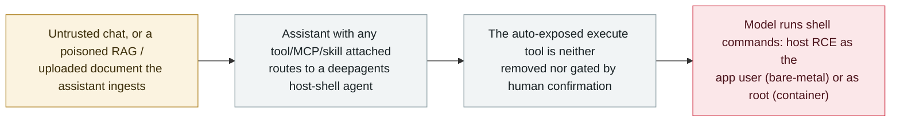

# MaxKB CVE-2026-77521: a prompt-injectable agent runs shell commands on the host (CVSS 10.0)

      

## Summary

**CVE-2026-77521 (CVSS 3.1 **10.0**): any MaxKB assistant with a tool, MCP tool, skill or sub-application attached routes chat through a `deepagents` agent built on a host-shell backend (`SandboxShellBackend`) that auto-exposes an `execute` shell tool MaxKB never removes or gates.** The advisory's own words: *"Untrusted chat - or indirect prompt injection via content the assistant ingests (RAG / uploaded documents) - can therefore drive the model to run shell commands."* On a bare-metal deployment `MAXKB_SANDBOX` is off by default, so `execute` runs commands directly on the host as the application user (remote code execution); on the official image the container runs as root (no `USER` directive) and the sandbox wrapper is bypassable. GHSA-f36j-f34j-h3rx, weaknesses **CWE-78 / CWE-250 / CWE-749**, reported by **Lasso Security**; affected `<= 2.10.3-lts`, fixed in **v2.10.5-lts**. No exploitation in the wild is recorded. Recorded `vulnerability` / `IPI` + `INFRA` / `high` / `real_harm: false` — the archive's second MaxKB record from this September batch, alongside the tool-permission bypass (`2026-09-02`, CVE-2026-77516).

## Attack chain

## Details

**The advisory.** MaxKB's GitHub security advisory **GHSA-f36j-f34j-h3rx**, *"Prompt-injectable agent can lead to command execution,"* covers MaxKB `<= 2.10.3-lts` (the maintainers note the vulnerable path likely predates that and affects all versions that build chat agents on `deepagents` + `SandboxShellBackend`). The chain, in the advisory's terms: any assistant with a tool, MCP tool, skill or sub-application attached enters the agent path (`base_chat_node.py:409`); the agent is built with `SandboxShellBackend`, which *"auto-adds `execute` + fs tools"*; MaxKB does not remove it (`excluded_tools` is unused) and does not gate it (`interrupt_on` covers only `write_file` / `read_file` / `edit_file`, **never `execute`**). So untrusted chat, or **indirect prompt injection via ingested content (RAG or uploaded documents)**, can make the model run shell commands.

**Why the impact reaches the host.** Containment depends entirely on `MAXKB_SANDBOX`. On a source / bare-metal deployment it defaults **off**, so `execute` runs *"directly on the host as the application user (remote code execution)."* On the official image the sandbox is compiled but, as the advisory documents, the container has **no `USER` directive and runs as root (UID 0)**, and the sandbox wrapper is separately bypassable — so even the "contained" configuration crosses to host and, with `S:C` (scope changed), to other tenants and reachable internal services. CVSS 3.1 base **10.0** (`AV:N/AC:L/PR:N/UI:N/S:C/C:H/I:H/A:H`) for the public / embedded anonymous-assistant case; weaknesses **CWE-78** (OS command injection), **CWE-250** (execution with unnecessary privileges) and **CWE-749** (exposed dangerous method). Credited to **Lasso Security**. Fixed in **v2.10.5-lts**.

**Why the archive records it.** This is the sharp end of the same surface as the archive's other MaxKB entry from this batch: there, the agent dispatch path was a second door around per-tool authorization ([CVE-2026-77516](2026-09-02-maxkb-tool-permission-bypass.md)); here, the agent path exposes a shell that untrusted input can drive to code execution. It is the recurring agent-platform failure — a capability wired into the agent that the product never constrained — carried all the way to host RCE, and it is reachable by indirect prompt injection, not only by a logged-in user, which is why the record carries both `IPI` and `INFRA`.

**Grading.** `vulnerability` / `real_harm: false` — a maintainer-disclosed flaw, fixed in v2.10.5-lts, with no known exploitation in the wild. Severity **high** under the archive's ladder: a severe flaw at CVSS 9+ is graded `high` even without in-the-wild exploitation, and `critical` is reserved for confirmed real damage or a first-of-its-kind milestone with a real victim. Confidence **A**: the maintainer's advisory plus the NVD record.

## Sources

| # | Source | Link |
|---|---|---|
| 1 | MaxKB security advisory GHSA-f36j-f34j-h3rx | <https://github.com/1Panel-dev/MaxKB/security/advisories/GHSA-f36j-f34j-h3rx> |
| 2 | NVD — CVE-2026-77521 | <https://nvd.nist.gov/vuln/detail/CVE-2026-77521> |

## Metadata

| Field | Value |
|---|---|
| Date | `2026-09-02` (raw: GHSA 2026-09-02 / NVD 2026-09-21, precision `day`) |
| Kind | Vulnerability disclosure `vulnerability` |
| Type | [`IPI`](../../taxonomy/types.md#ipi) [`INFRA`](../../taxonomy/types.md#infra) |
| Severity | **High** `high` |
| Confidence | **A** — maintainer advisory (GHSA) plus the NVD record |
| Real harm | No — fixed in v2.10.5-lts, no known exploitation |
| AI involvement | Confirmed `confirmed` |
| Region | [Global](../../regions/global.md) |
| Archive ID | `2026-09-02-maxkb-prompt-injection-command-execution` |

**Why this classification:** the agent's own runtime exposes an ungated shell tool (`INFRA`) that external, ingested content can drive to execution (`IPI`, via RAG / uploaded documents). `vulnerability` + `real_harm: false` because it was disclosed and patched with no known exploitation. `high` rather than `critical` under the archive's ladder — a CVSS 9+ flaw with no confirmed damage; `critical` needs confirmed harm or a first-of-its-kind milestone with a real victim. Dated to the GitHub advisory (2 September 2026); NVD listed it on 21 September. Grading criteria: [severity.md](../../taxonomy/severity.md) and [confidence.md](../../taxonomy/confidence.md).

## Related

**Topic:** [Agent infrastructure exposure (INFRA)](../../topics/agent-infra.md)

**Related records:**

- `2026-09-02` [MaxKB: the agent dispatch path lets a user denied a tool still call it and read its credentials](2026-09-02-maxkb-tool-permission-bypass.md)   The same September MaxKB advisory batch — the authorization side of the same agent path
- `2026-08-04` [Zammad: crafted text in an AI Agent field bypasses the sanitizer and runs commands](../2026-08/2026-08-04-zammad-ai-agent-template-rce.md)   Another agent-platform flaw where the agent's own configuration reaches server command execution
- `2026-09-23` [IBM FTM: unauthenticated RAG poisoning could steer the payment agent's MCP tools](2026-09-23-ibm-ftm-rag-poisoning.md)   Also reached through ingested content the agent trusts

---

[← 2026-09 index](README.md) · [← All records](../../README.md) · [Chinese](../i18n/zh/2026-09/2026-09-02-maxkb-prompt-injection-command-execution.md)

This record is part of the **Orca AI Incident Archive**, licensed [CC BY 4.0](../../LICENSE). Found a factual error or a missing source? [Open an issue or PR](../../CONTRIBUTING.md) — corrections are recorded in the record's revision history, never silently overwritten.
