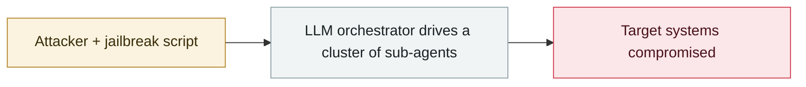

# Unit 42: AI agents compress two weeks of intrusion work into 10 hours

     

## Summary

The intrusion was carried out with frontier models + agent frameworks, using **known techniques across 50+ MITRE ATT&CK categories rather than zero-days** — the AI advantage is the efficiency of automating the standard attack workflow

## Attack chain

## Sources

| # | Source | Link |
|---|---|---|
| 1 | Yasashii Cybersecurity (via Unit 42) | <https://yasashii-cybersecurity.com/ai-three-incidents-2026-09/> |

## Metadata

| Field | Value |
|---|---|
| Date | `2026-09-02` (raw: 2026-09-02, precision `day`) |
| Kind | Threat report `report` |
| Type | [`WEAPON`](../../taxonomy/types.md#weapon) Agent used as a weapon |
| Severity | **Info** `info` |
| Confidence | **A** — primary source (vendor / victim / law enforcement / official report) |
| Real harm | n/a |
| AI involvement | Confirmed `confirmed` |
| Region | [Global](../../regions/global.md) · [Japan](../../regions/jp.md) |
| Archive ID | `2026-09-02-unit-agent-liang-ru-qin` |

**Why this classification:** Threat intelligence report covering several incidents; it is not counted as a single incident itself, so `severity` is recorded as `info`. Grading criteria: see [taxonomy/severity.md](../../taxonomy/severity.md) and [taxonomy/confidence.md](../../taxonomy/confidence.md).

## Related

**Topic:** [Offensive AI capability evolution](../../topics/offensive-ai.md)

**Related records:**

- `2026-09-11` [Claude used to scan 1.8 million Android apps for secrets](2026-09-11-claude-scans-18m-android-apks.md)   Claude used to scan 1.8 million Android apps for secrets
- `2026-09-10` [Anthropic September threat intelligence report](2026-09-10-anthropic-september-threat-report.md)   Anthropic September threat intelligence report
- `2026-09-15` [PaperCut AI agent swarm attack made public](2026-09-15-papercut-agent-swarm-disclosed.md)   PaperCut AI agent swarm attack made public
- `2026-08-28` [PaperCut AI agent swarm campaign begins](../2026-08/2026-08-28-papercut-agent-swarm-campaign-begins.md)   PaperCut AI agent swarm campaign begins

---

[← 2026-09 index](README.md) · [← All records](../../README.md) · [Chinese](../i18n/zh/2026-09/2026-09-02-unit-agent-liang-ru-qin.md)

This record is part of the **Orca AI Incident Archive**, licensed [CC BY 4.0](../../LICENSE). Found a factual error or a missing source? [Open an issue or PR](../../CONTRIBUTING.md) — corrections are recorded in the record's revision history, never silently overwritten.
