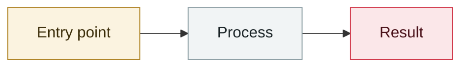

# Japan: shadow AI exposes health data on 726 people

     

## Summary

Employees fed business data into an **unapproved** generative AI service. It involved **726 people** at a local civil-servant credit union: names, dates of birth and **health conditions (hypertension, diabetes, dyslipidaemia)**. The incident occurred **2026-08-20** and was disclosed 09-04

## Attack chain

## Sources

| # | Source | Link |
|---|---|---|
| 1 | RIZAP advisory / Security NEXT (relayed) | <https://yasashii-cybersecurity.com/ai-three-incidents-2026-09/> |

## Metadata

| Field | Value |
|---|---|
| Date | `2026-09-04` (raw: 2026-09-04, precision `day`) |
| Kind | Incident `incident` |
| Type | [`OTHER`](../../taxonomy/types.md#other) Other |
| Severity | **High** `high` |
| Confidence | **A** — primary source (vendor / victim / law enforcement / official report) |
| Real harm | Yes |
| AI involvement | Confirmed `confirmed` |
| Region | [Japan](../../regions/jp.md) |
| Archive ID | `2026-09-04-ying-zi-zhi-ren-jian` |

**Why this classification:** Real incident with a confirmed victim. Rated `high`: real damage is limited in scope, or it is a CVSS 9+ severe flaw, or a capability demonstration of significance. Grading criteria: see [taxonomy/severity.md](../../taxonomy/severity.md) and [taxonomy/confidence.md](../../taxonomy/confidence.md).

---

[← 2026-09 index](README.md) · [← All records](../../README.md) · [Chinese](../i18n/zh/2026-09/2026-09-04-ying-zi-zhi-ren-jian.md)

This record is part of the **Orca AI Incident Archive**, licensed [CC BY 4.0](../../LICENSE). Found a factual error or a missing source? [Open an issue or PR](../../CONTRIBUTING.md) — corrections are recorded in the record's revision history, never silently overwritten.
