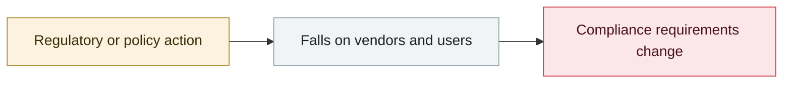

# Japan's IPA publishes the August 2026 AI Security Bulletin

     

## Summary

**58 pages**; the first edition to add "AI safety" as a fourth perspective, formally listing the **"deviant AI agent" as a new threat-actor type**

## Attack chain

## Sources

| # | Source | Link |
|---|---|---|
| 1 | IPA | <https://www.ipa.go.jp/digital/ai/security/ai-security-bulletin.html> |

## Metadata

| Field | Value |
|---|---|
| Date | `2026-09-07` (raw: 2026-09-07, precision `day`) |
| Kind | Policy & regulation `policy` |
| Type | [`GOV`](../../taxonomy/types.md#gov) Governance & policy |
| Severity | **Info** `info` |
| Confidence | **A** — primary source (vendor / victim / law enforcement / official report) |
| Real harm | n/a |
| AI involvement | Confirmed `confirmed` |
| Region | [Japan](../../regions/jp.md) |
| Archive ID | `2026-09-07-ipa-fa-bu-duan-xin` |

**Why this classification:** Policy / regulatory action, not counted in incident statistics; `severity` is recorded as `info`. Grading criteria: see [taxonomy/severity.md](../../taxonomy/severity.md) and [taxonomy/confidence.md](../../taxonomy/confidence.md).

## Related

**Topic:** [Defense & governance](../../topics/defense.md)

**Related records:**

- `2026-09-03` [US senators introduce the Ban Artificial Superintelligence Act](2026-09-03-ban-artificial-superintelligence-act.md)   US senators introduce the Ban Artificial Superintelligence Act
- `2026-09-05` [OpenAI formally acknowledges the "wiki incident", promises a disclosure framework](2026-09-05-wiki-zheng-shi-cheng-ren.md)   OpenAI formally acknowledges the "wiki incident", promises a disclosure framework
- `2026-09-01` ["88% of organisations hit a confirmed or suspected AI agent security incident this year"](2026-09-01-agent-zu-zhi-guo-qu.md)   "88% of organisations hit a confirmed or suspected AI agent security incident this year"
- `2026-08-03` [CrowdStrike 2026 threat hunting report](../2026-08/2026-08-03-crowdstrike-wei-xie-shou-lie.md)   CrowdStrike 2026 threat hunting report

---

[← 2026-09 index](README.md) · [← All records](../../README.md) · [Chinese](../i18n/zh/2026-09/2026-09-07-ipa-fa-bu-duan-xin.md)

This record is part of the **Orca AI Incident Archive**, licensed [CC BY 4.0](../../LICENSE). Found a factual error or a missing source? [Open an issue or PR](../../CONTRIBUTING.md) — corrections are recorded in the record's revision history, never silently overwritten.
