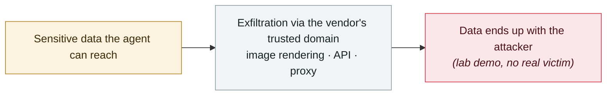

# ChatGPT sandbox flaw pipes a victim's Gmail data into the attacker's account

     

## Summary

Check Point Research (work dated **2026-06**): a weakness in the ChatGPT **code-execution sandbox** — **every container can reach the same internal JFrog Artifactory instance OpenAI uses for package management**, forming a covert channel. The attacker buries instructions in a shared conversation, a malicious prompt or a custom GPT configuration; the victim's session then carries out the hidden task while handling a normal request, sending data from connected apps to the attacker **without showing it in the chat output** and **with no confirmation prompt at all**.

The impact is not limited to Gmail — everything the victim's session has authorised (Google Drive, Microsoft Teams, GitHub connectors) is in scope. **The only visible sign is a small "Talked to Gmail" label logged after the fact**. OpenAI has fixed it and taken the internal service involved offline.

💡 **Note: JFrog Artifactory was also the egress for the 2026-07 OpenAI agent escape** — the same component has been a weak point in AI infrastructure twice within six months

## Attack chain

## Sources

| # | Source | Link |
|---|---|---|
| 1 | THN | <https://thehackernews.com/2026/09/chatgpt-flaw-let-planted-prompt-send.html> |
| 2 | CSO Online | <https://www.csoonline.com/article/4220203/chatgpt-flaw-lets-attackers-pull-gmail-data-across-accounts-via-a-hidden-channel.html> |

## Metadata

| Field | Value |
|---|---|
| Date | `2026-09-08` (raw: 2026-09-08, precision `day`) |
| Kind | Research demo `research` |
| Type | [`EXFIL`](../../taxonomy/types.md#exfil) Data exfiltration |
| Severity | **High** `high` |
| Confidence | **A** — primary source (vendor / victim / law enforcement / official report) |
| Real harm | Yes |
| AI involvement | Confirmed `confirmed` |
| Region | [Global](../../regions/global.md) |
| Archive ID | `2026-09-08-chatgpt-gmail-sha-xiang-que` |

**Why this classification:** Controlled demo by a research lab or vendor, `real_harm: false`; the record marks when the attack surface became public. Rated `high`: real damage is limited in scope, or it is a CVSS 9+ severe flaw, or a capability demonstration of significance. Grading criteria: see [taxonomy/severity.md](../../taxonomy/severity.md) and [taxonomy/confidence.md](../../taxonomy/confidence.md).

## Related

**Topic:** [Zero-click data exfiltration chain](../../topics/zero-click-exfil.md)

**Related records:**

- `2026-08-19` [Grok "cryptographic context injection": encrypted instructions, plaintext data](../2026-08/2026-08-19-grok-mi-ma-xue-wen.md)   Grok "cryptographic context injection": encrypted instructions, plaintext data
- `2026-08-18` [CoSnitch (CVE-2026-24301)](../2026-08/2026-08-18-cosnitch.md)   CoSnitch (CVE-2026-24301)
- `2026-07-07` [GitLost: GitHub Agentic Workflows leak private repositories](../2026-07/2026-07-07-gitlost-github-agentic-workflows.md)   GitLost: GitHub Agentic Workflows leak private repositories
- `2026-06-15` [SearchLeak (CVE-2026-42824)](../2026-06/2026-06-15-searchleak.md)   SearchLeak (CVE-2026-42824)

---

[← 2026-09 index](README.md) · [← All records](../../README.md) · [Chinese](../i18n/zh/2026-09/2026-09-08-chatgpt-gmail-sha-xiang-que.md)

This record is part of the **Orca AI Incident Archive**, licensed [CC BY 4.0](../../LICENSE). Found a factual error or a missing source? [Open an issue or PR](../../CONTRIBUTING.md) — corrections are recorded in the record's revision history, never silently overwritten.
