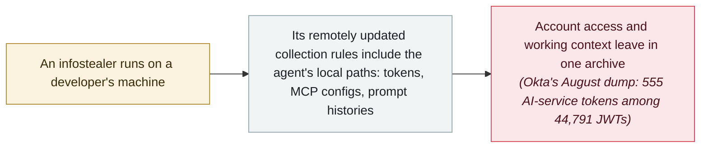

# Infostealers turn to AI-agent data: collection rules now target Claude, Cursor and Codex

      

## Summary

**Gen Digital** publishes an analysis of recent information-stealer collection rules and finds a new target list: local data belonging to AI coding agents and developer tools — **Claude, Cline, Codex, Continue, Cursor, OpenCode** and others. The targeting is not experimental. Over a three-month window, its telemetry recorded **Amatera** (Cline, Continue) and **Remus** (Claude, Cursor, OpenCode) detections among tens of thousands of protected users; **CallbackBeaver** has added Cursor and Claude to its collection scope with more than **5,000 samples in 30 days**, and BeeStealer, STG, HydraStealer, APEX and Otter show the behaviour spreading, with **Djinn** doing the same on macOS. What is collected is not preferences but **access and context**: access and refresh **tokens**, credentials stored in **MCP configurations**, prompt histories, conversation databases and traces of the projects a developer worked on. The following day, **Okta's threat-intelligence team** showed the same market from the buyer's side — a free 7 GB log dump from **5,871 infected machines** contained **555 tokens tied to AI services** among 44,791 JWTs, and 24 still-valid AI API keys

## Attack chain

## Details

**The collection rules changed.** Gen Digital's starting observation is simple: alongside the familiar browser, wallet and credential targets, stealers' rule sets now include *“local data associated with Claude, Cline, Codex, Continue, Cursor, OpenCode, and other AI-assisted development tools.”* The evidence is spread across families and platforms. Amatera collects Cline and Continue data; Remus collects Claude, Cursor and OpenCode; CallbackBeaver, a fast-emerging stealer, added Cursor and Claude and was seen in more than 5,000 samples in a 30-day window; lower-prevalence families (BeeStealer, STG Stealer, HydraStealer, APEX Stealer, Otter Stealer) show the behaviour is not one group's specialty; and on macOS, Djinn collects from Claude, Codex, Gemini, Cline, OpenCode and Kilo. Gen Digital's summary of the pace: *“AI agent data appearing in the collection rules of another stealer almost every day.”* The scale context: in the first half of 2026 its telemetry recorded infostealer detections among more than **3.3 million** unique protected users, with monthly figures consistently above **500,000** — figures that describe detections of all stealers, not infections caused by these rules.

**Access and context in the same archive.** What an agent's local directory holds differs by product, but the material falls into two categories. The first is **account access**: cached access tokens that work until they expire, refresh tokens that can extend the window, and credentials embedded in MCP configuration files — endpoints, headers, environment variables, API keys. The second is **context**: prompts and transcripts that may contain proprietary source code, internal hostnames, pasted secrets, or the shape of unfinished work, plus the account details and file histories that profile the user. Gen Digital's framing: *“a browser cookie can open a door, but an AI-agent archive may also tell the attacker whose door it is, which projects are behind it, and which connected systems may be reachable from the same workspace.”* The caveats are stated: a stolen token's value depends on scope, lifetime and the service's controls, and short-lived credentials or OS-protected storage limit what a stolen configuration unlocks. The cost of expansion is trivial — most stealers take remotely managed collection rules, so adding a new agent's path needs no new malware build, only a configuration update.

**The following day, from the buyer's side.** On 9 September, Okta's threat-intelligence team (Jeremy Kirk) published an analysis of a 7 GB infostealer log dump released for free on Telegram on 2 August, covering 5,871 folders — each an infected machine — across 162 countries. Using pattern matching and the secret-scanner TruffleHog, it counted **44,791 unique JWTs**, of which **555 were tied to authentication for AI services**; the dataset also held **24 still-valid API keys** spanning Google Gemini, OpenAI, Groq and OpenRouter. Newer stealers, Okta writes, *“have added explicit regex or glob rules for Anthropic or OpenAI style API keys and known AI-tool config paths.”* The motive is direct: *“a stolen LLM API key is easy to monetize, allowing a buyer to run inference on someone else's tab.”* Okta is precise about what its data does and does not show — it describes tokens present in a criminal dump and their replayability, not observed account takeovers, and the financial-loss figures it cites (about $1 million, $25,000 and $600,000 in unauthorized usage) come from separately reported incidents.

**How this record reads it.** Nothing here is a new way to compromise a machine — the stealer is already running; what changed is that AI-agent credentials became predictable, valuable local files, and the criminal market adjusted in weeks. Both vendors state their limits, and this record keeps them: `real_harm: false` because the compile concerns a capability trend rather than a named victim of the AI-agent rules, `medium` severity because the underlying data — reusable tokens and MCP credentials — is genuinely sensitive, and the trend is one-way.

## Sources

| # | Source | Link |
|---|---|---|
| 1 | Gen Digital | <https://www.gendigital.com/blog/insights/research/infostealers-your-ai-agent> |
| 2 | Okta Threat Intelligence | <https://www.okta.com/blog/threat-intelligence/signing_in_without_actually_signing_in/> |
| 3 | The Hacker News | <https://thehackernews.com/2026/09/infostealer-logs-expose-replayable-ai.html> |
| 4 | Cloud Security Alliance | <https://labs.cloudsecurityalliance.org/research/csa-research-note-infostealer-ai-token-replay-20260911-csa-s/> |

## Metadata

| Field | Value |
|---|---|
| Date | `2026-09-08` (raw: 2026-09-08, precision `day`) |
| Kind | Research demo `research` |
| Type | [`CRED`](../../taxonomy/types.md#cred) Credential abuse · [`EXFIL`](../../taxonomy/types.md#exfil) Data exfiltration |
| Severity | **Medium** `medium` |
| Confidence | **A** — primary sources: Gen Digital's own telemetry analysis and Okta's own log-dump analysis, with an independent CSA review |
| Real harm | No |
| AI involvement | Confirmed `confirmed` |
| Region | [Global](../../regions/global.md) |
| Archive ID | `2026-09-08-gen-digital-infostealers-ai-agent-data` |

**Why this classification:** Both primary sources are first-hand vendor analyses of their own telemetry; the behaviour is real and measured, but no specific victim of the new AI-agent collection rules is named, so `real_harm: false` with `medium` severity. Okta's cross-dump evidence is folded in here rather than recorded separately — it measures the same week's market with data (a passing remark about AI-tool config paths is not a record on its own). Dated to Gen Digital's post (8 September 2026); Okta followed on 9 September. Grading criteria: see [taxonomy/severity.md](../../taxonomy/severity.md) and [taxonomy/confidence.md](../../taxonomy/confidence.md).

## Related

**Topic:** [Agent infrastructure exposure](../../topics/agent-infra.md)

**Related records:**

- `2026-05-13` [OpenAI staff devices compromised via the TanStack incident](../2026-05/2026-05-13-tanstack-yuan-gong-she-bei.md)   When a developer machine's stolen credentials travelled into an AI organisation
- `2026-06-24` [Operation Endgame (Europol) takes down StealC and Amadey](../2026-06/2026-06-24-operation-endgame-europol-stealc.md)   The takedown wave this commodity market rebuilt after
- `2026-08-19` [Grok "cryptographic context injection": encrypted instructions, plaintext data](../2026-08/2026-08-19-grok-mi-ma-xue-wen.md)   Another path from a developer's local context to credential exposure

---

[← 2026-09 index](README.md) · [← All records](../../README.md) · [Chinese](../i18n/zh/2026-09/2026-09-08-gen-digital-infostealers-ai-agent-data.md)

This record is part of the **Orca AI Incident Archive**, licensed [CC BY 4.0](../../LICENSE). Found a factual error or a missing source? [Open an issue or PR](../../CONTRIBUTING.md) — corrections are recorded in the record's revision history, never silently overwritten.
