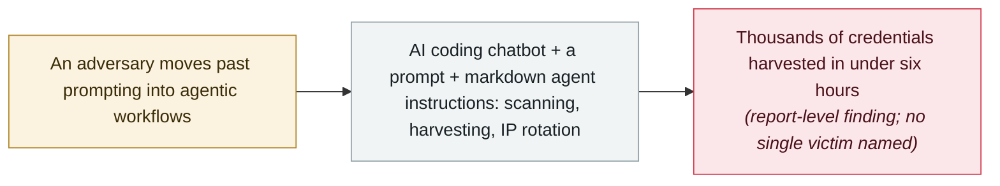

# GTIG AI threat tracker: from prompting to autonomy

     

## Summary

**Google Threat Intelligence Group (GTIG)** publishes its Q2 2026 **AI Threat Tracker**, describing how *“forward leaning adversaries transition from basic prompting to agentic AI workflows and AI-enabled automation.”* The cases span the ladder. **UNC6780** compromises developer accounts to publish trojanised forks of legitimate MCP servers — such as `tiktoken_mcp` — to PyPI, and its **DUSTMAKER** stealer extracts OIDC tokens from GitHub Actions runners to publish backdoored packages *“with valid, cryptographically signed SLSA Build 3 attestations”* that *“will pass AI coding agent automated trust checks.”* A suspected financially motivated actor used an AI coding chatbot, a prompt and preconfigured markdown agent instructions to plan and run a **mass credential-harvesting campaign in under six hours** — thousands of credentials, stolen from victim cloud infrastructure, with autonomous scanning, troubleshooting and IP rotation. State-linked groups run throughout: PRC-nexus **UNC6508** targets proprietary AI research, DPRK's **MIDNIGHT NEPTUNE** and Iran's **CALANQUE ION** embed commercial LLMs across operations, and GTIG disrupted a China-based actor that used Gemini to design an automated penetration-testing framework. The tracker also records the year's **LLMJacking** market — stolen AI accounts and hijacked compute — and LLM refusal bait: DUSTMAKER loaders open with biological- and nuclear-weapons text *“likely intended to cause LLM security scanners to fail or skip analysis.”*

## Attack chain

## Details

**The framing: prompting is over.** GTIG's baseline is its own May 2026 report on adversarial AI misuse; this tracker reports what changed since. *“Since the release of our May 2026 report… GTIG has observed forward leaning adversaries transition from basic prompting to agentic AI workflows and AI-enabled automation.”* The headline consequence is speed: agents compress the traditional window defenders have to respond, and the report's Q2 trend list reads as a map of where that shows up — accelerating software supply-chain risk around AI coding tooling, direct targeting of proprietary AI assets (“model weights to cloud compute quotas”), agentic automation of attack stages, and AI as a force multiplier across the lifecycle. The report is explicit about the limit: *“GTIG has not yet observed threat actors deploying fully autonomous pipelines against targets in the wild,”* describing instead *“a gradual maturation of tradecraft and layering of AI capabilities.”*

**The supply chain: UNC6780 and DUSTMAKER.** UNC6780's play is *“multiple tactics to trick AI coding assistants and large language model (LLM) security scanners”*: it compromises legitimate developer accounts and publishes trojanised forks of real MCP servers (the report names `tiktoken_mcp`) to PyPI, with malicious workspace hooks that are auto-ingested *“whenever the assets were downloaded or cloned.”* Its DUSTMAKER credential stealer detects when it is running in CI/CD, extracts OIDC tokens from the process memory of GitHub Actions runners, and uses them to authorise itself as a trusted publisher — publishing compromised packages *“with valid, cryptographically signed SLSA Build 3 attestations”* that *“will pass AI coding agent automated trust checks.”* The same malware carries LLM refusal bait: DUSTMAKER's JavaScript loaders open with biological- and nuclear-weapons text *“likely intended to cause LLM security scanners to fail or skip analysis”* — the tactic ESET would name GuardBreaker in the same week.

**The six-hour campaign and the "Recon" C2.** The report's most-quoted case: a suspected financially motivated actor compromised an organisation's cloud infrastructure and deployed an autonomous, multi-agent attack framework, then used *“an AI coding chatbot, a prompt, and a set of agent instructions to plan, build, and execute a mass credential harvesting campaign in less than six hours.”* With preconfigured markdown instruction sets as playbooks, the agent ran automated scanning and credential harvesting — *“compromising thousands of third-party credentials”* — while handling real-time troubleshooting and IP-rotation logic *“without manual intervention, significantly reducing the human-in-the-loop latency,”* and routing attack traffic through the victim's own legitimate IP range. A related find: an exposed C2 server hosting an automated recon and credential-management framework dubbed “Recon,” with directory listings full of agentic configuration files (`AGENTS.md`, `KNOWLEDGE.md`, `agentic_vuln_research.md`). One caveat this record keeps: the six-hour campaign may be the same intrusion described as one of the case studies in the archive's **Mandiant** record of 16 September — both concern a cloud compromise turned into an AI-assisted credential-harvesting hub — but neither report cites the other, so the overlap cannot be confirmed.

**Targets, actors, and the market.** GTIG attributes across the map: PRC-nexus **UNC6508** targets proprietary AI research at academic, medical and military institutions, and has compromised cloud environments to deploy local, open-weight LLM infrastructure; DPRK cluster **MIDNIGHT NEPTUNE** uses commercial LLMs and open-weight models for social engineering and automated backdoor development in cryptocurrency theft; Iran's **CALANQUE ION** (formerly APT42) uses Gemini for reconnaissance and pretexting. GTIG separately disrupted a PRC-nexus group using Gemini to design a dynamic, automated penetration-testing framework, and — *“the first time Google has pursued legal action over Gemini misuse”* — disrupted “Outsider Enterprise,” a China-based phishing-kit service whose operators used Gemini to generate code at scale. On the criminal side, the tracker documents a maturing **LLMJacking** market: stolen developer credentials, purchased AI accounts, and hijacked enterprise cloud infrastructure used to run unauthorised high-performance compute, with DPRK IT-worker clusters bulk-registering API accounts. Recorded as a `report` at `info` severity: no single victim or incident is the subject — it is the state-of-the-art survey that this archive's other records of the period sit inside.

## Sources

| # | Source | Link |
|---|---|---|
| 1 | Google Threat Intelligence Group | <https://cloud.google.com/blog/topics/threat-intelligence/from-prompting-to-autonomy-the-evolution-of-adversarial-ai> |
| 2 | ThreatOps | <https://www.threatops.tech/threat-pulse/gtig-adversarial-ai-agent-enabled-operations-september-2026> |

## Metadata

| Field | Value |
|---|---|
| Date | `2026-09-08` (raw: 2026-09-08, precision `day`) |
| Kind | Threat report `report` |
| Type | [`WEAPON`](../../taxonomy/types.md#weapon) Agent used as a weapon |
| Severity | **Info** `info` |
| Confidence | **A** — primary source: the report itself, from Google's own threat-intelligence group |
| Real harm | Not applicable |
| AI involvement | Confirmed `confirmed` |
| Region | [Global](../../regions/global.md) |
| Archive ID | `2026-09-08-gtig-prompting-to-autonomy` |

**Why this classification:** A vendor threat report, not a single incident — `info` severity with no `real_harm` assessment, consistent with the archive's treatment of the May GTIG tracker and the CrowdStrike and Mandiant reports. Date follows Google's RSS timestamp in GMT (8 September 2026, 14:00 UTC); the post page renders 9 September in some timezones. Grading criteria: see [taxonomy/severity.md](../../taxonomy/severity.md) and [taxonomy/confidence.md](../../taxonomy/confidence.md).

## Related

**Topic:** [Offensive AI capability evolution](../../topics/offensive-ai.md)

**Related records:**

- `2026-08-27` [GuardBreaker: a Russia-aligned group plants a nuclear-weapon request in its malware to derail AI analysis](../2026-08/2026-08-27-guardbreaker-uac-0099.md)   The refusal-bait tactic this report documents in DUSTMAKER, used in the wild the same quarter
- `2026-09-16` [Mandiant 2026 AI report: a runaway agent's $50,000 bill and AI-assisted intrusions](2026-09-16-mandiant-ai-risk-resilience-2026.md)   Its case study may be the same intrusion as the six-hour campaign
- `2026-05-12` [GTIG AI threat tracker, 2026 edition](../2026-05/2026-05-12-gtig-wei-xie-zhui-zong.md)   The May baseline this tracker updates
- `2025-11-13` [GTG-1002: first AI-orchestrated cyber-espionage campaign](../2025-11/2025-11-13-gtg-1002-first-ai-orchestrated-espionage.md)   Where Google first documented agent autonomy in state operations

---

[← 2026-09 index](README.md) · [← All records](../../README.md) · [Chinese](../i18n/zh/2026-09/2026-09-08-gtig-prompting-to-autonomy.md)

This record is part of the **Orca AI Incident Archive**, licensed [CC BY 4.0](../../LICENSE). Found a factual error or a missing source? [Open an issue or PR](../../CONTRIBUTING.md) — corrections are recorded in the record's revision history, never silently overwritten.
