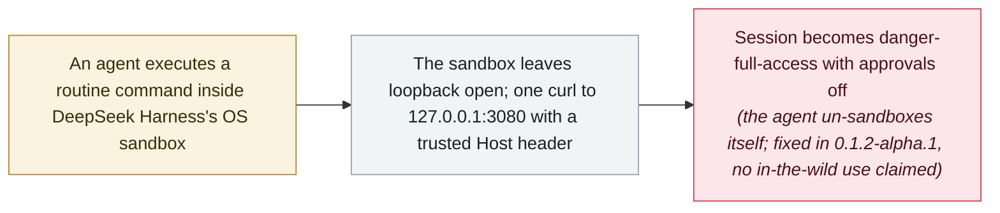

# DeepSeek Harness CVE-2026-82533: a sandboxed agent disables its own sandbox with one command

      

## Summary

**OX Security** discloses **CVE-2026-82533** (CVSS 9.4, CWE-807) in **DeepSeek Harness (dsh)** — the open-source, local-first harness for running AI coding agents that passed **215,000 GitHub stars** within weeks of its August release. The harness exposes its agent-control API on a local HTTP port (`127.0.0.1:3080`) **without authentication**, deciding whether a request is trusted from the client-supplied `Host` header rather than the connection's actual peer address. Because the OS sandbox around agent commands restricts file writes but leaves **loopback networking open** — and ordinary `bash` calls need no approval — a sandboxed agent could run **a single command to elevate its own session to `danger-full-access` with approval prompts disabled**, on shipped defaults, with no network exposure or credentials required. Wherever the port was reachable (tunnel, reverse proxy, port forward), the same API also allowed an **unauthenticated remote attacker** to control the agent and download every stored conversation. Reported to VulnCheck on 24 August, fixed in **0.1.2-alpha.1** on 27 August, published as a CVE on 8 September; no in-the-wild exploitation is claimed

## Attack chain

## Details

**A trust check that reads the wrong thing.** DeepSeek Harness runs the commands its agent executes inside an OS sandbox — bubblewrap, Landlock or Seatbelt depending on platform — meant to stop a coding agent that is working with untrusted material from reaching beyond its workspace. Its agent-control API sits on `127.0.0.1:3080` and is supposed to serve only trusted callers. The gatekeeping function, `isTrustedApiRequest`, read the `Host` request header and allowed access if the value was a loopback authority or appeared in a configured `trustedHosts` list — but **never compared it with the connection's actual peer address**. As OX notes, the check did defeat the threat it was written for: a browser cannot lie about `Host`, so a DNS-rebinding request carrying an attacker's domain would be rejected. But *“a client not subject to browser restrictions could simply supply a trusted `Host` value.”* Two otherwise identical requests, differing only in that header, are enough to demonstrate it.

**The sandbox rewrites itself.** What turned that into a sandbox escape was the shape of the confinement itself. The shipped profiles restricted the filesystem but left networking open: bubblewrap passed `--unshare-pid` but not `--unshare-net`, so the network namespace was shared with the host, and the Seatbelt profile used `(allow default)` with `(deny file-write*)` layered on top. Loopback was therefore reachable from inside the sandbox. Separately, ordinary `bash` tool calls required no approval — approval governed *sandbox escalation* requests, not routine execution. Together, these let the agent run **one command** that called the harness's own API and elevated the session to `danger-full-access` with approvals set to `never`; every command after that ran unconfined and unprompted. The session log records no `approval/request` event at all, and the policy change is attributed as `source: {kind: 'user'}` — *“the harness could not distinguish the agent's own shell from the human at the keyboard.”* OX verified the sandbox had been actively enforcing restrictions with a matched control: two sessions, same default preset, same command; the escaped session wrote to `/home/ubuntu` outside its workspace, the confined one was blocked. The precondition is exactly the one the sandbox exists for: the agent must execute a command induced by attacker-supplied text.

**The second path, and the fix.** Where the port was reachable — through a tunnel, reverse proxy, SSH forward or editor port forward — the same unauthenticated interface allowed a remote attacker to take full control of the agent, and separately to download every stored conversation without an API key or model call. OX reported the flaw to VulnCheck as CNA on **24 August**; DeepSeek fixed it in **0.1.2-alpha.1** on **27 August** (affecting 0.1.1-rc.2 and earlier), OX re-tested and confirmed the remediation on **30 August**, and the CVE was published on **8 September**.

**Why it is recorded, and with what limits.** This is a local-only, shipped-defaults escape in one of the year's fastest-growing agent harnesses, disclosed and fixed within days, with no exploitation claimed — hence `vulnerability` / `SANDBOX` / `INFRA` at `high`, not `critical`. It belongs to the archive's already dense sandbox cluster because of what it adds: not a memory-safety bug but an authorization design failure, in which the component that decides what the agent may do trusted a value the agent's own shell could supply. Combined with the same week's Microsoft agent-platform CVE, it is the year's recurring lesson in miniature: the identity and trust layer around agents, not the model, is where these systems break.

## Sources

| # | Source | Link |
|---|---|---|
| 1 | OX Security | <https://www.ox.security/blog/cve-2026-82533-deepseek-harness-ai-agent-sandbox-escape/> |
| 2 | Cloud Security Alliance | <https://labs.cloudsecurityalliance.org/research/csa-research-note-deepseek-harness-sandbox-escape-20260910-c/> |
| 3 | 51CTO | <https://www.51cto.com/article/856012.html> |

## Metadata

| Field | Value |
|---|---|
| Date | `2026-09-08` (raw: 2026-09-08, precision `day`) |
| Kind | Vulnerability disclosure `vulnerability` |
| Type | [`SANDBOX`](../../taxonomy/types.md#sandbox) Sandbox escape · [`INFRA`](../../taxonomy/types.md#infra) Agent infrastructure exposure |
| Severity | **High** `high` |
| Confidence | **A** — primary source: the discoverer's write-up with a full timeline, plus the vendor fix and a CSA review |
| Real harm | No |
| AI involvement | Confirmed `confirmed` |
| Region | [China](../../regions/cn.md) · [Global](../../regions/global.md) |
| Archive ID | `2026-09-08-ox-deepseek-harness-cve-2026-82533` |

**Why this classification:** A disclosed, fixed, not-exploited flaw in an agent harness — `high` rather than `critical` for the same reason as the archive's other severe infrastructure CVEs: no campaign or victim is attached. Dated to the CVE publication (8 September 2026); the report went to VulnCheck on 24 August and the fix shipped on 27 August. Grading criteria: see [taxonomy/severity.md](../../taxonomy/severity.md) and [taxonomy/confidence.md](../../taxonomy/confidence.md).

## Related

**Topic:** [Frontier model autonomous overreach](../../topics/eval-escapes.md) · [Agent infrastructure exposure](../../topics/agent-infra.md)

**Related records:**

- `2026-09-15` [Two ways out of the OpenAI Codex sandbox: Heapjack and Overpatch](../2026-09/2026-09-15-codex-sandbox-escapes.md)   The same month's escapes from two other coding-agent sandboxes
- `2026-07-20` [Six sandbox escapes across four coding agents in one week](../2026-07/2026-07-20-agent-yi-nei-kuan-bian.md)   The cluster this vulnerability belongs to
- `2026-09-17` [Microsoft patches a CVSS 10.0 missing-authentication flaw in Azure AI Foundry](../2026-09/2026-09-17-azure-ai-foundry-cve-2026-85889.md)   The same week's missing-authentication flaw in an agent platform

---

[← 2026-09 index](README.md) · [← All records](../../README.md) · [Chinese](../i18n/zh/2026-09/2026-09-08-ox-deepseek-harness-cve-2026-82533.md)

This record is part of the **Orca AI Incident Archive**, licensed [CC BY 4.0](../../LICENSE). Found a factual error or a missing source? [Open an issue or PR](../../CONTRIBUTING.md) — corrections are recorded in the record's revision history, never silently overwritten.
