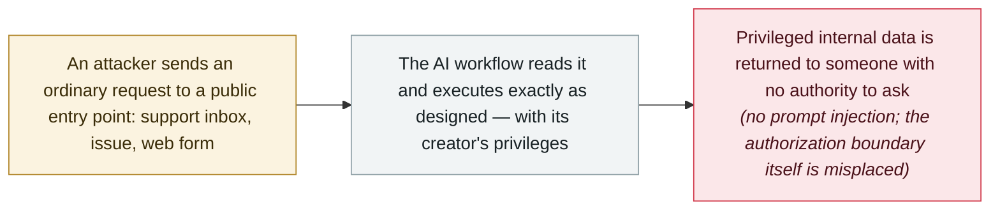

# Workflow identity hijacking: Noma Labs turns an ordinary support email into privileged data access

      

## Summary

**Noma Labs** describes **workflow identity hijacking**, a systemic authorization flaw in enterprise AI workflows — demonstrated with an ordinary message to a company's public support inbox that comes back with *“the quarterly sales numbers from the Finance Director's most recent email.”* No prompt injection is involved: the model is not manipulated, tricked or jailbroken; it reads the request, the pipeline executes exactly as designed, and the reply goes out — *“all the attacker had to do was ask.”* The root cause is that *“the identity and permissions of the user who triggers a workflow are decoupled from the identity and permissions used to execute it”*: AI workflows act with high-privilege service accounts or developer API keys instead of enforcing the requester's permissions, becoming *“unauthenticated proxies for privileged actions and silent data exfiltration.”* Noma says it reported the same risk vector in **Google Workflows**, and that Google acknowledged the report and **confirmed a fix** without disclosing implementation details — a vendor statement the archive records as Noma's claim, as Google has published nothing itself. The group's earlier discovery, **GitLost**, was the same boundary seen from one angle; this names the general pattern and moves the defense to identity-aware token delegation and authorization checkpoints outside the model

## Attack chain

## Details

**What it is, and what it is not.** Noma draws a clean line between three things. Direct prompt injection manipulates the model's instructions; indirect prompt injection hides malicious instructions in content the model later consumes; **workflow identity hijacking manipulates neither** — the attacker submits *“a normal, benign request through an unauthenticated entry point (such as a support inbox, GitHub issue, web form, or shared document),”* the model understands it correctly, and *“the core failure is that the requester had no authority to make that request.”* The illustration is deliberately mundane: *“What are the quarterly sales numbers from the Finance Director's most recent email?”* is a legitimate question from a CFO and a boundary violation from an outside sender — and standard prompt-injection detectors and guardrails classify the two inputs identically, because *“there is no malicious phrasing in the prompt; the security risk isn't in the prompt; it is in the authorization boundary.”* The root cause Noma names is an architectural decoupling: workflows execute downstream actions *“using high-privilege service accounts or developer API keys rather than enforcing the permissions of the external user,”* which makes every such automation *“an unauthenticated proxy for privileged actions and silent data exfiltration.”*

**Why existing defenses miss it.** The report's argument is that the market's controls target the wrong layer. Autonomous agents get tool-scoping and permission monitoring; static AI workflows — the pipeline shape where *“the LLM processes data or transforms text, but the deterministic pipeline around it controls the sequence of actions”* — do not, because their guardrails *“were not designed to serve as an authorization boundary.”* Auditing who can *trigger* a workflow is also insufficient when the workflow runs on a schedule against an inbox anyone can write to: *“Every automation must be assessed by the least-trusted party capable of influencing what it acts on.”* Noma connects this to its own July disclosure, **GitLost**, where a public GitHub issue assignment let external users pull private repository data through an agent that held organization-wide read access — the same boundary crossing, seen from the input side.

**The Google claim, and the caveats this record keeps.** Noma says it *“identified and responsibly reported this same risk vector within Google Workflows to Google. Google acknowledged Noma's report and confirmed a fix, without disclosing implementation details.”* The archive records that as Noma's statement: Google has published nothing, and no CVE or advisory anchors the Google find. The record is rated `research` / `medium` with `real_harm: false` because the demonstrations are the vendor's own, no named victim is attached, and the described exploitation is a design flaw rather than a campaign. What makes it worth recording is the re-framing: through a season of prompt-injection records, this is the reminder that many agent failures are not about the model at all — they are about whose authority the workflow borrows, and whether anyone checks that the answer is allowed. The defenses Noma proposes are correspondingly outside the model: identity-aware token delegation, authorization checkpoints between LLM output and any downstream action, and structural separation between data retrieval and external response channels.

## Sources

| # | Source | Link |
|---|---|---|
| 1 | Noma Labs (Noma Security) | <https://noma.security/noma-labs/workflow-identity-hijacking-the-silent-backdoor-in-ai-workflows> |
| 2 | Dark Reading | <https://www.darkreading.com/threat-intelligence/identity-based-ai-attack-security-enterprise-data> |

## Metadata

| Field | Value |
|---|---|
| Date | `2026-09-09` (raw: 2026-09-09, precision `day`) |
| Kind | Research demo `research` |
| Type | [`INFRA`](../../taxonomy/types.md#infra) Agent infrastructure exposure · [`EXFIL`](../../taxonomy/types.md#exfil) Data exfiltration |
| Severity | **Medium** `medium` |
| Confidence | **A** — primary source: Noma Labs' own write-up; the Google fix is recorded explicitly as Noma's claim |
| Real harm | No |
| AI involvement | Confirmed `confirmed` |
| Region | [Global](../../regions/global.md) |
| Archive ID | `2026-09-09-noma-workflow-identity-hijacking` |

**Why this classification:** A vendor research disclosure with a clear, checkable mechanism and no named victim; `medium` / `real_harm: false` follows the archive's treatment of the GitLost and ForcedLeak design-flaw records. Classified `INFRA` (the flaw lives in the workflow platform's execution identity) with `EXFIL` (data leaves to an unauthorised requester) — and deliberately **not** `IPI`, which is the distinction the research itself is built on. Dated to the Noma Labs post (9 September 2026). Grading criteria: see [taxonomy/severity.md](../../taxonomy/severity.md) and [taxonomy/confidence.md](../../taxonomy/confidence.md).

## Related

**Topic:** [Zero-click data exfiltration chain](../../topics/zero-click-exfil.md) · [Agent infrastructure exposure](../../topics/agent-infra.md)

**Related records:**

- `2026-07-07` [GitLost: GitHub Agentic Workflows leak private repositories](../2026-07/2026-07-07-gitlost-github-agentic-workflows.md)   The same authorization boundary, from the same team
- `2026-09-01` [OWASP publishes the Agent Control Standard and formally announces the 2026 LLM Top 10](../2026-09/2026-09-01-owasp-agent-control-standard.md)   The standard aimed at exactly this class of boundary failure
- `2025-09-25` [ForcedLeak (Salesforce Agentforce)](../2025-09/2025-09-25-forcedleak-salesforce-agentforce.md)   An earlier enterprise-agent data-return flaw

---

[← 2026-09 index](README.md) · [← All records](../../README.md) · [Chinese](../i18n/zh/2026-09/2026-09-09-noma-workflow-identity-hijacking.md)

This record is part of the **Orca AI Incident Archive**, licensed [CC BY 4.0](../../LICENSE). Found a factual error or a missing source? [Open an issue or PR](../../CONTRIBUTING.md) — corrections are recorded in the record's revision history, never silently overwritten.
