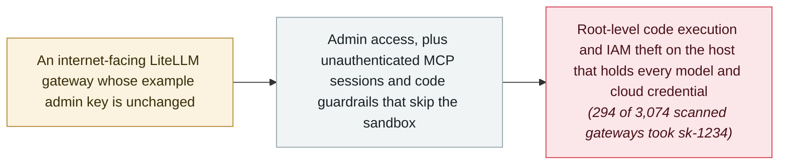

# Wiz: nearly 1 in 10 exposed LiteLLM gateways accept the example admin key sk-1234

      

## Summary

**Wiz Research** publishes *“Off Guard: Breaking LiteLLM from authentication bypass to cloud compromise”*, tying three findings into one chain from a public AI gateway to **root-level code execution and IAM theft**. Its scan of **3,074 internet-facing LiteLLM gateways** (Shodan, February 2026) found that **294 — nearly 1 in 10 — accepted the project's example admin key `sk-1234`**: whoever logs in with it controls the component that holds the model API keys and cloud credentials for everything behind it. The same research composes two flaws reported by Wiz's **Yaara Shriki**: **CVE-2026-59822**, the MCP authentication bypass (CVSS 4.0 **8.8**; KEV-listed 2 September), and **CVE-2026-59821**, in which LiteLLM's Custom Code Guardrails production endpoints skip the sandbox and validation used by the test endpoint — rated **low (2.1)** because it requires a privileged user, but part of the chain to code execution. Wiz's conclusion is that the gateway's defaults, not a single bug, are the systemic problem: default keys, unauthenticated MCP sessions and code-executing guardrails stack into cloud compromise. The companion lesson is scheduling: the flaw behind the KEV entry was reported in July and exploited in the wild by September

## Attack chain

## Details

**The scan: 294 of 3,074.** Wiz's starting measurement is blunt. In February 2026 it scanned **3,074 internet-facing LiteLLM gateways** found on Shodan and tested the key that LiteLLM's own documentation uses in every example: `sk-1234`. **294 of them — 9.6% — accepted it as a working admin key.** The severity of that number comes from what a LiteLLM gateway is: the proxy that fronts every model provider an organisation uses, which is why it accumulates the API keys, spend limits and cloud credentials for everything downstream. Wiz's chain does not stop at "read access to a configuration": with admin on the gateway, the following steps — including the MCP and guardrail surfaces — become reachable paths to running code on the host and using its cloud identity. (The scan is a snapshot of February 2026 and counts gateways that accept the example key, not gateways attacked with it.)

**The two CVEs in the chain.** The research composes two separately tracked flaws, both reported by **Yaara Shriki** (credited as `yaaras` in GitHub's advisories). **CVE-2026-59822** is the MCP authentication bypass: LiteLLM's MCP Streamable HTTP endpoint could establish an authenticated session from an arbitrary Bearer token because the OAuth2 passthrough fallback substituted an empty `UserAPIKeyAuth()` object for a failed validation — CVSS 4.0 **8.8**, fixed in 1.84.0, and listed in CISA's KEV catalog on **2 September**. **CVE-2026-59821** is the quieter one: LiteLLM's Custom Code Guardrails production create/update paths *“did not apply the same sandboxing and validation used by the test endpoint,”* so a privileged user could submit custom Python that executed in the proxy environment — rated **low (2.1)** because it requires that privileged user, but precisely the kind of "privileged enough to run code" position that the default key hands out. Neither is exotic alone; stacked on a defaulted gateway, they are a path to code execution and credential theft.

**Why it is recorded separately from the KEV entry.** The archive already holds the 2 September KEV disclosure as its own record; this one records the measurement and the composition — the exposure rate among internet-facing gateways, and the analysis that the failures cluster at the gateway's authentication and trust defaults rather than in a model or protocol design. The scheduling detail is part of the finding: the advisory behind the KEV listing was public in July, and by early September CISA had confirmed exploitation. The caveat this record keeps: the 294 figure is a scan of accepting-defaults gateways, and no compromise of a named gateway is credited to `sk-1234` in the research itself.

## Sources

| # | Source | Link |
|---|---|---|
| 1 | Wiz Research | <https://www.wiz.io/blog/off-guard-breaking-litellm-from-authentication-bypass-to-cloud-compromise> |
| 2 | GitHub Security Advisory (CVE-2026-59822) | <https://github.com/BerriAI/litellm/security/advisories/GHSA-7488-6r32-c95q> |
| 3 | GitHub Security Advisory (CVE-2026-59821) | <https://github.com/BerriAI/litellm/security/advisories/GHSA-72m8-9m7m-h278> |
| 4 | Cloud Security Alliance | <https://labs.cloudsecurityalliance.org/research/csa-research-note-litellm-gateway-default-credentials-202609/> |
| 5 | The Hacker News | <https://thehackernews.com/2026/09/nearly-1-in-10-exposed-litellm-gateways.html> |

## Metadata

| Field | Value |
|---|---|
| Date | `2026-09-09` (raw: 2026-09-09, precision `day`) |
| Kind | Research demo `research` |
| Type | [`INFRA`](../../taxonomy/types.md#infra) Agent infrastructure exposure · [`CRED`](../../taxonomy/types.md#cred) Credential abuse |
| Severity | **High** `high` |
| Confidence | **A** — primary source: the finder's write-up, with both upstream advisories and a CSA review |
| Real harm | No |
| AI involvement | Confirmed `confirmed` |
| Region | [Global](../../regions/global.md) |
| Archive ID | `2026-09-09-wiz-litellm-default-key-off-guard` |

**Why this classification:** A research report measuring exposure and composing known flaws; `real_harm: false` because no gateway is named as compromised by the default key, but `high` severity because the measured exposure — admin control of credential-holding gateways — is severe at scale, and one flaw in the chain is KEV-listed. Dated to the Wiz post (9 September 2026); the scan data is from February 2026. Grading criteria: see [taxonomy/severity.md](../../taxonomy/severity.md) and [taxonomy/confidence.md](../../taxonomy/confidence.md).

## Related

**Topic:** [Agent infrastructure exposure](../../topics/agent-infra.md)

**Related records:**

- `2026-09-02` [Any bearer token opens LiteLLM's MCP endpoint: CVE-2026-59822 enters CISA KEV](../2026-09/2026-09-02-litellm-mcp-auth-bypass-kev.md)   The KEV-listed bypass measured and composed here
- `2026-06-08` [LiteLLM CVE-2026-42271 MCP endpoint takeover](../2026-06/2026-06-08-litellm-mcp-duan-dian-jie.md)   The earlier LiteLLM MCP flaw exploited in the wild
- `2026-05-28` [BadHost (CVE-2026-48710)](../2026-05/2026-05-28-badhost.md)   The header-trust flaw chained with LiteLLM into unauthenticated RCE

---

[← 2026-09 index](README.md) · [← All records](../../README.md) · [Chinese](../i18n/zh/2026-09/2026-09-09-wiz-litellm-default-key-off-guard.md)

This record is part of the **Orca AI Incident Archive**, licensed [CC BY 4.0](../../LICENSE). Found a factual error or a missing source? [Open an issue or PR](../../CONTRIBUTING.md) — corrections are recorded in the record's revision history, never silently overwritten.
