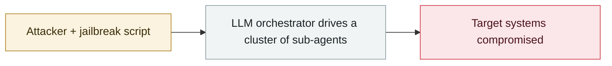

# Anthropic September threat intelligence report

     

## Summary

Anthropic's September threat intelligence report: multiple state-backed actors used Claude across parts of the intrusion chain, involving 300,000 identity records, and for the first time documents the model being used for victim triage and ransomware-copy generation.

## Attack chain

## Details

Covers **2025-12 → 2026-08** across seven harm domains (cyber operations, influence operations, surveillance, fraud and scams, biological misuse, conventional weapons, distillation), involving actors in at least 10 countries.
**The models involved are Claude Haiku / Sonnet / Opus; apart from one illegal-distillation case, no misuse of Fable- or Mythos-class models was found.**

| ID | Attribution | Time | What Claude was used for | Scale |
|---|---|---|---|---|
| **GTG-20006** | Russian state-backed (suspected Midnight Blizzard) | 2025-12→2026-08 | Automated reconnaissance, phishing infrastructure, malware evasion, credential collection, data exfiltration, maintaining persistent access | **20+ organizations**: Ukrainian and European governments, military drone manufacturers, diplomatic missions, defence organizations, hotel WiFi. Hundreds of GB exfiltrated, including **300,000+ national identity records** |
| **GTG-50014** | ShinyHunters-linked (including French-speaking operators) | 2025-12→2026-08 | Credential validation, supply-chain reconnaissance, token generation, bulk data export, cross-tenant access, API authentication tooling | Tech vendors, aviation, energy, SaaS, retail, Web3; **200+ downstream customer organizations** affected. TB-scale exfiltration, millions of payment records, **some intrusions completed within hours** |
| **GTG-10007** | Chinese-speaking users (suspected in Changsha, Hunan; university students and security-company staff) | 2025-12→2026-08 | Autonomous binary reverse engineering, vulnerability hypothesis generation, exploit development, reconnaissance orchestration, malware development, running an intelligence-collection platform | About **50 organizations** (education, retail, energy, tech, healthcare, finance, manufacturing) + government agencies worldwide. **A dozen-plus zero-days found in a single month**, hundreds of MB of student data exfiltrated |
| **GTG-50020** | Russian-speaking, profit-driven | 2026-05→06 | **Prompt injection against evaluation sandboxes**, automated penetration workflows, account-factory automation, KYC-interception disguises | Started with hotel-booking / fintech platforms, **then turned to AI vendors themselves**, targeting about **30 AI companies in 4 days** to try to obtain pre-release model access (unsuccessfully). About 26 GB exfiltrated from a single victim |
| **GTG-50029** | A single French-speaking politically motivated actor | 2026-02→07 | Custom scanners, API key validation, writing and debugging exploit code, a self-built "fafsearch" doxxing platform, credential-collection automation | European political parties, media, think tanks, SaaS providers; tracked **42 entities**, gained internal access to **14**. 12–26 GB exfiltrated, 140,000 records from one political platform, tens of millions of rows in the doxxing database |
| **GTG-04001** | Russian state-linked (assessed as Politology / Africa Corps / SVR) | Through mid-2026 | Daily content generation, contract drafting, HR scoring systems, employee-evaluation automation, **forged government documents**, managing surveillance operations | The Central African Republic information space; **daily 98.9 FM radio broadcasts** + distribution via several state media outlets and Telegram. Breakout Scale **Category Four** |
| **GTG-54002** | LKM Company (a French digital advertising firm) | Mid-2025→2025-09 | Bulk article generation, rewriting real news with a political slant, fabricated bylines, a structured JSON output pipeline | About **70 fake news sites**, **8,913+ articles in 20 languages**, 250+ fake X accounts across six continents |
| **GTG-84005** | BBS Bilisim Teknolojileri (an Istanbul tech company) | Through mid-2026 | Building a voter-targeting system from census and election data, managing fake-account networks, a synthetic-news rewriting pipeline, fabricated dossiers | All **222 parliamentary constituencies** in Malaysia; about 1,000 fake X accounts |
| **GTG-24015** | Russian state-owned / state-funded media (Sputnik, RIA Novosti, RT) | Through mid-2026 | Newsroom automation, content production, article polishing, generating defamatory claims, manufacturing a "verification loop" | Audiences in Moldova, Latin America, Africa and worldwide; false allegations against Moldovan President Maia Sandu (before the 2025-09 election). 4 accounts removed |
| **GTG-50021** | Russian/Ukrainian-speaking (pseudonym "kl1zy") | — | Proxy setup, credential-collection tooling | Fraudulent resale of Claude access, silent proxying to other models, credential theft |
| **GTG-15001** | A China-based app studio | 2026-04 | Running an AI persona network across **20+ dating apps** | **4,700+ AI personas** that talked to **at least 25,000 real people** within two weeks, exchanging about **2.36 million messages**; AI personas and real gig workers were mixed into the same match stream at roughly **3:1**, and the personas were instructed **never to reveal they were automated** |
| **Distillation** | **7 labs in China** | From 2026-02 | Illegal distillation of Anthropic's general-purpose models | All targeted generally available models |

**Three cross-case trends**:
1. AI is becoming **more autonomous in cyber operations**, shifting from assistant to executor and coordinator; multi-agent systems handle reconnaissance, exploitation and exfiltration
2. **Attacks run on agent frameworks, and API keys are the loot** — attackers have started to "live off AI resources", compromising AI vendors, evaluators and wrapper services to reuse and resell API keys
3. **One person + AI ≈ a nation-state team** (GTG-50029 hitting 42 entities single-handedly being the proof)

## Sources

| # | Source | Link |
|---|---|---|
| 1 | Anthropic | <https://www.anthropic.com/threat-intelligence-report-september-2026> |
| 2 | report PDF | <https://www-cdn.anthropic.com/e50be2e51e7695dc4b1366a37a245a597377d3b5/Anthropic-Detecting-and-countering-091026.pdf> |

## Metadata

| Field | Value |
|---|---|
| Date | `2026-09-10` (raw: 2026-09-10, precision `day`) |
| Kind | Incident `incident` |
| Type | [`WEAPON`](../../taxonomy/types.md#weapon) Agent used as a weapon |
| Severity | **Critical** `critical` |
| Confidence | **A** — primary source (vendor / victim / law enforcement / official report) |
| Real harm | Yes |
| AI involvement | Confirmed `confirmed` |
| Region | [Global](../../regions/global.md) |
| Archive ID | `2026-09-10-anthropic-september-threat-report` |

**Why this classification:** Real incident with a confirmed victim. Rated `critical`: confirmed real damage at the multi-organization / government / critical-infrastructure / supply-chain-worm level, or a first-of-its-kind capability milestone with real victims. Grading criteria: see [taxonomy/severity.md](../../taxonomy/severity.md) and [taxonomy/confidence.md](../../taxonomy/confidence.md).

## Related

**Topic:** [Offensive AI capability evolution](../../topics/offensive-ai.md)

**Related records:**

- `2026-09-11` [Claude used to scan 1.8 million Android apps for secrets](2026-09-11-claude-scans-18m-android-apks.md)   Claude used to scan 1.8 million Android apps for secrets
- `2026-09-15` [PaperCut AI agent swarm attack made public](2026-09-15-papercut-agent-swarm-disclosed.md)   PaperCut AI agent swarm attack made public
- `2026-09-02` [Unit 42: AI agents compress two weeks of intrusion work into 10 hours](2026-09-02-unit-agent-liang-ru-qin.md)   Unit 42: AI agents compress two weeks of intrusion work into 10 hours
- `2026-08-28` [PaperCut AI agent swarm campaign begins](../2026-08/2026-08-28-papercut-agent-swarm-campaign-begins.md)   PaperCut AI agent swarm campaign begins

---

[← 2026-09 index](README.md) · [← All records](../../README.md) · [Chinese](../i18n/zh/2026-09/2026-09-10-anthropic-september-threat-report.md)

This record is part of the **Orca AI Incident Archive**, licensed [CC BY 4.0](../../LICENSE). Found a factual error or a missing source? [Open an issue or PR](../../CONTRIBUTING.md) — corrections are recorded in the record's revision history, never silently overwritten.
