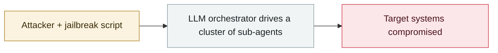

# Claude used to scan 1.8 million Android apps for secrets

     

## Summary

One concrete case in Anthropic's September report: a suspected French-speaking **ShinyHunters** member (handle **`frkoo`**) deployed a credential-harvesting pipeline **across 10 AWS EC2 workers**, downloading from multiple app stores and **scanning 1.8 million Android APKs for secrets**. The account has been removed and guardrails adjusted

## Attack chain

## Sources

| # | Source | Link |
|---|---|---|
| 1 | BleepingComputer | <https://www.bleepingcomputer.com/news/security/hackers-abused-claude-to-extract-secrets-from-18m-android-apps/> |
| 2 | Anthropic report | <https://www.anthropic.com/threat-intelligence-report-september-2026> |

## Metadata

| Field | Value |
|---|---|
| Date | `2026-09-11` (raw: 2026-09-11, precision `day`) |
| Kind | Incident `incident` |
| Type | [`WEAPON`](../../taxonomy/types.md#weapon) Agent used as a weapon |
| Severity | **Critical** `critical` |
| Confidence | **A** — primary source (vendor / victim / law enforcement / official report) |
| Real harm | Yes |
| AI involvement | Confirmed `confirmed` |
| Region | [Global](../../regions/global.md) |
| Archive ID | `2026-09-11-claude-scans-18m-android-apks` |

**Why this classification:** Real incident with a confirmed victim. Rated `critical`: confirmed real damage at the multi-organization / government / critical-infrastructure / supply-chain-worm level, or a first-of-its-kind capability milestone with real victims. Grading criteria: see [taxonomy/severity.md](../../taxonomy/severity.md) and [taxonomy/confidence.md](../../taxonomy/confidence.md).

## Related

**Topic:** [Offensive AI capability evolution](../../topics/offensive-ai.md)

**Related records:**

- `2026-09-10` [Anthropic September threat intelligence report](2026-09-10-anthropic-september-threat-report.md)   Anthropic September threat intelligence report
- `2026-09-15` [PaperCut AI agent swarm attack made public](2026-09-15-papercut-agent-swarm-disclosed.md)   PaperCut AI agent swarm attack made public
- `2026-09-02` [Unit 42: AI agents compress two weeks of intrusion work into 10 hours](2026-09-02-unit-agent-liang-ru-qin.md)   Unit 42: AI agents compress two weeks of intrusion work into 10 hours
- `2026-08-28` [PaperCut AI agent swarm campaign begins](../2026-08/2026-08-28-papercut-agent-swarm-campaign-begins.md)   PaperCut AI agent swarm campaign begins

---

[← 2026-09 index](README.md) · [← All records](../../README.md) · [Chinese](../i18n/zh/2026-09/2026-09-11-claude-scans-18m-android-apks.md)

This record is part of the **Orca AI Incident Archive**, licensed [CC BY 4.0](../../LICENSE). Found a factual error or a missing source? [Open an issue or PR](../../CONTRIBUTING.md) — corrections are recorded in the record's revision history, never silently overwritten.
