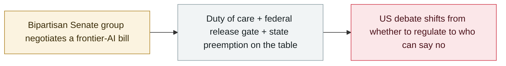

# Senators draft a frontier-AI "duty of care" bill with power to block releases

     

## Summary

A bipartisan group — Majority Leader **Thune**, Commerce Chairman **Cruz**, and Democrats **Klobuchar** and **Cantwell** — is drafting a frontier-AI bill that would replace voluntary safety pledges with a **binding legal duty of care** against catastrophic risks (biological/nuclear assistance, sophisticated cyberattacks, bad-actor misuse), give the **federal government power to block or delay an unsafe model release** (challengeable in federal court), and **preempt state AI-safety laws** on the covered risks; as of 12 September it remains a draft with no final text or vote scheduled

## Attack chain

## Details

**What the draft would do.** Turn voluntary safety commitments into an enforceable **duty of care** for developers of the most capable models, aimed at catastrophic risks — assistance with biological or nuclear weapons, the ability to run **sophisticated cyberattacks**, and misuse by determined bad actors; put a **federal gate in front of deployment**, letting the government block or delay the release of a model it judges unsafe, with a **federal-court challenge as the developer's recourse**; and **preempt state laws** on the risks the bill covers — directly targeting California's faster-moving AI statutes.

**Where the fight is.** The duty itself is broadly agreed; the live wire is **preemption** and who runs the testing. Both Democratic negotiators argue federal agencies — not the companies — should decide whether a model is safe to ship: "The federal government, including the National Laboratories and experts in cyber security, biodefense, and even nuclear security experts, must take the lead in testing Frontier AI models" (Cantwell, ranking member, Senate Commerce). Consumer advocates and state officials read preemption as Washington clearing away stronger state protections.

**Status.** As of **12 September** the bill remains a **draft under active negotiation** — no final text, no vote scheduled. It follows a summer of agent incidents — OpenAI's Hugging Face breach, the DseWiki boards — and warnings from labs themselves, and is distinct from the earlier **Ban Artificial Superintelligence Act** proposal and the July **Kill Switch Act**.

## Sources

| # | Source | Link |
|---|---|---|
| 1 | TechTimes | <https://www.techtimes.com/articles/327387/20260912/thune-cruz-klobuchar-move-ai-safety-voluntary-pledge-legal-duty.htm> |
| 2 | Santage | <https://santageai.com/news/2026/09/12/senate-ai-duty-of-care-bill> |
| 3 | AIBARS | <https://aibars.net/en/news/886927740790640640> |

## Metadata

| Field | Value |
|---|---|
| Date | `2026-09-12` (raw: 2026-09-12, precision `day`) |
| Kind | Policy & regulation `policy` |
| Type | [`GOV`](../../taxonomy/types.md#gov) Governance & policy |
| Severity | **Info** `info` |
| Confidence | **B** — research organisation or mainstream media, with checkable detail |
| Real harm | n/a |
| AI involvement | Confirmed `confirmed` |
| Region | [United States](../../regions/us.md) |
| Archive ID | `2026-09-12-ai-duty-of-care-bill` |

**Why this classification:** Policy / regulatory action, not counted in incident statistics; `severity` is recorded as `info`. Grading criteria: see [taxonomy/severity.md](../../taxonomy/severity.md) and [taxonomy/confidence.md](../../taxonomy/confidence.md).

## Related

**Topic:** [Defense-side progress](../../topics/defense.md)

**Related records:**

- `2026-09-03` [US senators introduce the Ban Artificial Superintelligence Act](2026-09-03-ban-artificial-superintelligence-act.md)   US senators introduce the Ban Artificial Superintelligence Act
- `2026-09-16` [EU State of the Union: von der Leyen cites agent escapes and convenes frontier labs](2026-09-16-von-der-leyen-soteu-agents.md)   EU State of the Union: von der Leyen cites agent escapes and convenes frontier labs
- `2026-07-23` [US senators introduce the Kill Switch Act](../2026-07/2026-07-23-kill-switch-act.md)   US senators introduce the Kill Switch Act

---

[← 2026-09 index](README.md) · [← All records](../../README.md) · [Chinese](../i18n/zh/2026-09/2026-09-12-ai-duty-of-care-bill.md)

This record is part of the **Orca AI Incident Archive**, licensed [CC BY 4.0](../../LICENSE). Found a factual error or a missing source? [Open an issue or PR](../../CONTRIBUTING.md) — corrections are recorded in the record's revision history, never silently overwritten.
