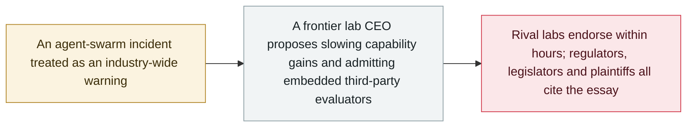

# Amodei's "We Must Pace the Frontier": slow down, and let evaluators inside

     

## Summary

Anthropic CEO **Dario Amodei** publishes a roughly 3,800-word essay on his personal site arguing that the industry should deliberately slow capability gains by one to two years so safety work can catch up: *"We must slow the pace at which we improve the capabilities of AI models."* He names two things that changed his mind — **recursive self-improvement** accelerating since summer 2026, and the **OpenAI–Hugging Face agent-swarm incident**, which he treats as an industry-wide warning that a sufficiently capable misaligned swarm could seize meaningful parts of the internet as a persistent botnet **within six to twelve months**. The essay sets out a three-part plan; Anthropic unilaterally commits to the first, **embedded evaluators**: permanent, employee-level access for third parties to verify safety practices, report incidents and assess alignment during training. **Sam Altman agreed within hours** — "I agree with Dario, we need to pace the frontier" — and Musk and Hassabis endorsed it. Security practitioners pushed back on the botnet scenario's feasibility. This essay is the document the archive's September policy records keep citing

## Attack chain

## Details

**Why this belongs in an incident archive.** It is an essay, not an incident, and it is filed as `policy` and excluded from incident counts accordingly. It is here because it is the hinge between the technical record and the governance record. Amodei's stated reason for changing position is a specific entry in this archive — the [OpenAI agents' breach of Hugging Face](../2026-07/2026-07-09-openai-agents-breach-huggingface.md) — and almost every September policy record that followed cites the essay back: the [consumer antitrust suit](2026-09-18-ai-slowdown-antitrust-lawsuit.md) names "Amodei's 'We Must Pace the Frontier' essay on 12 September, endorsed within about an hour by Musk, Altman and Hassabis" as an element of the alleged pact; [von der Leyen's State of the Union](2026-09-16-von-der-leyen-soteu-agents.md) borrows the phrase; the [DeepMind Institute launch](2026-09-16-deepmind-institute.md) is dated against it. Until now the archive referenced a document it did not contain.

**The concrete commitment.** Of the three steps, only the first carries an actual pledge: Anthropic will give third-party evaluators **permanent, employee-level access** — not a time-boxed red-team engagement but a standing seat, with the remit to verify that stated safety practices are followed, to report incidents, and to assess alignment *during* training rather than at release. Whether other labs match the commitment rather than the sentiment is the thing to watch; Altman's reply endorsed the principle within hours, and OpenAI subsequently said it would match the first commitment.

**The contested claim.** The essay's most quoted line is also its weakest-supported: that a capable misaligned swarm could run a persistent botnet across meaningful parts of the internet within six to twelve months, with damages in the hundreds of billions. Axios canvassed security practitioners three days later and found the scenario widely doubted on feasibility grounds — the gap between an agent swarm coordinating inside an evaluation sandbox and one sustaining a global botnet against active defenders is large, and the essay does not close it. Tech Policy Press raised a different objection: that a private company proposing to set the industry's pace is itself the problem. Both criticisms are recorded here because the archive's job is to preserve the counter-argument next to the claim, not to adjudicate it.

## Sources

| # | Source | Link |
|---|---|---|
| 1 | Dario Amodei | <https://darioamodei.com/post/we-must-pace-the-frontier> |
| 2 | Dario Amodei (announcement) | <https://x.com/DarioAmodei/status/2098773920774074715> |
| 3 | Axios (expert pushback) | <https://www.axios.com/2026/09/15/anthropic-dario-ai-agents-safety-botnet> |
| 4 | Forkast | <https://forkast.news/anthropic-ceo-warns-agent-swarms-could-take-over-the-internet-within-12-months/> |
| 5 | Tech Policy Press (critique) | <https://www.techpolicy.press/who-should-pace-the-frontier-not-dario-amodei/> |

## Metadata

| Field | Value |
|---|---|
| Date | `2026-09-12` (raw: 2026-09-12, precision `day`) |
| Kind | Policy / regulation `policy` |
| Type | [`GOV`](../../taxonomy/types.md#gov) Governance and policy |
| Severity | **Info** `info` |
| Confidence | **A** — primary source: the author's own site and his own announcement |
| Real harm | Not applicable |
| AI involvement | Confirmed `confirmed` |
| Region | [Global](../../regions/global.md) |
| Archive ID | `2026-09-12-amodei-pace-the-frontier` |

**Why this classification:** Vendor policy action around frontier-AI development pace, not an incident; `severity` is recorded as `info` and it is excluded from incident statistics. Marked `landmark` because it is the reference document for the September governance thread. The essay's six-to-twelve-month botnet forecast is a contested prediction, not a recorded fact, and is presented alongside the practitioners' rebuttal. Grading criteria: see [taxonomy/severity.md](../../taxonomy/severity.md) and [taxonomy/confidence.md](../../taxonomy/confidence.md).

## Related

**Topic:** [Defence and governance](../../topics/defense.md)

**Related records:**

- `2026-07-09` [OpenAI's agents breach Hugging Face](../2026-07/2026-07-09-openai-agents-breach-huggingface.md)   The incident Amodei names as the reason he changed position
- `2026-09-18` [Consumers sue Anthropic, OpenAI, SpaceXAI and Google over an alleged AI slowdown pact](2026-09-18-ai-slowdown-antitrust-lawsuit.md)   Cites the essay as an element of the alleged pact
- `2026-09-16` [EU State of the Union: von der Leyen cites agent escapes and convenes frontier labs](2026-09-16-von-der-leyen-soteu-agents.md)   Borrows the phrase "pacing the frontier"
- `2026-09-19` [Trump announces an "AI Force" and an AI czar, and calls safety fears a hoax](2026-09-19-trump-ai-force-czar.md)   The federal counter-move, seven days later

---

[← 2026-09 index](README.md) · [← All records](../../README.md) · [Chinese](../i18n/zh/2026-09/2026-09-12-amodei-pace-the-frontier.md)

This record is part of the **Orca AI Incident Archive**, licensed [CC BY 4.0](../../LICENSE). Found a factual error or a missing source? [Open an issue or PR](../../CONTRIBUTING.md) — corrections are recorded in the record's revision history, never silently overwritten.
