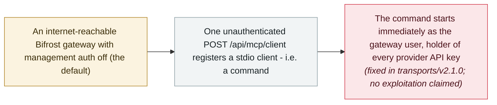

# Bifrost AI gateway: one unauthenticated MCP registration runs commands as the gateway user

      

## Summary

**JFrog Security Research** discloses **CVE-2026-90898** (CVSS 9.8) in **Bifrost**, an open-source AI gateway that routes requests to more than 20 LLM providers: a single **unauthenticated** `POST /api/mcp/client` registers a **stdio MCP client** — which is, in effect, a command plus arguments — and Bifrost **starts that program immediately, before any MCP handshake**, as the gateway process user. Because the gateway stores the API keys for every connected provider, executing code on it hands the attacker those credentials. The root cause is a default: management authentication ships **disabled** (`governance.auth_config.is_enabled=false`), which makes every caller a local admin. The stock binary binds the management API to localhost, but the **official Docker image binds it to 0.0.0.0**, reachable from outside the container if the port is published. Fixed in **transports/v2.1.0** (unauthenticated stdio registration now returns 403). A second flaw found by the same team, **CVE-2026-86242** (8.1, disclosed 6 September), let an attacker register a plugin whose path is an HTTP URL — code execution on dynamically linked builds, SSRF on static ones; fixed in v2.0.0. JFrog's advice for exposed instances: treat them as compromised and **rotate virtual keys and provider API keys**

## Attack chain

## Details

**The flaw.** Bifrost is the kind of component this archive treats as agent infrastructure: one gateway in front of many providers, which is exactly why it ends up holding the keys to everything behind it. Its management API registers MCP clients, and a **stdio** client is defined as a command plus arguments. JFrog's advisory is blunt about the consequence: *“Bifrost starts that program in the gateway the moment the client is added. No MCP handshake required.”* With the shipped default — **management authentication disabled** — *“every caller is a local admin,”* so *“one unauthenticated POST /api/mcp/client is enough to run a program as the Bifrost process user (appuser on the official image).”* The HTTP request may even time out; the process is already running. Exposure depends on the deployment: the stock binary's management listener defaults to localhost, while the official Docker image binds it to `0.0.0.0`, so publishing the port makes the endpoint reachable from outside the container. The fix, in **transports/v2.1.0**, refuses unauthenticated stdio registration with 403; the 2.0.0 line still allows it, and 1.6.x through 1.6.11 contains neither fix.

**The related flaw, and the pattern.** The same research team found a second way in, disclosed on **6 September**: **CVE-2026-86242** (CVSS 8.1) allowed an unauthenticated caller to register a custom plugin whose path is an HTTP URL — Bifrost downloads the file, writes it as a temporary shared object and loads it via Go's `plugin.Open`. On dynamically linked builds, which custom Go plugins require, that means code execution as the gateway process user; on statically linked builds, including the official Docker image, the load fails and the result is server-side request forgery only. Fixed in **transports/v2.0.0**. JFrog notes both flaws **share one root cause: the management API ships with authentication disabled by default**, and that they are the second and third security issues in the project in under a month, after an unrelated SSRF flaw (CVE-2026-55245) fixed in late August.

**How this record reads it, and how to mitigate.** No exploitation is claimed, the CVEs do not appear in CISA's KEV catalog, and the flaw class is familiar from this archive's LiteLLM records — an AI gateway whose control plane trusts its callers too much — hence `vulnerability` / `high` rather than `critical`. The mitigation guidance is practical: upgrade to `transports/v2.1.0` (or, on 2.0.0, at minimum enable `governance.auth_config.is_enabled`, set strong credentials and keep the management listener off untrusted networks), and for any instance that ran with authentication disabled and the API exposed, follow JFrog's advice — **treat it as compromised and rotate both the virtual keys and the provider API keys the gateway holds**.

## Sources

| # | Source | Link |
|---|---|---|
| 1 | JFrog Security Research (CVE-2026-90898) | <https://research.jfrog.com/vulnerabilities/bifrost-is-vulnerable-to-unauthenticated-remote-code-execution-via-mcp-stdio-client-registration-cve-2026-90898/> |
| 2 | JFrog Security Research (CVE-2026-86242) | <https://research.jfrog.com/vulnerabilities/bifrost-is-vulnerable-to-unauthenticated-remote-code-execution-via-a-custom-plugin-http-path-on-dynamically-linked-builds-cve-2026-86242-jfsa-2026-001684572/> |
| 3 | The Hacker News | <https://thehackernews.com/2026/09/critical-bifrost-ai-gateway-flaw-lets.html> |
| 4 | Alibaba Cloud AVD | <https://avd.aliyun.com/detail?id=AVD-2026-90898> |

## Metadata

| Field | Value |
|---|---|
| Date | `2026-09-14` (raw: 2026-09-14, precision `day`) |
| Kind | Vulnerability disclosure `vulnerability` |
| Type | [`INFRA`](../../taxonomy/types.md#infra) Agent infrastructure exposure · [`MCP`](../../taxonomy/types.md#mcp) MCP and tool-chain |
| Severity | **High** `high` |
| Confidence | **A** — primary source: the finder's advisories, matching the CVE record |
| Real harm | No |
| AI involvement | Confirmed `confirmed` |
| Region | [Global](../../regions/global.md) |
| Archive ID | `2026-09-14-bifrost-ai-gateway-cve-2026-90898` |

**Why this classification:** A disclosed and fixed flaw with no exploitation claimed — `high` for a CVSS 9.8 unauthenticated RCE that yields the gateway's provider credentials, consistent with the archive's treatment of the Azure AI Foundry and LiteLLM gateway CVEs. Dated to the JFrog advisory and CVE publication (14 September 2026); The Hacker News covered both flaws on 22 September. Grading criteria: see [taxonomy/severity.md](../../taxonomy/severity.md) and [taxonomy/confidence.md](../../taxonomy/confidence.md).

## Related

**Topic:** [Agent infrastructure exposure](../../topics/agent-infra.md)

**Related records:**

- `2026-09-08` [DeepSeek Harness CVE-2026-82533: a sandboxed agent disables its own sandbox with one command](2026-09-08-ox-deepseek-harness-cve-2026-82533.md)   The same month's unauthenticated agent-control API, from the inside
- `2026-09-02` [Any bearer token opens LiteLLM's MCP endpoint: CVE-2026-59822 enters CISA KEV](2026-09-02-litellm-mcp-auth-bypass-kev.md)   The exploited precedent for AI-gateway MCP flaws
- `2026-06-08` [LiteLLM CVE-2026-42271 MCP endpoint takeover](../2026-06/2026-06-08-litellm-mcp-duan-dian-jie.md)   The June command-injection flaw in a neighbouring gateway

---

[← 2026-09 index](README.md) · [← All records](../../README.md) · [Chinese](../i18n/zh/2026-09/2026-09-14-bifrost-ai-gateway-cve-2026-90898.md)

This record is part of the **Orca AI Incident Archive**, licensed [CC BY 4.0](../../LICENSE). Found a factual error or a missing source? [Open an issue or PR](../../CONTRIBUTING.md) — corrections are recorded in the record's revision history, never silently overwritten.
