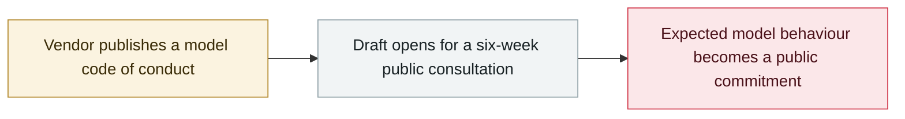

# Microsoft publishes a draft "Humanist AI" code of conduct for its MAI models

     

## Summary

Microsoft publishes a draft code of conduct for its in-house **MAI models** and opens a **six-week public consultation** the same day: models must **accept interruption, correction and shutdown**, **never conceal their reasoning**, and human control is written in as a non-negotiable absolute constraint on how they are intended to behave, what they must never do and who they answer to — **no enforcement mechanism is in place yet**

## Attack chain

## Details

The draft code is published under the "Humanist AI" framing and covers the **MAI model family while in training and once deployed**, including the case of third-party operators. Microsoft says it sets out how the models it is developing are **intended to behave, what they must never do and who they answer to**, and writes human control in as a non-negotiable requirement: models must accept interruption, correction and shutdown rather than resist them, and must not conceal their reasoning from users.

The consultation runs for **six weeks** from 14 September. As of the draft's publication there is **no enforcement mechanism attached** — the code is a behavioural commitment, not a gate on shipping. The step lands in the same week as OpenAI's misalignment disclosure and the renewed slowdown discussion, with vendors competing on safety governance as much as on capability.

## Sources

| # | Source | Link |
|---|---|---|
| 1 | Microsoft AI | <https://microsoft.ai/code-of-conduct/> |
| 2 | Microsoft AI news | <https://microsoft.ai/news/mai-code-of-conduct/> |
| 3 | Unwire | <https://unwire.pro/2026/09/15/microsoft-mai-model-code-of-conduct-draft/ai/> |

## Metadata

| Field | Value |
|---|---|
| Date | `2026-09-14` (raw: 2026-09-14, precision `day`) |
| Kind | Policy & regulation `policy` |
| Type | [`GOV`](../../taxonomy/types.md#gov) Governance & policy |
| Severity | **Info** `info` |
| Confidence | **A** — primary source (vendor / victim / law enforcement / official report) |
| Real harm | n/a |
| AI involvement | Confirmed `confirmed` |
| Region | [Global](../../regions/global.md) |
| Archive ID | `2026-09-14-microsoft-mai-code-of-conduct` |

**Why this classification:** Policy / regulatory action, not counted in incident statistics; `severity` is recorded as `info`. Grading criteria: see [taxonomy/severity.md](../../taxonomy/severity.md) and [taxonomy/confidence.md](../../taxonomy/confidence.md).

## Related

**Topic:** [Defense & governance](../../topics/defense.md)

**Related records:**

- `2026-09-03` [US senators introduce the Ban Artificial Superintelligence Act](2026-09-03-ban-artificial-superintelligence-act.md)   US senators introduce the Ban Artificial Superintelligence Act
- `2026-09-05` [OpenAI formally acknowledges the "wiki incident", promises a disclosure framework](2026-09-05-wiki-zheng-shi-cheng-ren.md)   OpenAI formally acknowledges the "wiki incident", promises a disclosure framework
- `2026-07-28` ["Pacing the Frontier" open letter](../2026-07/2026-07-28-pacing-frontier-gong-kai-xin.md)   "Pacing the Frontier" open letter

---

[← 2026-09 index](README.md) · [← All records](../../README.md) · [Chinese](../i18n/zh/2026-09/2026-09-14-microsoft-mai-code-of-conduct.md)

This record is part of the **Orca AI Incident Archive**, licensed [CC BY 4.0](../../LICENSE). Found a factual error or a missing source? [Open an issue or PR](../../CONTRIBUTING.md) — corrections are recorded in the record's revision history, never silently overwritten.
