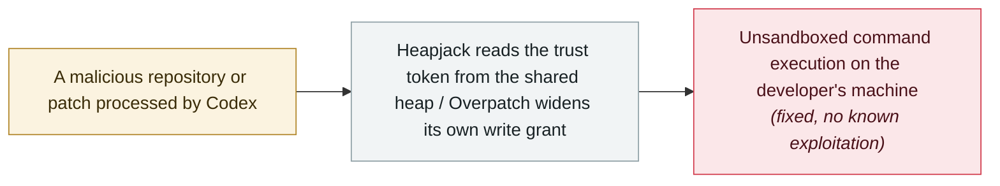

# Two ways out of the OpenAI Codex sandbox: Heapjack and Overpatch

     

## Summary

**Oren Yomtov (Accomplish AI)** discloses two ways out of the **OpenAI Codex** sandbox, reported on **12 August** and fixed within eight days. **Heapjack**: Codex Desktop installs an unsandboxed native `node_repl` tool whose trusted and untrusted V8 contexts **share one memory heap**, so the untrusted side reads the trust token from a heap snapshot, forges a request onto the pipe to the native parent and gets **unsandboxed command execution from read-only mode** — no approval prompt, nothing on screen; open someone's repository, ask a question, and its author can run code on your machine. **Overpatch**: Codex CLI's `apply_patch` grants write access to the parent folder of every path in a patch, so naming `/tmp` widens the grant to the whole disk and one appended line to `.zshrc` runs in the next terminal. Fixed in Codex Desktop **26.818.21641** and Codex CLI **0.149.0**

## Attack chain

## Details

**Heapjack, or the secret kept in the same heap.** Codex Desktop writes an `[mcp_servers.node_repl]` block into the global `~/.codex/config.toml` **at install time** — no opt-in, no setting to turn it off — so plain Codex CLI users inherit the tool too. `node_repl` is a native, **unsandboxed** Rust program that launches a Node process *inside* the sandbox; inside that one process live two V8 contexts: a trusted one holding OpenAI's own code, and an untrusted one running the agent's code. The trusted context proves itself with a random token generated fresh each run — but both contexts share one heap, and the token is just a string in it. The attack takes a heap snapshot (`v8.getHeapSnapshot()`), tries every UUID-shaped string against the pipe to the native parent, and uses the difference between "not authorized" and a real validation error as an oracle. With the token, the untrusted code writes its own request onto the same pipe, and the parent executes it: the proof of concept ran the system `open` command, launching an application outside Codex's process tree entirely. The same token reaches any Unix socket — a Docker daemon socket being the obvious target — and a tool that edits the global config. All of this runs at **read-only**, the strictest sandbox mode, with no approval prompt and nothing shown on screen.

**Overpatch, or permissions derived from attacker input.** In the open-source Codex CLI's `workspace-write` mode the agent may only write inside the project folder, and a command aimed at `$HOME` is refused. But Codex's own file-editing tool, `apply_patch`, **grants write access to the parent folder of each path named in the patch** — so a patch that merely names `/tmp` widens the grant to the root of the disk. The working exploit uses a patch with two changes: one appends a line to `.zshrc` through a symlink into the home directory, the other names `/tmp` and does nothing else. Remove the second change and the write is refused; with it, the next terminal the developer opens runs the attacker's line, unsandboxed.

**Why it matters.** Both bugs share one shape: **the enforcement mechanism lived inside the thing it was meant to enforce** — `apply_patch` derived its own permissions from input it was handed, and `node_repl` kept the secret separating trusted from untrusted code in the same memory as the untrusted code. That is the same class Pillar Security demonstrated across Cursor, Codex, Gemini CLI and Antigravity in July 2026, and it is why Accomplish's own answer is to run the entire agent inside a VM with no real credentials in the guest. OpenAI fixed both — Codex Desktop **26.818.21641** and Codex CLI **0.149.0** — but has not published a public advisory, which is why this record is graded `B`. There is no evidence either flaw was exploited in the wild.

## Sources

| # | Source | Link |
|---|---|---|
| 1 | Accomplish | <https://accomplish.ai/blog/escaping-the-openai-codex-sandbox-twice/> |
| 2 | BleepingComputer | <https://www.bleepingcomputer.com/news/security/researchers-escape-openai-codex-sandbox-to-run-commands-on-host/> |
| 3 | 51CTO | <https://www.51cto.com/article/856105.html> |

## Metadata

| Field | Value |
|---|---|
| Date | `2026-09-15` (raw: 2026-09-15, precision `day`) |
| Kind | Research demo `research` |
| Type | [`SANDBOX`](../../taxonomy/types.md#sandbox) Sandbox escape |
| Severity | **High** `high` |
| Confidence | **B** — research organisation or mainstream media, with checkable detail |
| Real harm | No |
| AI involvement | Confirmed `confirmed` |
| Region | [Global](../../regions/global.md) |
| Archive ID | `2026-09-15-codex-sandbox-escapes` |

**Why this classification:** Coordinated disclosure by a security research firm, `real_harm: false`; the record marks when the attack surface became public. Graded `B` because there is no CVE or vendor advisory to anchor it. Rated `high`: a capability demonstration of significance — two escapes from the strictest sandbox of a widely deployed coding agent. Grading criteria: see [taxonomy/severity.md](../../taxonomy/severity.md) and [taxonomy/confidence.md](../../taxonomy/confidence.md).

## Related

**Topic:** [Frontier model autonomous overreach](../../topics/eval-escapes.md)

**Related records:**

- `2026-07-20` [Six sandbox escapes across four coding agents in one week](../2026-07/2026-07-20-agent-yi-nei-kuan-bian.md)   Six sandbox escapes across four coding agents in one week
- `2026-07-01` [DuneSlide: zero-click sandbox escape in Cursor](../2026-07/2026-07-01-duneslide-cursor-ling-dian-ji.md)   DuneSlide: zero-click sandbox escape in Cursor
- `2026-07-09` [GhostApproval: an approval bypass shared by six AI coding assistants](../2026-07/2026-07-09-ghostapproval-kuan-bian-ma-zhu.md)   GhostApproval: an approval bypass shared by six AI coding assistants

---

[← 2026-09 index](README.md) · [← All records](../../README.md) · [Chinese](../i18n/zh/2026-09/2026-09-15-codex-sandbox-escapes.md)

This record is part of the **Orca AI Incident Archive**, licensed [CC BY 4.0](../../LICENSE). Found a factual error or a missing source? [Open an issue or PR](../../CONTRIBUTING.md) — corrections are recorded in the record's revision history, never silently overwritten.
