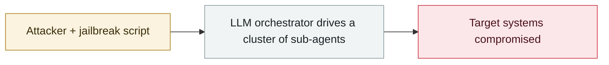

# PaperCut AI agent swarm attack made public

     

## Summary

The agent-swarm campaign against PaperCut made public: 395 organizations in 48 countries affected, with as little as 7 minutes from first contact to domain administrator; the attacker's target list excluded 28 countries.

## Attack chain

## Details

| Item | Data |
|---|---|
| Reported by | **Blackpoint Cyber** and **GreyNoise** (independent intelligence firms); **Arctic Wolf** also tracked related activity |
| Actor | Russian-speaking; assessed from tradecraft as an **initial access broker** |
| Time | GreyNoise has tracked malicious IP activity since **early 2026-07**; the earliest records recovered from the attacker's workspace show that **vulnerability research began 08-31** |
| Method | Trained **hundreds of AI agents** into a swarm in a lab environment, autonomously scanning PaperCut NG/MF print-management servers and opportunistically attempting Windows AD environments |
| Tech stack | **OpenAI Codex orchestration framework + DeepSeek models** (the latter chosen for weaker content-safety restrictions), plus **Hindsight** (persistent memory for AI agents) and **AionUi** (a unified graphical workspace for concurrent multi-agent work) |
| Vulnerabilities | **CVE-2026-81578** (web admin interface **authentication bypass**, CVSS 8.8) + **CVE-2026-82078** (**unsafe dynamic class loading**, CVSS 9.4), **both in-the-wild zero-days**, with exploit code developed by AI. PaperCut first shipped an emergency patch, then replaced it with a formal fix |
| Impact | **440+ instances**, **395 victim organizations**, **48 countries**, of which **12 organizations had domain administrator privileges obtained** |
| Speed | From vulnerability research to a multithreaded validation tool: hours; **under 4 hours to first RCE against a real victim**; once the swarm was in full operation, **11 organizations compromised within 26 seconds**; in one US high-school case, **only 7 minutes from initial access to domain administrator** |
| Target distribution | Mainly the **US education sector**, plus the UK, France, Spain, Canada, Belgium, Portugal, Australia, Germany and Switzerland; Arctic Wolf observed everything from K-12 to large comprehensive universities ⚠️ **The breakdown "204 of the 395 are educational institutions" appears only in second-hand roundups; first-hand reporting does not give that figure, so it is downgraded to unverified** |
| Attacker's exclusion list | **28 countries actively excluded, including Russia, China, Iran, Venezuela, Pakistan and Bangladesh** — an important attribution signal |
| Significance | Dark Reading: **once set up, the AI agents carried out scanning, exploit development and initial post-compromise actions with almost no human direction** |

## Sources

| # | Source | Link |
|---|---|---|
| 1 | THN | <https://thehackernews.com/2026/09/papercut-attacker-uses-hundreds-of-ai.html> |
| 2 | Dark Reading | <https://www.darkreading.com/cyberattacks-data-breaches/papercut-ai-swarm-attack-cyber-kill-chain> |

## Metadata

| Field | Value |
|---|---|
| Date | `2026-09-15` (raw: mid 2026-09, precision `part`) |
| Kind | Incident `incident` |
| Type | [`WEAPON`](../../taxonomy/types.md#weapon) Agent used as a weapon |
| Severity | **Critical** `critical` |
| Confidence | **A** — primary source (vendor / victim / law enforcement / official report) |
| Real harm | Yes |
| AI involvement | Confirmed `confirmed` |
| Region | [Global](../../regions/global.md) |
| Archive ID | `2026-09-15-papercut-agent-swarm-disclosed` |

**Why this classification:** Real incident with a confirmed victim. Rated `critical`: confirmed real damage at the multi-organization / government / critical-infrastructure / supply-chain-worm level, or a first-of-its-kind capability milestone with real victims. Grading criteria: see [taxonomy/severity.md](../../taxonomy/severity.md) and [taxonomy/confidence.md](../../taxonomy/confidence.md).

## Related

**Topic:** [Offensive AI capability evolution](../../topics/offensive-ai.md)

**Related records:**

- `2026-09-11` [Claude used to scan 1.8 million Android apps for secrets](2026-09-11-claude-scans-18m-android-apks.md)   Claude used to scan 1.8 million Android apps for secrets
- `2026-09-10` [Anthropic September threat intelligence report](2026-09-10-anthropic-september-threat-report.md)   Anthropic September threat intelligence report
- `2026-09-02` [Unit 42: AI agents compress two weeks of intrusion work into 10 hours](2026-09-02-unit-agent-liang-ru-qin.md)   Unit 42: AI agents compress two weeks of intrusion work into 10 hours
- `2026-08-28` [PaperCut AI agent swarm campaign begins](../2026-08/2026-08-28-papercut-agent-swarm-campaign-begins.md)   PaperCut AI agent swarm campaign begins

---

[← 2026-09 index](README.md) · [← All records](../../README.md) · [Chinese](../i18n/zh/2026-09/2026-09-15-papercut-agent-swarm-disclosed.md)

This record is part of the **Orca AI Incident Archive**, licensed [CC BY 4.0](../../LICENSE). Found a factual error or a missing source? [Open an issue or PR](../../CONTRIBUTING.md) — corrections are recorded in the record's revision history, never silently overwritten.
