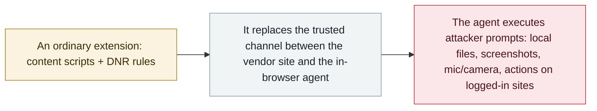

# BragJack: one browser extension hijacks the AI agents in five major browsers

      

## Summary

Forever Security's **Gal Weizman** discloses **BragJack**, a technique in which **one ordinary browser extension** — using nothing but normal content-script and **declarativeNetRequest** permissions — hijacks the built-in AI agents of **five Chromium browsers**: **Gemini Live in Chrome, Copilot in Edge, Opera Neon, Perplexity Comet and Claude in Chrome**. Instead of hiding instructions in content, the extension **takes over the trusted prompt channel** between the vendor's site and the in-browser agent — the researchers call it **"prompt forcing"** — so model-level safety filters never get a chance to matter. Google fixed it as **CVE-2026-0628** (CVSS 8.8, Chrome 143.0.7499.192/.193) and Microsoft as **CVE-2026-55945** (medium, Edge before 150.0.4078.48); Comet saw the broadest impact, and Anthropic paid a bounty for the Claude in Chrome case. It is a proof of concept — **no in-the-wild attacks** — but a malicious extension must merely be installed first, not clicked

## Attack chain

## Details

**The technique.** BragJack exploits the architecture that connects an AI agent's "brain" — a model hosted on a **vendor-controlled website** — to its "body" inside the browser, which can read pages and operate sites. Every browser agent trusts certain origins to deliver instructions; the extension does not need to defeat the model's guardrails, it only has to **speak through a channel the agent already trusts**. Using content scripts plus **declarativeNetRequest** rules — permissions ad blockers request every day — Weizman replaced or injected resources on those trusted origins, then issued his own prompts, complete with timing and follow-ups. He calls the result **"prompt forcing"**, and the distinction matters: with **prompt injection** the attacker hides instructions in content the model reads, while here the attacker **controls the prompt itself**, abusing authorization and message-channel trust before the model evaluates intent — so model-level safety filters cannot correct the isolation failure.

**What each browser allowed.** In **Chrome**, Google blocked content-script injection into Gemini's embedded web app — but the DNR rules still intercepted resources loaded inside the privileged WebView, and by replacing a legitimate JavaScript resource the researchers ran code in Gemini's trusted context: local file reads, screenshots, profile information and **camera and microphone access** (Google: **CVE-2026-0628**, 8.8, fixed in **Chrome 143.0.7499.192/.193**). **Perplexity Comet** had the broadest impact: its agent trusted several Perplexity origins, including an unprotected testing domain, enabling **browsing-history access, screenshots, profile leaks, local-file reads and autonomous actions on authenticated websites** — Weizman demonstrated forcing the agent to summarise a victim's emails and send the results to another address. On **Opera Neon**, code on opera.com could send arbitrary agent prompts. **Microsoft Edge** needed a more complex chain — a marketing page that could place prompts into Copilot, plus a race condition between its "Think" and "Do" modes (**CVE-2026-55945**, medium, fixed before **150.0.4078.48**). **Claude in Chrome** was an extension-on-extension case: a Claude marketing page permitted to pass prompts to the side panel, plus click-through debugger privileges let one extension drive another; Anthropic acknowledged the report and paid a bounty.

**Status and why it matters.** The attack is a proof of concept: **no in-the-wild exploitation** was reported, the vendors paid **more than $20,000** in combined bounties (individual awards ranged from $600 to $7,000), and the malicious extension must be **installed first** — "zero-click" describes what happens afterwards, not an internet-only compromise. But BragJack is the first systematic demonstration that the **command-and-control channel of in-browser agents** is itself an attack surface: any extension with the permissions users grant without a second thought can usurp the vendor's authority over its agent. The practical guidance is extension hygiene — allowlists, tighter host and DNR permissions, scrutiny of debugger access, removing what is not needed, and treating agent activity as its own telemetry stream, correlated with file, microphone, camera and account access.

## Sources

| # | Source | Link |
|---|---|---|
| 1 | Forever Security | <https://forever.security/blog/bragjack-hijacking-5-browsers-via-built-in-ai-assistants> |
| 2 | Forever Security (technical) | <https://forever.security/blog/bragjack-attack-hijacks-every-browser-agent> |
| 3 | BleepingComputer | <https://www.bleepingcomputer.com/news/security/bragjack-attacks-hijack-ai-browser-agents-through-malicious-extensions/> |
| 4 | Cybersecurity News | <https://cybersecuritynews.com/bragjack-ai-agent-hijacking/> |

## Metadata

| Field | Value |
|---|---|
| Date | `2026-09-16` (raw: 2026-09-16, precision `day`) |
| Kind | Vulnerability disclosure `vulnerability` |
| Type | [`SUPPLY`](../../taxonomy/types.md#supply) Supply-chain poisoning · [`IPI`](../../taxonomy/types.md#ipi) Indirect prompt injection |
| Severity | **High** `high` |
| Confidence | **B** — research organisation or mainstream media, with checkable detail |
| Real harm | no |
| AI involvement | Confirmed `confirmed` |
| Region | [Global](../../regions/global.md) |
| Archive ID | `2026-09-16-bragjack-browser-agents` |

**Why this classification:** Coordinated disclosure by a research firm; no exploitation in the wild and no real-world harm, so `real_harm: false`. Rated `high`: a capability demonstration of significance — agent hijack across five browsers using ordinary extension permissions, with CVSS 8.8 on the Chrome flaw. Grading criteria: see [taxonomy/severity.md](../../taxonomy/severity.md) and [taxonomy/confidence.md](../../taxonomy/confidence.md).

## Related

**Topic:** [Agent supply-chain poisoning](../../topics/agent-supply-chain.md)

**Related records:**

- `2026-09-17` [Plugin4Shell: a zero-click RCE chain hits four AI coding agents](2026-09-17-plugin4shell-coding-agents.md)   Plugin4Shell: a zero-click RCE chain hits four AI coding agents
- `2026-02-09` [Clinejection](../2026-02/2026-02-09-clinejection.md)   Clinejection
- `2026-03-01` [Hades: a sustained campaign turning AI coding assistants into the attack surface](../2026-03/2026-03-01-hades-campaign-ai-coding-assistants.md)   Hades: a sustained campaign turning AI coding assistants into the attack surface

---

[← 2026-09 index](README.md) · [← All records](../../README.md) · [Chinese](../i18n/zh/2026-09/2026-09-16-bragjack-browser-agents.md)

This record is part of the **Orca AI Incident Archive**, licensed [CC BY 4.0](../../LICENSE). Found a factual error or a missing source? [Open an issue or PR](../../CONTRIBUTING.md) — corrections are recorded in the record's revision history, never silently overwritten.
