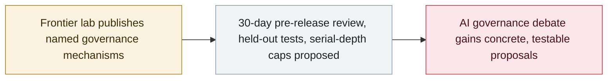

# Google DeepMind launches the DeepMind Institute for AGI governance

     

## Summary

Google DeepMind launches the **DeepMind Institute** — led by **Demis Hassabis, Shane Legg and James Manyika** — opening with four essays that put **concrete AI policy mechanisms** on the table: Hassabis proposes a **US-led frontier AI standards body that reviews models up to 30 days before release** (initially voluntary, later required to deploy in the US, moving to **held-out tests** and potentially a **coordinated slowdown if risks escalate**), while safety researchers **Rohin Shah and Anca Dragan** argue for capping **"opaque serial depth"** — how much computation a model may do without emitting a readable reasoning trace

## Attack chain

## Details

**The launch.** Google and DeepMind launched the **DeepMind Institute** on **16 September**, opening with four essays on AGI-era policy. Its directors are DeepMind co-founder **Shane Legg** (also managing editor), Google executive **James Manyika**, and DeepMind chair **Demis Hassabis**.

**The proposals.** Hassabis proposes a **US-led frontier AI standards body** that would **review models up to 30 days before release** — initially voluntarily, later as a requirement to deploy in the US — moving to undisclosed **"held-out" tests**, and potentially a **coordinated slowdown if risks escalate**. Safety researchers **Rohin Shah** and **Anca Dragan** argue separately for capping **"opaque serial depth"**, the amount of computation a model can perform **without producing a readable reasoning trace**.

**Why it matters.** A major lab has moved from broad statements of concern to **named mechanisms and timelines**, which is the point at which AI governance starts becoming actual policy. The launch lands in the middle of the September slowdown debate — Amodei's "pace the frontier" essay (12 September), von der Leyen's State of the Union (16 September) and the consumer antitrust suit over the alleged slowdown pact (18 September) — and the proposals give that debate concrete, testable designs.

## Sources

| # | Source | Link |
|---|---|---|
| 1 | DeepMind Institute | <https://institute.deepmind.com/essays/introducing-the-deepmind-institute/> |
| 2 | DeepMind Institute (site) | <https://institute.deepmind.com/> |
| 3 | ExplainX | <https://www.explainx.ai/blog/google-deepmind-institute-agi-launch-2026> |

## Metadata

| Field | Value |
|---|---|
| Date | `2026-09-16` (raw: 2026-09-16, precision `day`) |
| Kind | Policy & regulation `policy` |
| Type | [`GOV`](../../taxonomy/types.md#gov) Governance & policy |
| Severity | **Info** `info` |
| Confidence | **A** — primary source (vendor / victim / law enforcement / official report) |
| Real harm | n/a |
| AI involvement | Confirmed `confirmed` |
| Region | [Global](../../regions/global.md) |
| Archive ID | `2026-09-16-deepmind-institute` |

**Why this classification:** Vendor policy publication, not an incident; `severity` is recorded as `info`. Grading criteria: see [taxonomy/severity.md](../../taxonomy/severity.md) and [taxonomy/confidence.md](../../taxonomy/confidence.md).

## Related

**Topic:** [Defense-side progress](../../topics/defense.md)

**Related records:**

- `2026-09-16` [EU State of the Union: von der Leyen cites agent escapes and convenes frontier labs](2026-09-16-von-der-leyen-soteu-agents.md)   EU State of the Union: von der Leyen cites agent escapes and convenes frontier labs
- `2026-09-18` [Consumers sue Anthropic, OpenAI, SpaceXAI and Google over an alleged AI slowdown pact](2026-09-18-ai-slowdown-antitrust-lawsuit.md)   Consumers sue Anthropic, OpenAI, SpaceXAI and Google over an alleged AI slowdown pact
- `2026-07-28` ["Pacing the Frontier" open letter](../2026-07/2026-07-28-pacing-frontier-gong-kai-xin.md)   "Pacing the Frontier" open letter

---

[← 2026-09 index](README.md) · [← All records](../../README.md) · [Chinese](../i18n/zh/2026-09/2026-09-16-deepmind-institute.md)

This record is part of the **Orca AI Incident Archive**, licensed [CC BY 4.0](../../LICENSE). Found a factual error or a missing source? [Open an issue or PR](../../CONTRIBUTING.md) — corrections are recorded in the record's revision history, never silently overwritten.
