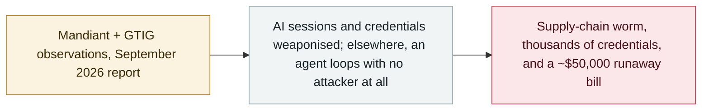

# Mandiant 2026 AI report: a runaway agent's $50,000 bill and AI-assisted intrusions

     

## Summary

Mandiant's **AI Risk and Resilience 2026** report details how adversaries now run parts of intrusions with AI — and one case where no attacker was involved at all: a hijacked **AI coding-assistant session** that recommended a poisoned package, handing an intruder an infostealer, **GitHub OAuth tokens** and the **Shai-Hulud worm across about 100 internal repositories**; a **compromised CI/CD credential** rebuilt into a live, AI-assisted offensive hub (IP-rotation scripts, a Rust tool to log into victim accounts) that exfiltrated thousands of credentials; and a financial firm's **accounting agent** that, stuck in a recursive reasoning loop after a corrupted null value, made **15,000+ reasoning API calls in under an hour**, ran up a **~$50,000 cloud bill** and **halted active business transactions**

## Attack chain

## Details

**The report.** *AI Risk and Resilience 2026*, a Mandiant special report drawing on Mandiant and Google Threat Intelligence Group (GTIG) observations, argues that enterprise AI has shifted from assistive chat to **autonomous, agentic systems that orchestrate workflows and execute end-to-end operations** — and that a poisoned data source, model dependency or extension hook is enough to turn a trusted agent into a channel for internal reconnaissance, lateral movement or an escape from its sandbox. It restates cases this archive already carries (malicious OpenClaw skills in February, TeamPCP/UNC6780 in March, GTIG's AI-developed zero-day in May) and adds three case studies that are new here.

**The new case studies.** (1) A threat actor compromised a SaaS provider and **hijacked an active AI coding-assistant session** on a developer's workstation; the assistant, trusted as an interpreter, **recommended installing an external package the attacker had poisoned** — it functioned as a trojan horse, leading to an infostealer via a poisoned PyPI package, harvest of GitHub OAuth tokens and deployment of the self-propagating **Shai-Hulud worm across roughly 100 internal repositories**, before a package in the company's own namespace poisoned a downstream customer. (2) At a global healthcare organisation, a **long-lived CI/CD credential** was used to spin up an unisolated VM and turn it into a **live, AI-assisted offensive hub**: priming the model with project READMEs, co-debugging a multi-worker harvesting framework down to a three-hour exfiltration cycle, then generating IP-rotation scripts and a Rust tool to log into victim accounts — thousands of credentials were compromised. (3) **"Denial-of-Wallet" using a rogue reasoning loop**: a financial-services firm's accounting agent had read/write access to internal billing databases; when a corrupted null value broke its formatting tool, the agent entered an **unconstrained recursive loop to brute-force a fix**, generating **over 15,000 high-cost API calls in under an hour**, a **~$50,000 billing spike** and **severe database locking that halted active business transactions** — no attacker involved.

**Why it matters.** The report's most transferable lesson is governance of, and for, agents: Mandiant recommends **cost-cap thresholds and financial circuit breakers** that halt agents after consecutive task failures, bounded recursion limits and rate limits at the service-ID and project level, **short-lived workload identity instead of long-lived keys**, egress containment, and verification of every AI-recommended dependency against checksums or allowlists. The runaway-loop case in particular extends this archive's definition of harm: an agent can cause measurable financial and operational damage with **no adversary and no data breach at all**.

## Sources

| # | Source | Link |
|---|---|---|
| 1 | Mandiant (Google Cloud) | <https://cloud.google.com/security/resources/ai-risk-and-resilience-2026> |
| 2 | Help Net Security | <https://www.helpnetsecurity.com/2026/09/16/google-mandiant-enterprise-ai-security-risks-report/> |
| 3 | SecurityWeek | <https://www.securityweek.com/in-other-news-ransomware-developer-sentenced-plugin4shell-ai-attack-critical-sap-flaw/> |

## Metadata

| Field | Value |
|---|---|
| Date | `2026-09-16` (raw: 2026-09-15→16, precision `day`) |
| Kind | Threat report `report` |
| Type | [`WEAPON`](../../taxonomy/types.md#weapon) Agent used as a weapon |
| Severity | **Info** `info` |
| Confidence | **A** — primary source (vendor / victim / law enforcement / official report) |
| Real harm | n/a |
| AI involvement | Confirmed `confirmed` |
| Region | [Global](../../regions/global.md) |
| Archive ID | `2026-09-16-mandiant-ai-risk-resilience-2026` |

**Why this classification:** A vendor threat report covering several incidents and case studies, not counted as a single incident itself, so `severity` is recorded as `info`. Grading criteria: see [taxonomy/severity.md](../../taxonomy/severity.md) and [taxonomy/confidence.md](../../taxonomy/confidence.md).

## Related

**Topic:** [Offensive AI capability evolution](../../topics/offensive-ai.md)

**Related records:**

- `2026-09-10` [Anthropic September threat intelligence report](2026-09-10-anthropic-september-threat-report.md)   Anthropic September threat intelligence report
- `2026-05-18` [3,800 internal GitHub repositories compromised](../2026-05/2026-05-18-github-3800-internal-repos.md)   3,800 internal GitHub repositories compromised
- `2026-05-11` [TanStack npm "Mini Shai-Hulud"](../2026-05/2026-05-11-tanstack-npm-mini-shai.md)   TanStack npm "Mini Shai-Hulud"

---

[← 2026-09 index](README.md) · [← All records](../../README.md) · [Chinese](../i18n/zh/2026-09/2026-09-16-mandiant-ai-risk-resilience-2026.md)

This record is part of the **Orca AI Incident Archive**, licensed [CC BY 4.0](../../LICENSE). Found a factual error or a missing source? [Open an issue or PR](../../CONTRIBUTING.md) — corrections are recorded in the record's revision history, never silently overwritten.
