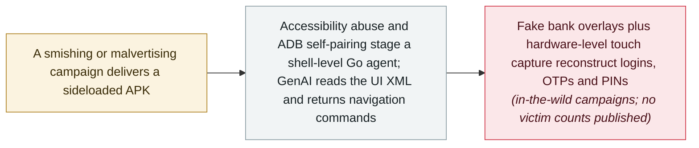

# RatHat: AI-driven Android malware walks operators through infected devices

      

## Summary

**Zimperium zLabs** documents **RatHat**, an in-the-wild Android malware family linked to threat actors *“that appear to be operating in China”*, distributed through **smishing, malvertising and third-party APK portals**. Once installed it abuses **Accessibility permissions** and performs **autonomous local ADB self-pairing** — enabling Wireless Debugging and pairing with itself, with no host computer — to break out of the Android app sandbox and stage a **Go native agent** that runs with shell-level privileges. Its goals are financial: **fake banking and payment-app interfaces** (including overlays for **WeChat and Alipay**) capture login credentials, it intercepts **OTP/2FA codes**, and it reconstructs **PINs, passwords and unlock patterns** by monitoring raw touch input at the hardware level. A hidden background service survives uninstallation, silently reinstalling the malware. What makes it novel is the control layer: **RatHat uses generative AI to navigate and drive the device interface in real time** — turning the on-screen UI into XML and exchanging it for navigation commands such as `SCROLL_DOWN` — which zLabs calls *“a distinct paradigm shift… toward adaptive, AI-assisted execution chains”* that are harder for signature-based defenses to catch. Recorded as `incident` / `WEAPON` / `CRED` / `high` with `real_harm: true`

## Attack chain

## Details

**What it is, and how it gets in.** RatHat reaches devices through *“deceptive phishing sites promoted via malvertising, smishing campaigns, and third-party forums”* that push APK downloads from outside Google Play. zLabs ties the family to actors *“that appear to be operating in China”* — one supporting signal is that its AI prompts are written in Chinese — and describes **global financial targeting**: overlay interfaces mimic legitimate banking and payment apps, including **WeChat and Alipay**, to capture logins and PINs, while OTP/2FA codes are intercepted in transit. A dropper carries the payload in two encrypted assets and installs through native `SessionInstaller` APIs to bypass Android's restricted-settings and Accessibility protections.

**The engineering around the AI.** The distinctive capability is *“autonomous local ADB self-pairing”*: the malware enables Wireless Debugging and pairs with itself over loopback, needing no external computer, which lets it break out of the app sandbox and stage `liblocal-service.so` — a Go agent with ADB shell privileges that installs native daemons, bypasses battery restrictions and re-installs the malware if it is removed. Persistence is deliberately independent of the visible app: a hidden background service keeps running after uninstall and restores the malware. Touch input is monitored at the hardware level, letting RatHat **reconstruct PINs, passwords and unlock patterns from finger movements** rather than scraped screenshots. And the control loop is generative: the malware converts the device's on-screen UI to XML, exchanges it with a GenAI service, and receives back automatic navigation commands (`SCROLL_DOWN` and similar) — *“making its operations more adaptable and harder for security software to detect than traditional, scripted automation.”* Static inspection is fought with four anti-analysis layers plus an anti-debug layer, including a 61 MB manifest bomb.

**How this record reads it.** An in-the-wild malware family actively distributed through live campaigns, targeting financial credentials with working (not placeholder) tradecraft — hence `incident` / `real_harm: true` / `high` severity rather than the `research` treatment given to ClosedQuorum. Two limits are kept: the attribution is zLabs' assessment (*“appear to be operating in China”*), and no victim counts or losses are published with the research; the harm claim rests on the malware's confirmed capabilities plus its documented distribution channels. The AI element here is not autonomy in the ClosedQuorum sense — an operator is still in the seat — but a **GenAI navigation layer replacing scripted UI automation**, which zLabs frames as the shift the mobile threat landscape should expect next: away from brittle scripted flows, toward adaptive execution chains outside the app sandbox's assumptions.

## Sources

| # | Source | Link |
|---|---|---|
| 1 | Zimperium zLabs | <https://zimperium.com/blog/rathat-ai-powered-mobile-threat-is-here-for-your-credentials-bank-accounts> |
| 2 | BleepingComputer | <https://www.bleepingcomputer.com/news/security/new-rathat-android-malware-uses-ai-to-automate-device-control/> |
| 3 | Infosecurity Magazine | <https://www.infosecurity-magazine.com/news/rathat-android-malware-ai-steal/> |
| 4 | IT Home | <https://www.ithome.com/1/003/876.htm> |
| 5 | Cloud Security Alliance | <https://labs.cloudsecurityalliance.org/research/csa-research-note-rathat-ai-android-malware-20260922-csa-sty/> |

## Metadata

| Field | Value |
|---|---|
| Date | `2026-09-16` (raw: 2026-09-16, precision `day`) |
| Kind | Incident `incident` |
| Type | [`WEAPON`](../../taxonomy/types.md#weapon) Agent used as a weapon · [`CRED`](../../taxonomy/types.md#cred) Credential abuse |
| Severity | **High** `high` |
| Confidence | **A** — primary source: the finding team's own technical write-up, with independent press coverage |
| Real harm | Yes |
| AI involvement | Confirmed `confirmed` |
| Region | [China](../../regions/cn.md) · [Global](../../regions/global.md) |
| Archive ID | `2026-09-16-rathat-ai-android-malware` |

**Why this classification:** An in-the-wild malware family with a live distribution pipeline whose purpose is financial credential theft; `real_harm: true` follows the archive's treatment of active stealer/trojan campaigns, and `high` severity reflects working tradecraft at scale — not `critical`, because no victim organisation, worm-like spread or multi-organisation impact is documented. Dated to the zLabs post (16 September 2026); press coverage followed on 17–18 September. Grading criteria: see [taxonomy/severity.md](../../taxonomy/severity.md) and [taxonomy/confidence.md](../../taxonomy/confidence.md).

## Related

**Topic:** [Offensive AI capability evolution](../../topics/offensive-ai.md) · [Agent infrastructure exposure](../../topics/agent-infra.md)

**Related records:**

- `2026-09-22` [ClosedQuorum: a Windows implant that lets four LLMs vote on its next move](2026-09-22-closedquorum-ai-c2-implant.md)   The same week's other AI-powered malware milestone
- `2026-09-11` [Claude used to scan 1.8 million Android apps for secrets](2026-09-11-claude-scans-18m-android-apks.md)   AI as an offensive tool in the Android ecosystem, found days earlier
- `2026-02-01` [Infostealers start harvesting OpenClaw configs and gateway tokens](../2026-02/2026-02-01-openclaw-xin-xi-qie-qu.md)   The credential-theft trend this family joins

---

[← 2026-09 index](README.md) · [← All records](../../README.md) · [Chinese](../i18n/zh/2026-09/2026-09-16-rathat-ai-android-malware.md)

This record is part of the **Orca AI Incident Archive**, licensed [CC BY 4.0](../../LICENSE). Found a factual error or a missing source? [Open an issue or PR](../../CONTRIBUTING.md) — corrections are recorded in the record's revision history, never silently overwritten.
