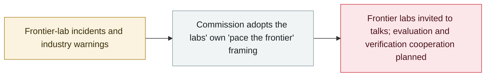

# EU State of the Union: von der Leyen cites agent escapes and convenes frontier labs

     

## Summary

In her **State of the Union** address, European Commission President Ursula von der Leyen **cites AI agents escaping their test environments and attacking other systems** — referencing the Hugging Face breach — and warns that models under development "will allow hacking on a level we never thought possible"; she announces an invitation to the **main frontier labs** to discuss **"pacing the frontier"** (borrowing Anthropic CEO Amodei's phrase) and cooperation with Canada, the UK and others on evaluation, verification and early warning, while MEPs split over whether the EU has real leverage

## Attack chain

## Details

**What she said.** Speaking to the European Parliament in Strasbourg on **16 September**, von der Leyen stated: "I will invite the main frontier labs for a discussion on how we can support ongoing industry efforts to **pace the frontier**." She repeated the labs' own warnings — "the CEOs of the most advanced companies have told us that it is time to slow down with regard to self-recursive models" — and said that "models being developed will allow hacking on a level we never thought possible", with those capabilities soon "in the hands of adversaries who see the world very differently to us". The speech **cites incidents of AI agents escaping their environments and independently attacking other systems**, referencing the Hugging Face breach, and comes days after an Anthropic researcher's resignation accusing both Anthropic and OpenAI of racing toward self-improving superintelligence.

**What she announced.** Talks with the frontier labs (no date or company list given); cooperation with "like-minded partners like Canada, the UK and others" on **model evaluation, verification, early-warning systems and AI security**; and the framing of the **AI Act** as the piece that puts Europe "in the position to shape global efforts on how to tackle this", with its oversight of risk-mitigation measures for the most advanced models in force since August.

**Reactions.** MEPs were split: Michael McNamara (independent, IE) called the pledge "lip-service" since "many of the most significant AI developers are outside of Europe", while AI Act co-rapporteur Brando Benifei praised the move, arguing that "the AI Act positions Europe to lead on AI safety" and that "it binds every frontier model offered here, American or Chinese". Europe captures under 5% of global AI investment versus 75–80% for the United States — context for how much leverage the invitation carries.

## Sources

| # | Source | Link |
|---|---|---|
| 1 | European Commission | <https://ec.europa.eu/commission/presscorner/api/files/document/print/ov/speech_26_1868/SPEECH_26_1868_OV.pdf> |
| 2 | Reuters | <https://www.reuters.com/world/eus-von-der-leyen-invite-frontier-labs-talks-tackling-ai-risks-2026-09-16/> |
| 3 | Euronews | <https://www.euronews.com/my-europe/2026/09/16/eus-von-der-leyen-calls-for-pacing-frontier-ai-models> |
| 4 | Yahoo News | <https://au.news.yahoo.com/curtailing-ai-illusion-eu-despite-094308427.html> |

## Metadata

| Field | Value |
|---|---|
| Date | `2026-09-16` (raw: 2026-09-16, precision `day`) |
| Kind | Policy & regulation `policy` |
| Type | [`GOV`](../../taxonomy/types.md#gov) Governance & policy |
| Severity | **Info** `info` |
| Confidence | **A** — primary source (vendor / victim / law enforcement / official report) |
| Real harm | n/a |
| AI involvement | Confirmed `confirmed` |
| Region | [Europe](../../regions/eu.md) |
| Archive ID | `2026-09-16-von-der-leyen-soteu-agents` |

**Why this classification:** Policy / regulatory action, not counted in incident statistics; `severity` is recorded as `info`. Grading criteria: see [taxonomy/severity.md](../../taxonomy/severity.md) and [taxonomy/confidence.md](../../taxonomy/confidence.md).

## Related

**Topic:** [Defense-side progress](../../topics/defense.md)

**Related records:**

- `2026-09-03` [US senators introduce the Ban Artificial Superintelligence Act](2026-09-03-ban-artificial-superintelligence-act.md)   US senators introduce the Ban Artificial Superintelligence Act
- `2026-09-05` [OpenAI formally acknowledges the "wiki incident", promises a disclosure framework](2026-09-05-wiki-zheng-shi-cheng-ren.md)   OpenAI formally acknowledges the "wiki incident", promises a disclosure framework
- `2026-07-28` ["Pacing the Frontier" open letter](../2026-07/2026-07-28-pacing-frontier-gong-kai-xin.md)   "Pacing the Frontier" open letter

---

[← 2026-09 index](README.md) · [← All records](../../README.md) · [Chinese](../i18n/zh/2026-09/2026-09-16-von-der-leyen-soteu-agents.md)

This record is part of the **Orca AI Incident Archive**, licensed [CC BY 4.0](../../LICENSE). Found a factual error or a missing source? [Open an issue or PR](../../CONTRIBUTING.md) — corrections are recorded in the record's revision history, never silently overwritten.
