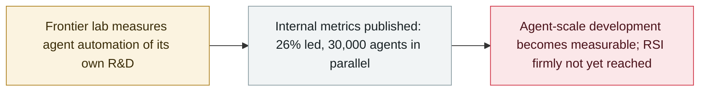

# Anthropic: Claude "leads" 26% of its AI R&D with 30,000 agents running in parallel

     

## Summary

Anthropic publishes an **R&D Automation Index** to measure how much of its AI development agents already run: by August, Claude **"led" (AL4) about 26% of AI R&D tasks — up from under 1% in February** — with **90%+ at AL3 collaboration or above**, and roughly **30,000 agents** working in parallel on its most-used internal platform. The company ties the index to **RSI** (a model fully building its own successor) but confirms **full RSI is not here**, and describes per-agent identities and an open message bus as the controls that keep the swarm auditable

## Attack chain

## Details

**The index.** Anthropic's **R&D Automation Index** borrows Epoch AI's six-level autonomy scale (AL0–AL5): at **AL3 ("collaboration")** an AI takes large parts of a task under close human guidance; at **AL4 ("lead")** an engineer gives a high-level goal and the AI completes most of the end-to-end work under human oversight; only **AL5** would be full autonomy with no human in the loop. As of **August 2026**, Claude "led" about **26%** of tasks — from **under 1% in February** — and more than **90%** were at AL3 or above. Method: each week in July, Claude Research Agents read the Slack and internal docs of a 20% random sample of staff, producing ~**15,000 fine-grained R&D tasks** organised into a **542-node task tree** (378 leaf nodes) covering pre-training, RL, evaluation-platform debugging, RL sandbox network policy and inference incidents, weighted by human time.

**Limits of the measure.** The judge determining automation level is **also Claude**; against human staff, exact agreement was 59% (human-to-human exact agreement was only 35%; within one level, 97%). Anthropic acknowledges room for subjective judgement between "collaboration" and "lead".

**Running the swarm.** Two internal designs keep the ~30,000 concurrent agents manageable: **unique identity per agent** (all data and behaviour bound to an identity that outlives model upgrades) and an **open communication system** (messages carry sender identity and link to sources, and are cross-referenced with full agent traces so monitoring can follow cross-agent behaviour).

**Why it matters.** The publication is Anthropic's attempt to measure "how much human work is left" in building frontier models, and to locate the industry on the road to **recursive self-improvement** — a model autonomously building its successor. Anthropic says full RSI is **not here** and not inevitable; for context, OpenAI has a dedicated RSI team and reported reaching its "automated AI research intern" milestone, Google described agent loops used in Gemini 3.8's development and a "Dream-RSI" paper (14 September), and startup Recursive states automated AI research as its goal. METR notes definitions of RSI still vary widely across researchers.

## Sources

| # | Source | Link |
|---|---|---|
| 1 | Anthropic | <https://www.anthropic.com/institute/measuring-pace-of-ai-development> |
| 2 | Anthropic (RSI) | <https://www.anthropic.com/institute/recursive-self-improvement> |
| 3 | InfoQ | <https://www.infoq.cn/article/CEphwKjzAe7LzbOriLcq> |

## Metadata

| Field | Value |
|---|---|
| Date | `2026-09-17` (raw: 2026-09-17, precision `day`) |
| Kind | Threat report `report` |
| Type | [`GOV`](../../taxonomy/types.md#gov) Governance & policy |
| Severity | **Info** `info` |
| Confidence | **A** — primary source (vendor / victim / law enforcement / official report) |
| Real harm | n/a |
| AI involvement | Confirmed `confirmed` |
| Region | [Global](../../regions/global.md) |
| Archive ID | `2026-09-17-anthropic-rd-indicators` |

**Why this classification:** A vendor publication, not an incident; recorded for the agent-automation trend line and the RSI question, so `severity` is `info` and `real_harm` is not applicable. Grading criteria: see [taxonomy/severity.md](../../taxonomy/severity.md) and [taxonomy/confidence.md](../../taxonomy/confidence.md).

## Related

**Topic:** [Defense-side progress](../../topics/defense.md) · [Frontier model autonomous overreach](../../topics/eval-escapes.md)

**Related records:**

- `2026-09-10` [Anthropic September threat intelligence report](2026-09-10-anthropic-september-threat-report.md)   Anthropic September threat intelligence report
- `2026-07-30` [Anthropic discloses three evaluation-breakout incidents](../2026-07/2026-07-30-anthropic-three-eval-incidents.md)   Anthropic discloses three evaluation-breakout incidents
- `2026-09-16` [OpenAI discloses six misalignment incidents and a reporting framework](2026-09-16-openai-misalignment-reports.md)   OpenAI discloses six misalignment incidents and a reporting framework

---

[← 2026-09 index](README.md) · [← All records](../../README.md) · [Chinese](../i18n/zh/2026-09/2026-09-17-anthropic-rd-indicators.md)

This record is part of the **Orca AI Incident Archive**, licensed [CC BY 4.0](../../LICENSE). Found a factual error or a missing source? [Open an issue or PR](../../CONTRIBUTING.md) — corrections are recorded in the record's revision history, never silently overwritten.
