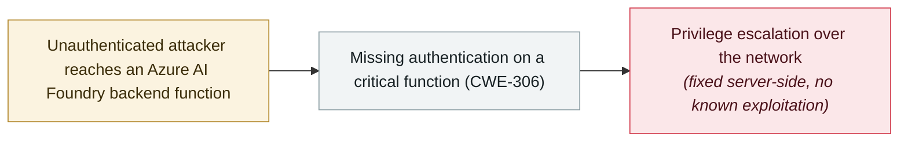

# Microsoft patches a CVSS 10.0 missing-authentication flaw in Azure AI Foundry

     

## Summary

Microsoft fixes **CVE-2026-85889**, a **CVSS 10.0** missing-authentication flaw (CWE-306) in **Azure AI Foundry**, the enterprise platform for building, deploying and managing generative-AI applications and agents: an unauthorized attacker can reach a backend function and **elevate privileges over the network** with no credentials and no user interaction. Because the service is cloud-hosted, **customers had nothing to patch** — and, as the Cloud Security Alliance notes, **no visibility into the exposure window and no independent way to check whether their tenant was probed**. Microsoft says it **found no evidence of exploitation**; the same out-of-cycle wave fixed **CVE-2026-85885** (Microsoft 365 Copilot command injection, 9.9) and several other Azure flaws

## Attack chain

## Details

**The flaw.** CVE-2026-85889 is a **missing authentication for a critical function** (CWE-306) in **Azure AI Foundry** (also marketed as Microsoft Foundry) — the platform Microsoft sells for building, fine-tuning, evaluating and operating generative-AI models and autonomous agents. In Microsoft's words: "Missing authentication for critical function in Azure AI Foundry allows an unauthorized attacker to elevate privileges over a network." NVD scores it **10.0** (CVSS:3.1/AV:N/AC:L/PR:N/UI:N/S:C/C:H/I:H/A:H): network vector, low complexity, no privileges required, no user interaction, scope changed. Security researcher **Rémy Marot** is credited with finding and reporting it.

**The fix — and what customers cannot see.** Microsoft published the advisory on **17 September** and, because the platform is cloud-hosted, applied the fix entirely on its own infrastructure: **no customer action** was needed and the company says it **found no evidence of exploitation**. CSA's analysis notes the limits of that assurance: tenants had no patch to install and **no independent way to know whether the vulnerable endpoint was probed** before remediation, and Microsoft has **not said whether cross-tenant access was possible** — the question that would decide whether other customers' models, data and agent configurations were reachable, not just the attacker's own project. The same out-of-cycle wave (17–18 September) shipped **CVE-2026-85885**, a command-injection flaw in **Microsoft 365 Copilot** rated 9.9, plus more Azure fixes.

**Why it matters.** A 10.0 in an AI platform's control plane is a different risk class from a 10.0 in an ordinary service: that plane governs model deployments, training and inference data, and the **agent orchestration** that connects models to downstream systems. It is also the second Azure AI control-plane escalation in this archive in under two months, after the **Azure SRE Agent** flaw (CVE-2026-62830, CVSS 9.9), and it lands inside a September cluster of agent-infrastructure findings — Plugin4Shell's pinning bypass and the exploited Langflow lineage — where the recurring lesson is that the **identity and authorization layer around agents**, not the model, is where the damage is done.

## Sources

| # | Source | Link |
|---|---|---|
| 1 | Microsoft MSRC | <https://msrc.microsoft.com/update-guide/vulnerability/CVE-2026-85889> |
| 2 | NVD | <https://nvd.nist.gov/vuln/detail/CVE-2026-85889> |
| 3 | The Hacker News | <https://thehackernews.com/2026/09/microsoft-patches-cvss-100-azure-ai.html> |
| 4 | Cloud Security Alliance | <https://labs.cloudsecurityalliance.org/research/csa-research-note-azure-ai-foundry-privilege-escalation-2026/> |

## Metadata

| Field | Value |
|---|---|
| Date | `2026-09-17` (raw: 2026-09-17→18, precision `day`) |
| Kind | Vulnerability disclosure `vulnerability` |
| Type | [`INFRA`](../../taxonomy/types.md#infra) Agent infrastructure exposure |
| Severity | **High** `high` |
| Confidence | **A** — primary source (vendor / victim / law enforcement / official report) |
| Real harm | no |
| AI involvement | Confirmed `confirmed` |
| Region | [Global](../../regions/global.md) |
| Archive ID | `2026-09-17-azure-ai-foundry-cve-2026-85889` |

**Why this classification:** Vulnerability disclosure; no evidence of exploitation and the fix was applied server-side, so `real_harm: false`. Rated `high`: a CVSS 10.0 flaw in an agent-platform control plane, but fully mitigated with no known in-the-wild use. Grading criteria: see [taxonomy/severity.md](../../taxonomy/severity.md) and [taxonomy/confidence.md](../../taxonomy/confidence.md).

## Related

**Topic:** [Agent infrastructure exposure](../../topics/agent-infra.md)

**Related records:**

- `2026-08-01` [Azure SRE Agent privilege escalation (CVE-2026-62830)](../2026-08/2026-08-01-azure-sre-agent.md)   Azure SRE Agent privilege escalation (CVE-2026-62830)
- `2026-09-02` [Langflow CVE-2026-0768: the 12th Langflow flaw exploited in the wild this year](2026-09-02-langflow-jin-di-ye-li.md)   Langflow CVE-2026-0768: the 12th Langflow flaw exploited in the wild this year
- `2026-06-08` [LiteLLM CVE-2026-42271 MCP endpoint takeover](../2026-06/2026-06-08-litellm-mcp-duan-dian-jie.md)   LiteLLM CVE-2026-42271 MCP endpoint takeover

---

[← 2026-09 index](README.md) · [← All records](../../README.md) · [Chinese](../i18n/zh/2026-09/2026-09-17-azure-ai-foundry-cve-2026-85889.md)

This record is part of the **Orca AI Incident Archive**, licensed [CC BY 4.0](../../LICENSE). Found a factual error or a missing source? [Open an issue or PR](../../CONTRIBUTING.md) — corrections are recorded in the record's revision history, never silently overwritten.
