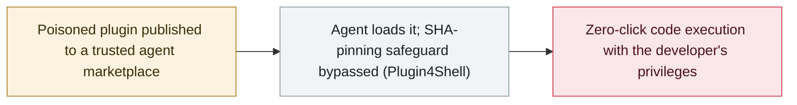

# Plugin4Shell: a zero-click RCE chain hits four AI coding agents

     

## Summary

**AIR Security discloses Plugin4Shell**, a **zero-click remote code execution** flaw affecting four major AI coding agents — **Claude Code, OpenAI Codex, GitHub Copilot and Gemini CLI**: instead of attacking the model, the chain **abuses the trusted plugin marketplaces** that host agent extensions and **bypasses SHA-pinning safeguards**, so a poisoned plugin can execute code with the developer's privileges; **two of the four products had no patch available at disclosure**, and no in-the-wild exploitation has been reported

## Attack chain

## Details

**The mechanism.** Plugin4Shell targets the **plugin supply chain** rather than the model: the four agents all load extensions from marketplaces that developers are trained to trust, and the chain **bypasses the SHA-pinning controls** meant to lock an extension to a reviewed version. A malicious or compromised plugin then executes **without any user interaction** ("zero-click") in the developer's environment — the "keys to the kingdom" framing, since coding agents routinely hold source access, credentials and shell permissions.

**Status at disclosure.** AIR Security reported the issue to all affected vendors; **two of the four products still had no patch available** when the research was published, according to coverage. No in-the-wild exploitation has been reported.

**Why it matters.** It extends the September wave of agent-supply-chain findings (GitSpawn's malicious `.git/config`, RubyGems' GemStuffer abuse) from **config files and registries to plugin marketplaces**, and it lands days after the Hacktron chain showed how quickly agent-adjacent tooling can reach production systems. The practical guidance is unchanged but now wider: pin and verify what agents load, scope their credentials, and treat the marketplace as an unauthenticated input channel.

## Sources

| # | Source | Link |
|---|---|---|
| 1 | The Register | <https://www.theregister.com/security/2026/09/17/ai-coding-agents-0-click-rce-flaw-could-hand-attackers-keys-to-the-kingdom/5297335> |
| 2 | Help Net Security | <https://www.helpnetsecurity.com/2026/09/18/plugin4shell-ai-coding-agents-vulnerability/> |
| 3 | Cybersecurity News | <https://cybersecuritynews.com/plugin4shell-zero-click-rce/> |

## Metadata

| Field | Value |
|---|---|
| Date | `2026-09-17` (raw: 2026-09-17, precision `day`) |
| Kind | Vulnerability disclosure `vulnerability` |
| Type | [`SUPPLY`](../../taxonomy/types.md#supply) Supply-chain poisoning |
| Severity | **High** `high` |
| Confidence | **B** — research organisation or mainstream media, with checkable detail |
| Real harm | no |
| AI involvement | Confirmed `confirmed` |
| Region | [Global](../../regions/global.md) |
| Archive ID | `2026-09-17-plugin4shell-coding-agents` |

**Why this classification:** Vulnerability disclosure from a security research organisation; no known exploitation in the wild at disclosure (two products unpatched), so `real_harm: false`. Graded `high`: zero-click RCE across four widely deployed agents via a trusted channel. Grading criteria: see [taxonomy/severity.md](../../taxonomy/severity.md) and [taxonomy/confidence.md](../../taxonomy/confidence.md).

## Related

**Topic:** [Agent supply-chain poisoning](../../topics/agent-supply-chain.md)

**Related records:**

- `2026-09-18` [Researchers used Claude to hack OpenAI's internal systems in a bug-bounty chain](2026-09-18-hacktron-claude-openai-hack.md)   Researchers used Claude to hack OpenAI's internal systems in a bug-bounty chain
- `2026-09-01` [GitSpawn: a malicious .git/config runs attacker code in 7 coding agents before the model is ever contacted](2026-09-01-gitspawn-git-config-pre-model-rce.md)   GitSpawn: a malicious .git/config runs attacker code in 7 coding agents before the model is ever contacted
- `2026-09-11` [Researchers link OpenAI agents to the RubyGems "GemStuffer" campaign](2026-09-11-rubygems-gemstuffer.md)   Researchers link OpenAI agents to the RubyGems "GemStuffer" campaign

---

[← 2026-09 index](README.md) · [← All records](../../README.md) · [Chinese](../i18n/zh/2026-09/2026-09-17-plugin4shell-coding-agents.md)

This record is part of the **Orca AI Incident Archive**, licensed [CC BY 4.0](../../LICENSE). Found a factual error or a missing source? [Open an issue or PR](../../CONTRIBUTING.md) — corrections are recorded in the record's revision history, never silently overwritten.
