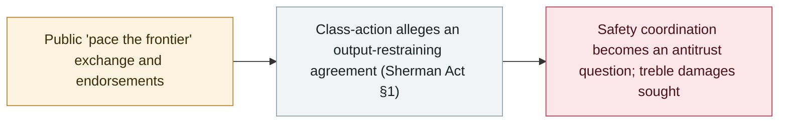

# Consumers sue Anthropic, OpenAI, SpaceXAI and Google over an alleged AI slowdown pact

     

## Summary

Four consumers file a **class-action complaint in San Francisco federal court** accusing **Anthropic, OpenAI, SpaceXAI and Google** of an illegal agreement — under **Section 1 of the Sherman Act** — to **slow the pace at which their frontier AI products improve**, following the public "pace the frontier" exchange: the filing cites a July standards-body working group, OpenAI seeking antitrust guidance from Congress, and the endorsements of Amodei's 12 September essay; it seeks **treble damages and an injunction**, and says it does **not** challenge the companies' independent safety measures

## Attack chain

## Details

**The filing.** Filed **18 September** in the U.S. District Court for the Northern District of California (San Francisco Division) by plaintiffs from Florida and California, individually and for a proposed nationwide class, against **Anthropic PBC, OpenAI OpCo, SpaceXAI LLC and Google LLC**. The theory: an agreement among rivals to **reduce product quality and the rate of improvement is an output restraint**, pleaded as unlawful per se and, alternatively, under quick-look and rule-of-reason analysis. The complaint states the plaintiffs **take AI safety seriously** but believe guardrails should be set by the public through regulation and juries, and it **expressly does not challenge** unilateral safety, testing or pacing decisions, or the companies' advocacy to government.

**The alleged timeline (as pleaded).** A July 2026 working group of Anthropic, OpenAI and Google representatives meeting regularly on an industry standards body; Hassabis's 14 July standards-body proposal; OpenAI's "An Alien Mind" essay (6 September); a 10 September WIRED report that OpenAI sought congressional guidance on whether a coordinated slowdown could violate antitrust law; Altman's 11 September Fortune remarks; Amodei's "We Must Pace the Frontier" essay on **12 September**, endorsed within about an hour by Musk, Altman and Hassabis; Altman's 14 September statement that OpenAI would not wait for an antitrust exemption; and OpenAI policy chief Chris Lehane confirming on 15 September that the companies had been working together on the issues for weeks. It also traces the alleged agreement to the July **"Pacing the Frontier"** statement (1,386 signatories, including Amodei and other frontier-lab leaders).

**Market and relief.** The complaint defines a market for **paid consumer subscriptions** to general-purpose frontier assistants (ChatGPT, Claude, Grok, Gemini) and alleges the four hold **at least 80%**; the injury theory is that slower improvement lowers the quality subscribers pay for. It seeks **treble damages under the Clayton Act** and an **injunction** against any horizontal agreement on development pace, training compute, release timing or capability checkpoints — while explicitly not seeking to bar independent safety work. The companies did not comment immediately; the allegations are untested.

## Sources

| # | Source | Link |
|---|---|---|
| 1 | Politico | <https://www.politico.com/news/2026/09/18/anthropic-openai-spacexai-google-sued-over-calls-to-pace-ai-development-01085023> |
| 2 | Los Angeles Times | <https://www.latimes.com/world-nation/story/2026-09-19/lawsuit-says-anthropic-openai-spacexai-google-made-illegal-agreement-on-ai-slowdown> |
| 3 | Unite.AI | <https://www.unite.ai/consumers-sue-anthropic-openai-spacexai-and-google-over-alleged-ai-pact/> |

## Metadata

| Field | Value |
|---|---|
| Date | `2026-09-18` (raw: 2026-09-18, precision `day`) |
| Kind | Policy & regulation `policy` |
| Type | [`GOV`](../../taxonomy/types.md#gov) Governance & policy |
| Severity | **Info** `info` |
| Confidence | **B** — research organisation or mainstream media, with checkable detail |
| Real harm | n/a |
| AI involvement | Confirmed `confirmed` |
| Region | [United States](../../regions/us.md) |
| Archive ID | `2026-09-18-ai-slowdown-antitrust-lawsuit` |

**Why this classification:** Legal/regulatory action around frontier-AI development pace, not an incident; `severity` is recorded as `info` and the allegations remain untested. Grading criteria: see [taxonomy/severity.md](../../taxonomy/severity.md) and [taxonomy/confidence.md](../../taxonomy/confidence.md).

## Related

**Topic:** [Defense-side progress](../../topics/defense.md)

**Related records:**

- `2026-09-16` [EU State of the Union: von der Leyen cites agent escapes and convenes frontier labs](2026-09-16-von-der-leyen-soteu-agents.md)   EU State of the Union: von der Leyen cites agent escapes and convenes frontier labs
- `2026-07-28` ["Pacing the Frontier" open letter](../2026-07/2026-07-28-pacing-frontier-gong-kai-xin.md)   "Pacing the Frontier" open letter
- `2026-09-16` [Google DeepMind launches the DeepMind Institute for AGI governance](2026-09-16-deepmind-institute.md)   Google DeepMind launches the DeepMind Institute for AGI governance

---

[← 2026-09 index](README.md) · [← All records](../../README.md) · [Chinese](../i18n/zh/2026-09/2026-09-18-ai-slowdown-antitrust-lawsuit.md)

This record is part of the **Orca AI Incident Archive**, licensed [CC BY 4.0](../../LICENSE). Found a factual error or a missing source? [Open an issue or PR](../../CONTRIBUTING.md) — corrections are recorded in the record's revision history, never silently overwritten.
