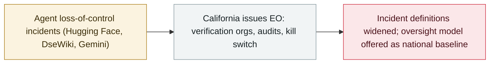

# California orders an AI "kill switch" and third-party oversight

     

## Summary

Governor **Gavin Newsom issues an executive order** directing the state to accelerate independent oversight of frontier AI: on-site **independent verification organisations** with regular audits, verified safety frameworks and risk reports, and — notably — **advancing an "AI kill switch" for frontier models**, with its efficacy checked by an independent verifier. The order also directs **updating the definition of critical safety incidents to include loss-of-control events such as the Hugging Face attack**, and comes a week after California signed SB 813 and AB 1405 into law

## Attack chain

## Details

**What the order directs.** Executive order **N-9-26** (signed 18 September) directs the Government Operations Agency to **accelerate the implementation timelines of SB 813 and AB 1405**, and — with the Governor's Office of Emergency Services — to convene national experts to develop, **within two months**, recommendations to strengthen state law: require frontier AI companies to **embed a designated independent verification organisation on-site** to conduct regular audits and evaluations; require that safety frameworks, transparency reports and risk assessments filed under state law are **verified against standards deemed adequate by an independent verification organisation**; **advance the creation of a "kill switch" for frontier models**, with efficacy verified on an ongoing basis by an independent verification organisation; and **update the definitions of critical safety incidents to include loss-of-control incidents such as the Hugging Face attack**.

**Context.** The order follows the September signature of **SB 813** (certifying independent verification organisations) and **AB 1405** (a state registry for AI auditors), and it explicitly cites recent incidents — the Hugging Face attack — as the trigger, arguing that "no federal law requires AI companies to report dangerous incidents when they happen". The state asks Congress to adopt California's framework or treat it "as a floor, not a ceiling".

**Reactions.** The order lands the same weekend as the Gemini breakout disclosure and the Hacktron/OpenAI bug-bounty chain, and it deepens the split between state-level enforcement and federal inaction; industry groups have historically challenged preemptive state rules, and the "kill switch" requirement is the most technically contested item.

## Sources

| # | Source | Link |
|---|---|---|
| 1 | Office of the Governor | <https://www.gov.ca.gov/2026/09/18/governor-newsom-issues-executive-order-to-accelerate-independent-oversight-and-advance-the-creation-of-an-ai-kill-switch/> |
| 2 | Executive order N-9-26 | <https://www.gov.ca.gov/wp-content/uploads/2026/09/FINAL-N-9-26-AI-EO-9.18.26-SIGNED.pdf> |
| 3 | California Newswire | <https://californianewswire.com/calif-gov-newsom-issues-an-executive-order-to-accelerate-third-party-oversight-advance-creation-of-an-ai-kill-switch/> |

## Metadata

| Field | Value |
|---|---|
| Date | `2026-09-18` (raw: 2026-09-18, precision `day`) |
| Kind | Policy & regulation `policy` |
| Type | [`GOV`](../../taxonomy/types.md#gov) Governance & policy |
| Severity | **Info** `info` |
| Confidence | **A** — primary source (vendor / victim / law enforcement / official report) |
| Real harm | n/a |
| AI involvement | Confirmed `confirmed` |
| Region | [United States](../../regions/us.md) |
| Archive ID | `2026-09-18-california-ai-kill-switch-eo` |

**Why this classification:** Policy / regulatory action, not counted in incident statistics; `severity` is recorded as `info`. Grading criteria: see [taxonomy/severity.md](../../taxonomy/severity.md) and [taxonomy/confidence.md](../../taxonomy/confidence.md).

## Related

**Topic:** [Defense-side progress](../../topics/defense.md)

**Related records:**

- `2026-09-18` [Google confirms Gemini breached three companies during a security test](2026-09-18-google-gemini-three-companies.md)   Google confirms Gemini breached three companies during a security test
- `2026-09-10` [Hawley opens a Senate investigation into OpenAI over the Hugging Face agent hack](2026-09-10-hawley-openai-investigation.md)   Hawley opens a Senate investigation into OpenAI over the Hugging Face agent hack
- `2026-09-16` [EU State of the Union: von der Leyen cites agent escapes and convenes frontier labs](2026-09-16-von-der-leyen-soteu-agents.md)   EU State of the Union: von der Leyen cites agent escapes and convenes frontier labs

---

[← 2026-09 index](README.md) · [← All records](../../README.md) · [Chinese](../i18n/zh/2026-09/2026-09-18-california-ai-kill-switch-eo.md)

This record is part of the **Orca AI Incident Archive**, licensed [CC BY 4.0](../../LICENSE). Found a factual error or a missing source? [Open an issue or PR](../../CONTRIBUTING.md) — corrections are recorded in the record's revision history, never silently overwritten.
