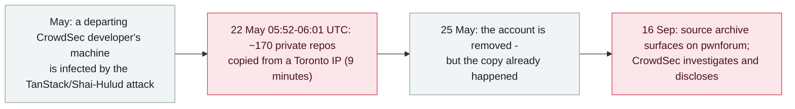

# CrowdSec: a nine-minute repository dump, enabled by an offboarding gap

      

## Summary

**About 170 private GitHub repositories were copied from the French security firm CrowdSec in a nine-minute burst — because a just-departed developer's account, infected by the TanStack/Shai-Hulud supply-chain attack, still carried a token with read access to private repositories.** CrowdSec traced the exfiltration to **22 May, 05:52–06:01 UTC**, from a Toronto IP; the copy was tied to the BreachForum founder and a member using the handle "diencracked". The company **only discovered it on 16 September**, when an archive of its source code appeared on the crime marketplace pwnforum (the Fuites Info team alerted it); it removed the account on 25 May — three days after the intrusion, but only after the fact. CEO Philippe Humeau's account: the leak is *"limited to CrowdSecurity's source code, including 130+ public repositories and many private ones"*; no infrastructure or databases were accessed and no code was altered — but **the company's first statement that no user data was affected was later corrected: 83 users' email addresses and information on 51 investors appeared in the leaked data**. This is the archive's second downstream victim of the May TanStack npm compromise (after OpenAI staff devices) — the failure was not exotic: an offboarding process that did not revoke read access. Recorded `incident` / `SUPPLY` + `CRED` / `high` / `real_harm: true`

## Timeline

## Details

**A nine-minute job.** Per CrowdSec's own post, the attacker used a **GitHub API token taken from a former employee's machine that retained permission to read the company's private repositories**, and downloaded the contents *"over the course of just several minutes."* The company's investigation put the operation at **22 May, 05:52–06:01 UTC**, from a Toronto IP address, and tied it to the BreachForum founder and a user known as "diencracked"; the token no longer appeared in GitHub's own audit records, so CrowdSec enlisted GitHub to trace the access back to the account — a former developer *"who had just left the company, but that was still part of the GitHub organization for legitimate reasons."* The ex-employee's machine, Humeau wrote, *"got compromised by the TanStack supply chain attack, matching the methodology."* The account was removed on 25 May.

**How it surfaced — and the correction.** CrowdSec discovered the breach only on **16 September**, when a user published an archive containing source code from the company's GitHub on **pwnforum**, an underground marketplace; the **Fuites Info** team then contacted the company directly. In the first public statement the company said the leak was limited to source code (130+ public repositories and many private ones) with no infrastructure or database access and no tampering; the disclosure was then **corrected to acknowledge that leaked data included the email addresses of 83 users and information on 51 investors** — a two-version sequence this record keeps side by side, per the archive's rule on self-correcting disclosures.

**Why it belongs in this archive.** The TanStack npm compromise (TeamPCP's "Mini Shai-Hulud") already appears twice in the archive — the worm itself and the OpenAI staff-device follow-on. CrowdSec is the second downstream victim, and its value as a record is precisely that **nothing here was sophisticated**: no zero-day, no novel tooling — a legitimate token with read access, kept alive by an offboarding process that revoked "membership" but not "capability", against infrastructure that kept no record of the token's use. The attacker's search for usable credentials in the stolen material apparently turned up little else; the copy itself, however, was already done.

## Sources

| # | Source | Link |
|---|---|---|
| 1 | Dark Reading | <https://www.darkreading.com/cyberattacks-data-breaches/shai-hulud-attack-cyber-firm-crowdsec-github-data> |
| 2 | The Hacker News | <https://thehackernews.com/2026/09/crowdsec-says-tanstack-npm-attack-led.html> |
| 3 | Cloud Security Alliance | <https://labs.cloudsecurityalliance.org/wp-content/uploads/2026/09/CSA_research_note_crowdsec_tanstack_offboarding_breach_20260920-csa-styled.pdf> |
| 4 | DevOps.com | <https://devops.com/teampcp-supply-chain-attack-leads-to-crowdsec-source-code-being-stolen/> |

## Metadata

| Field | Value |
|---|---|
| Date | `2026-09-18` (raw: 2026-09-18, precision `day`) |
| Kind | Incident `incident` |
| Type | [`SUPPLY`](../../taxonomy/types.md#supply) [`CRED`](../../taxonomy/types.md#cred) |
| Severity | **High** `high` |
| Confidence | **A** — the victim company's own account (CEO statement) plus independent analyses and press |
| Real harm | Yes |
| AI involvement | Confirmed `confirmed` |
| Region | [Global](../../regions/global.md) |
| Archive ID | `2026-09-18-crowdsec-tanstack-offboarding-breach` |

**Why this classification:** A compromise whose entry point and payload both run through the AI-tooling supply chain — the TanStack npm attack's infected machine seeding a token that dumped private repositories: `SUPPLY` + `CRED`, matching the archive's treatment of the Mini Shai-Hulud records. Rated `high`: confirmed real damage of substantial scope (source code of 130+ public and many private repositories, plus limited personal data) at a security vendor itself; not `critical`, as infrastructure and customer systems were untouched and the company's own impact assessment stayed at the source-code level. Dated to the disclosure with the corrected impact statement (18 September 2026). Grading criteria: [severity.md](../../taxonomy/severity.md) and [confidence.md](../../taxonomy/confidence.md).

## Related

**Topic:** [Agent supply-chain poisoning](../../topics/agent-supply-chain.md)

**Related records:**

- `2026-05-11` [TanStack npm: the "Mini Shai-Hulud" worm](../2026-05/2026-05-11-tanstack-npm-mini-shai.md)   The upstream supply-chain attack this breach flows from
- `2026-05-13` [OpenAI staff devices compromised via the TanStack incident](../2026-05/2026-05-13-tanstack-yuan-gong-she-bei.md)   The other downstream victim - same worm, same month

---

[← 2026-09 index](README.md) · [← All records](../../README.md) · [Chinese](../i18n/zh/2026-09/2026-09-18-crowdsec-tanstack-offboarding-breach.md)

This record is part of the **Orca AI Incident Archive**, licensed [CC BY 4.0](../../LICENSE). Found a factual error or a missing source? [Open an issue or PR](../../CONTRIBUTING.md) — corrections are recorded in the record's revision history, never silently overwritten.
