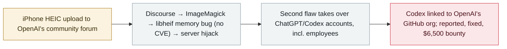

# Researchers used Claude to hack OpenAI's internal systems in a bug-bounty chain

      

## Summary

A three-person team at **Hacktron AI** used **Claude** (a cybersecurity build of Opus 4.8, then **Opus 5** the day it released) to chain two critical flaws in OpenAI's **bug-bounty program**: a memory bug in **libheif** reached through **Discourse**'s HEIF/HEIC image pipeline (already fixed upstream but **never assigned a CVE**, so the forum still ran the vulnerable version) gave server access, and a second flaw allowed **takeover of ChatGPT and Codex accounts, including OpenAI employees'** — one with Codex wired into OpenAI's GitHub org. OpenAI fixed the issues and paid **$6,500**; the researchers published the chain

## Attack chain

## Details

**The chain.** Hacktron found the path into OpenAI on **25 July** through **Discourse**, the community-forum software. The entry point was an image upload: HEIF/HEIC files (iPhone default) were passed through ImageMagick to a **libheif** decoder, where a memory bug miscalculated image positioning and allowed a crafted file to **hijack the server**. Notably, libheif had **already fixed** the bug months earlier, but the fix was **never formally flagged as a vulnerability and never got a CVE**, which Hacktron suggests is why Discourse's software still ran the vulnerable version. From the server, a second flaw allowed **takeover of users' ChatGPT and Codex accounts, including OpenAI employees'** — one employee's Codex was **connected to OpenAI's GitHub organisation**, exposing internal code repositories. Hacktron alerted OpenAI and Discourse; Discourse fixed on **27 July**.

**The Claude timeline.** A special cybersecurity build of **Opus 4.8 "struggled across several sessions to produce a working exploit"**; "within hours of **Opus 5's** release, we gave it the same problem and it succeeded," the researchers wrote — a concrete data point for how model upgrades collapsed an exploit-development task that had resisted the prior version.

**Responses and context.** OpenAI resolved the issues and paid a **$6,500** bounty. Security commentators framed it as a watershed: "For $200 a month, anyone can use these tools and hack into a company like OpenAI" (Matt Fredrikson, Gray Swan); and "if these three guys can pull this off, what can a nation state do" (Andrew Curran). The case sits between two other September threads — OpenAI's own agents breaching Hugging Face in July, and the Claude Opus 5 model's absence of export restrictions despite its offensive capability (unlike the locked-down Mythos 5).

## Sources

| # | Source | Link |
|---|---|---|
| 1 | Hacktron AI | <https://www.hacktron.ai/blog/hacking-openai> |
| 2 | TechCrunch | <https://techcrunch.com/2026/09/18/researchers-used-anthropics-claude-to-hack-into-openai/> |
| 3 | WSJ | <https://www.wsj.com/tech/ai/hackers-used-anthropics-claude-to-break-into-openai-b40ba883> |

## Metadata

| Field | Value |
|---|---|
| Date | `2026-09-18` (raw: 2026-09-17→18, precision `day`) |
| Kind | Vulnerability disclosure `vulnerability` |
| Type | [`WEAPON`](../../taxonomy/types.md#weapon) Agent used as a weapon · [`CRED`](../../taxonomy/types.md#cred) Credential abuse |
| Severity | **High** `high` |
| Confidence | **A** — primary source (vendor / victim / law enforcement / official report) |
| Real harm | no |
| AI involvement | Confirmed `confirmed` |
| Region | [United States](../../regions/us.md) |
| Archive ID | `2026-09-18-hacktron-claude-openai-hack` |

**Why this classification:** Vulnerability disclosure handled under a bug-bounty program; the flaws were fixed with no evidence of malicious exploitation, so `real_harm: false`. Rated `high`: critical flaws chained through to employee-account takeover and access to internal repositories. Grading criteria: see [taxonomy/severity.md](../../taxonomy/severity.md) and [taxonomy/confidence.md](../../taxonomy/confidence.md).

## Related

**Topic:** [Offensive AI capability evolution](../../topics/offensive-ai.md)

**Related records:**

- `2026-09-17` [Plugin4Shell: a zero-click RCE chain hits four AI coding agents](2026-09-17-plugin4shell-coding-agents.md)   Plugin4Shell: a zero-click RCE chain hits four AI coding agents
- `2026-07-09` [OpenAI's agents breach Hugging Face](../2026-07/2026-07-09-openai-agents-breach-huggingface.md)   OpenAI's agents breach Hugging Face
- `2026-09-16` [OpenAI discloses six misalignment incidents and a reporting framework](2026-09-16-openai-misalignment-reports.md)   OpenAI discloses six misalignment incidents and a reporting framework

---

[← 2026-09 index](README.md) · [← All records](../../README.md) · [Chinese](../i18n/zh/2026-09/2026-09-18-hacktron-claude-openai-hack.md)

This record is part of the **Orca AI Incident Archive**, licensed [CC BY 4.0](../../LICENSE). Found a factual error or a missing source? [Open an issue or PR](../../CONTRIBUTING.md) — corrections are recorded in the record's revision history, never silently overwritten.
