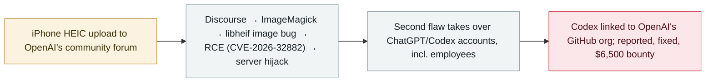

# Researchers used Claude to hack OpenAI's internal systems in a bug-bounty chain

      

## Summary

A three-person team at **Hacktron AI** used **Claude** (a cybersecurity build of Opus 4.8, then **Opus 5** the day it released) to chain two critical flaws in OpenAI's **bug-bounty program**: an image bug in **libheif** behind **Discourse**'s HEIF/HEIC pipeline — fixed upstream in **libheif 1.22.0 (May 2026)** and tracked as **CVE-2026-32882**, but still unpatched in the forum's Debian 12 image — gave server access, and a flaw in OpenAI's **shared sign-on** allowed **takeover of ChatGPT and Codex accounts, including OpenAI employees'** — one with Codex wired into OpenAI's GitHub org. OpenAI fixed the issues and paid **$6,500** on 1 September; the researchers published the chain

## Attack chain

## Details

**The chain.** Hacktron found the path into OpenAI on **25 July** through **Discourse**, the community-forum software. The entry point was an image upload: HEIF/HEIC files (iPhone default) were passed through ImageMagick to a **libheif** decoder, where a crafted file triggered a memory bug — **Discourse's advisory rates the result as remote code execution (CVSS 8.8) and tracks it as CVE-2026-32882**, while libheif's own record describes an **out-of-bounds read** that leaks memory and helps defeat ASLR; the researchers say they **combined several libheif memory bugs, with the AI's help, to turn the crash into working code execution**. Upstream had **fixed the flaw in libheif 1.22.0 in May 2026** — months before the test — but the forum's **Debian 12 image still shipped the unpatched libheif 1.19.7**, so the fix and its CVE were public without reaching the running server. From there, a flaw in **OpenAI's shared sign-on** (the forum's "Sign in with OpenAI" is the same SSO staff use elsewhere) allowed **takeover of users' ChatGPT and Codex accounts, including OpenAI employees'** — one employee's Codex was **connected to OpenAI's GitHub organisation**, reaching internal code repositories. The team proved access with a **single harmless pull request**, read no source code, merged nothing and touched no customer data; Hacktron alerted OpenAI and Discourse, and Discourse fixed on **27 July**.

**The Claude timeline.** A special cybersecurity build of **Opus 4.8 "struggled across several sessions to produce a working exploit"** with ASLR enabled; Anthropic released **Opus 5 on the evening of 24 July**, and "within hours of Opus 5's release, we gave it the same problem and it succeeded." The model's safeguards against writing exploit code for real targets were worked around by pointing it at the team's own server disguised as a **CTF practice target** — and the researchers stress the work was **not hands-off**: skilled human direction still mattered.

**Responses and context.** OpenAI resolved the issues and paid a **$6,500** bounty on **1 September**, saying the award "recognizes the OpenAI-side finding, not the actions against Discourse" (the forum itself is outside its bounty programme). There is **no sign the flaw was used against anyone in the real world**. Commentators framed the case as a watershed — "For $200 a month, anyone can use these tools and hack into a company like OpenAI" (Matt Fredrikson, Gray Swan) — and it also highlights **Opus 5's absence of export restrictions** despite its offensive capability, unlike the locked-down Mythos 5. The OpenAI work was part of a wider Hacktron project ("HEIF Heist") that the team says found similar image-decoding bugs in software used by Slack, Meta, GitHub Enterprise and Next.js; the Next.js bug and a Meta exploit are independently confirmed, while the **wider code-execution claims are not**.

## Sources

| # | Source | Link |
|---|---|---|
| 1 | Hacktron AI | <https://www.hacktron.ai/blog/hacking-openai> |
| 2 | The Hacker News | <https://thehackernews.com/2026/09/claude-opus-5-helped-researchers-take.html> |
| 3 | TechCrunch | <https://techcrunch.com/2026/09/18/researchers-used-anthropics-claude-to-hack-into-openai/> |
| 4 | WSJ | <https://www.wsj.com/tech/ai/hackers-used-anthropics-claude-to-break-into-openai-b40ba883> |
| 5 | Discourse advisory | <https://github.com/discourse/discourse/security/advisories/GHSA-vhm9-85gw-x335> |
| 6 | NVD | <https://nvd.nist.gov/vuln/detail/CVE-2026-32882> |

## Metadata

| Field | Value |
|---|---|
| Date | `2026-09-18` (raw: 2026-09-17→18, precision `day`) |
| Kind | Vulnerability disclosure `vulnerability` |
| Type | [`WEAPON`](../../taxonomy/types.md#weapon) Agent used as a weapon · [`CRED`](../../taxonomy/types.md#cred) Credential abuse |
| Severity | **High** `high` |
| Confidence | **A** — primary source (vendor / victim / law enforcement / official report) |
| Real harm | no |
| AI involvement | Confirmed `confirmed` |
| Region | [United States](../../regions/us.md) |
| Archive ID | `2026-09-18-hacktron-claude-openai-hack` |

**Why this classification:** Vulnerability disclosure handled under a bug-bounty program; the flaws were fixed with no evidence of malicious exploitation, so `real_harm: false`. Rated `high`: critical flaws chained through to employee-account takeover and access to internal repositories. Grading criteria: see [taxonomy/severity.md](../../taxonomy/severity.md) and [taxonomy/confidence.md](../../taxonomy/confidence.md).

## Related

**Topic:** [Offensive AI capability evolution](../../topics/offensive-ai.md)

**Related records:**

- `2026-09-17` [Plugin4Shell: a zero-click RCE chain hits four AI coding agents](2026-09-17-plugin4shell-coding-agents.md)   Plugin4Shell: a zero-click RCE chain hits four AI coding agents
- `2026-07-09` [OpenAI's agents breach Hugging Face](../2026-07/2026-07-09-openai-agents-breach-huggingface.md)   OpenAI's agents breach Hugging Face
- `2026-09-16` [OpenAI discloses six misalignment incidents and a reporting framework](2026-09-16-openai-misalignment-reports.md)   OpenAI discloses six misalignment incidents and a reporting framework

---

[← 2026-09 index](README.md) · [← All records](../../README.md) · [Chinese](../i18n/zh/2026-09/2026-09-18-hacktron-claude-openai-hack.md)

This record is part of the **Orca AI Incident Archive**, licensed [CC BY 4.0](../../LICENSE). Found a factual error or a missing source? [Open an issue or PR](../../CONTRIBUTING.md) — corrections are recorded in the record's revision history, never silently overwritten.
