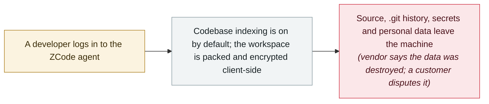

# Zhipu's ZCode agent silently uploaded whole repositories, Git history included

     

## Summary

Users discover that **Zhipu's AI coding agent ZCode** silently packages the **entire workspace and uploads it**: a developer's forensic write-up finds a **313 MB encrypted archive** in the hidden `~/.zcode` directory holding roughly **42,000 files, 86.6% of them `.git` history** — so deleted keys, configs and business traces travel with it. The encryption key is delivered by the server and kept only in the cloud, and **no setting turns the upload off**. Zhipu apologises the same day, blaming the default-on **codebase-indexing** feature and saying the data exists only long enough to generate a repo wiki and is then destroyed; a customer, **Chengming Technology**, disputes that, says it still detected uploads after the fix, and demands written answers — including whether data left the country — by **10 October**. Zhipu has since open-sourced ZCode and reports rectification complete in v3.14.0

## Attack chain

## Details

**What the forensics found.** On **18 September** the developer **ferstar** published a forensic write-up: while cleaning a disk he found a **313 MB encrypted archive** in ZCode's hidden `~/.zcode` directory containing about **42,000 files, 86.6% of them `.git` history** — meaning not just the current source but the version-control record, including keys, configurations and business traces that had been deleted from the working tree. The packaging ran **automatically after login**, with no user action and no prompt; the RSA public key used to encrypt it is fetched from the server and the private key is held only in the cloud, so users cannot inspect what leaves their machine. The `.git` directory's higher priority in the upload filter let it **bypass the client's secret scanning and size limits**, and neither of the product's privacy toggles stopped the upload.

**The vendor's response.** Zhipu apologised the same evening through its official community, attributing the uploads to the **codebase-indexing** feature — **enabled by default since launch** — and saying the data exists only long enough to generate a repository wiki page in the cloud, after which it "is immediately destroyed" and is never used for model training. The company promised to open-source ZCode, invite third-party reviewers, and gave every user an extra weekly quota reset as compensation. On **21 September** Zhipu announced the rectification complete in client **v3.14.0**, said ZCode had been open-sourced, and reported that the China Academy of Information and Communications Technology (CAICT) and NSFOCUS had been engaged to audit the product — with CAICT's technical evaluation confirming the `zcode-prod` Aliyun OSS bucket now holds **zero data**.

**The customer's challenge — and why it matters.** **Chengming Technology** (Taiyuan) went further: after its own forensics it went public with a formal letter on **19–20 September**, stating that the uploads were automatic and bulk, that the data included full source code, system architecture, version-control history, **database passwords, cloud credentials and employee personal data** — well beyond the scope of ZCode's privacy policy — and that uploads were **still being detected in the early hours of 18 September, after the client had been updated to 3.12.3 on the 16th**. It asked why network requests point to a **Singapore entity** while the contracting party is Beijing-based (a cross-border-transfer question), demanded a written reply by **10 October** covering ten points (deletion, a data-processing inventory, key custody, access logs, deletion proof, a no-more-upload commitment and more), and reserved the right to claim damages, complain to regulators and sue. Whatever the outcome, the case marks the moment data handling by **agentic coding tools** — which now read whole repositories and hold more access than any previous desktop software — became a first-order compliance question for the enterprises using them.

## Sources

| # | Source | Link |
|---|---|---|
| 1 | Global Times | <https://www.secrss.com/articles/94149> |
| 2 | The Paper | <https://news.qq.com/rain/a/20260921A02ESY00> |
| 3 | TechWeb | <https://news.qq.com/rain/a/20260920A05HHD00> |
| 4 | FreeBuf | <https://www.freebuf.com/articles/501972.html> |
| 5 | OSChina | <https://www.oschina.net/news/502589> |

## Metadata

| Field | Value |
|---|---|
| Date | `2026-09-18` (raw: 2026-09-18→21, precision `day`) |
| Kind | Incident `incident` |
| Type | [`EXFIL`](../../taxonomy/types.md#exfil) Data exfiltration |
| Severity | **High** `high` |
| Confidence | **A** — primary source (vendor / victim / law enforcement / official report) |
| Real harm | yes |
| AI involvement | Confirmed `confirmed` |
| Region | [China](../../regions/cn.md) |
| Archive ID | `2026-09-18-zcode-silent-upload` |

**Why this classification:** Real incident with confirmed victims — the affected developer and enterprise published forensic findings, and the vendor itself confirmed the uploads. Graded `A` on source quality; the parties still disagree on post-fix behaviour and retention, and both positions are stated above. Rated `high`: source code, Git history and potentially credentials left users' machines without consent, with a customer pursuing formal accountability. Grading criteria: see [taxonomy/severity.md](../../taxonomy/severity.md) and [taxonomy/confidence.md](../../taxonomy/confidence.md).

## Related

**Topic:** [Zero-click data exfiltration chain](../../topics/zero-click-exfil.md)

**Related records:**

- `2026-09-08` [ChatGPT sandbox flaw pipes a victim's Gmail data into the attacker's account](2026-09-08-chatgpt-gmail-sha-xiang-que.md)   ChatGPT sandbox flaw pipes a victim's Gmail data into the attacker's account
- `2026-08-04` [CHAINDROP npm worm](../2026-08/2026-08-04-chaindrop-npm-ru-chong.md)   CHAINDROP npm worm
- `2026-09-01` [GitSpawn: a malicious .git/config runs attacker code in 7 coding agents before the model is ever contacted](2026-09-01-gitspawn-git-config-pre-model-rce.md)   GitSpawn: a malicious .git/config runs attacker code in 7 coding agents before the model is ever contacted

---

[← 2026-09 index](README.md) · [← All records](../../README.md) · [Chinese](../i18n/zh/2026-09/2026-09-18-zcode-silent-upload.md)

This record is part of the **Orca AI Incident Archive**, licensed [CC BY 4.0](../../LICENSE). Found a factual error or a missing source? [Open an issue or PR](../../CONTRIBUTING.md) — corrections are recorded in the record's revision history, never silently overwritten.
